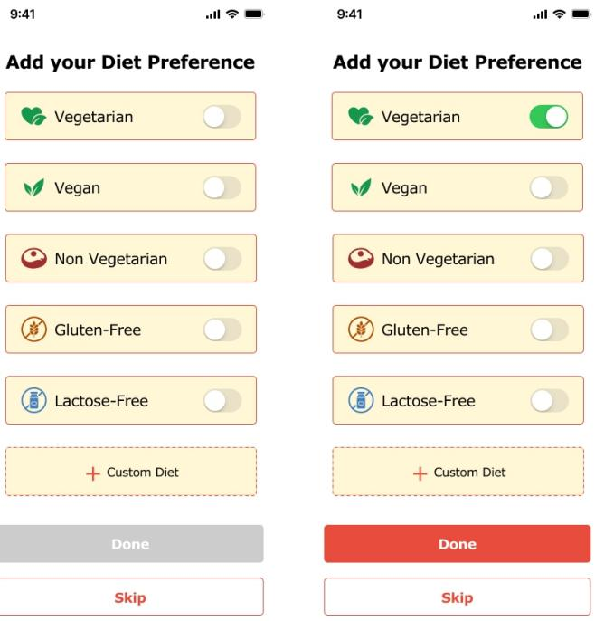
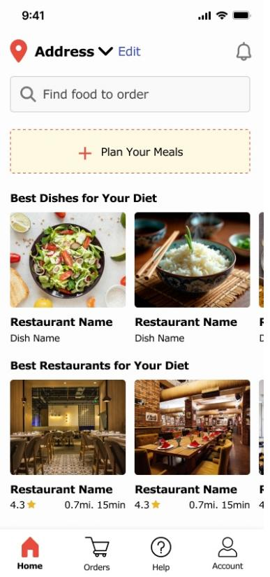
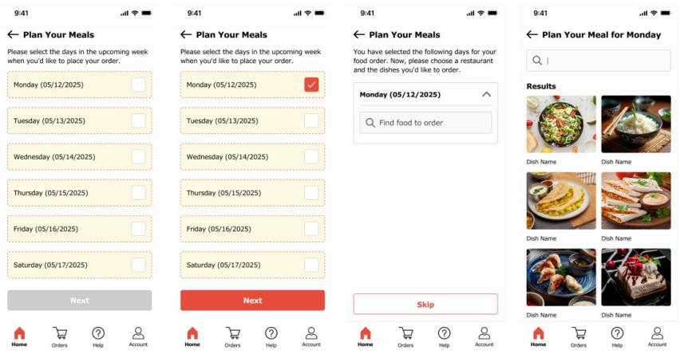

# ElderEats: Simplifying Food Delivery for Elderly Users

Ankitaben Thakkar and Youngsoo Shin

Seidenberg School of CSIS, Pace University, 15 Beekman Street, New York, NY 10038, USA

# ABSTRACT

Older adults often face difficulties when using modern food delivery applications, which are usually not designed with their physical and mental needs in mind. In this work, we present ElderEats, a mobile food ordering application created to reduce memory load and make ordering easier for elderly users. ElderEats recognizes that older adults interact with technology differently from younger generations and places their needs at the center of its design. During onboarding, the app collects information about users’ dietary preferences and restrictions, allowing it to recommend meals and restaurants that match their needs. The interface uses clear navigation, large buttons, and readable text to make the experience more comfortable and accessible. Additional features include a weekly meal planner that helps users schedule meals in advance and modify them easily when needed. To evaluate the app, a usability study was conducted with twenty participants aged 65 and above. Each participant completed the same meal-ordering tasks using both ElderEats and a standard commercial food delivery application. The results showed that participants found ElderEats easier to navigate, more comfortable to use, and better suited to their dietary and accessibility needs. They also reported higher satisfaction and confidence throughout the ordering process. The study highlights the importance of designing mobile services that address the physical and mental changes that come with aging. ElderEats shows that small but thoughtful design choices, such as guided setup, clear layouts, and personalized meal suggestions, can greatly improve the digital experience for older adults and make everyday tasks like food ordering simpler, faster, and more enjoyable.

Keywords: Human–computer interaction (HCI), User experience (UX) design, Older adults and technology, Accessibility and inclusive design

# INTRODUCTION

With over 1 billion people worldwide aged 65 and above, designing technology for older adults is no longer optional, it’s essential (United Nations, 2019). In this study, we focus on people aged 65 and above, who often face challenges when using mobile apps. Food delivery apps can be very helpful for seniors by providing convenience and independence, but many of these apps are difficult for older users to navigate and use comfortably (Mace et al., 2022).

Most food delivery apps today have busy home screens filled with too many banners, categories, advertisements, and promotions that can confuse

or overwhelm users (Zajicek, 2004; Li and Luximon, 2019). Small text, complicated menus, and unclear navigation make things even harder for people who have vision problems or memory issues (Czaja and Lee, 2007; Vaportzis et al., 2017). Many apps are designed for younger users who are comfortable with quick swiping and tapping through many options. However, older adults often prefer simpler, step-by-step actions that are easier to follow (Melenhorst et al., 2006; Lee and Coughlin, 2019).

As people get older, cooking every day can become tiring or difficult, especially for those dealing with health problems or limited mobility (Charness and Boot, 2009; Gomez-Hernandez et al., 2023). Food delivery services can be a great solution to help them stay independent and eat well. But these services are only useful if the apps are easy to use. When an app helps older users quickly find meals that match their dietary needs, it not only saves time but also supports their health and reduces stress (Heart and Kalderon, 2013).

This paper introduces ElderEats, a mobile food ordering app designed specifically for older adults using a human-centered approach. The app solves common usability problems through four main features: collecting dietary preferences during setup, recommending meals and restaurants that match the user’s needs, offering a weekly meal planner to reduce daily decisionmaking, and using an accessible design with large buttons, clear text, and high contrast visuals. We built a working prototype using Figma and tested it with twenty older adults. The results showed major improvements in how quickly users could complete tasks, how confident they felt, and how satisfied they were compared to using a standard food delivery app.

# BACKGROUND AND RELATED WORKS

To better understand how mobile food delivery apps can work better for older adults, we investigated prior research in areas like human-computer interaction, aging, and mobile usability. Earlier studies show that older users often face challenges like small text, hard-to-use menus, and too many steps in apps. We also looked at design ideas that make apps easier for seniors, such as simpler layouts and features made for their needs. In addition, we explored food-related apps and how features like personalization and planning can affect the user experience for older people.

# Usability Challenges for Older Adults

Older adults frequently encounter challenges when using mobile applications. Research has found that age-related declines in vision, memory, and motor skills can reduce confidence in navigating interfaces (Czaja and Lee, 2007). Similarly, studies have emphasized how unfamiliarity with digital platforms compounds these difficulties (Charness and Boot, 2009). Detailed research on mobile interface usability for older adults has highlighted problems like dense menus and unclear navigation flows (Li and Luximon, 2019). Other findings show that small touch targets and ambiguous gestures on tablets frustrated older users, leading to reduced adoption (Vaportzis et al., 2017). Further research has identified motivational and contextual factors that influence

older adults’ technology use (Lee and Coughlin, 2019). These findings suggest that without age-specific design considerations, food ordering apps may lead to errors, confusion, or abandonment. Studies have stressed that systems not tailored to cognitive aging risk marginalizing older users from digital commerce (Iftikhar et al., 2021).

# Accessible Interface Design

Accessible design plays a key role in supporting older adults’ interaction with mobile systems. Research has proposed design exemplars for older users, including high-contrast visuals, simplified layouts, and reduced cognitive load (Zajicek, 2004). Evidence-based design principles for aging populations emphasize clarity, consistency, and ease of input (Rogers et al., 2009). Web Content Accessibility Guidelines (WCAG) 2.1 guidelines and comprehensive frameworks provide further direction on accessibility best practices, applicable across web and mobile platforms (Seeman et al., 2017; Shneiderman et al., 2017). Studies have identified small usability improvements such as larger fonts, fewer options per screen, and undo functionality that significantly enhance user confidence (Pratt et al., 2018). These insights inform our decision to prioritize clear navigation, readable typography, and minimal clutter in ElderEats.

# Personalization in Food Applications

While mainstream food delivery apps emphasize variety and speed, they often overlook dietary needs and planning support features especially important to older users. Research has reported that older adults are more willing to adopt health-related Information and Communication Technology (ICT) when it offers personalized benefits (Heart and Kalderon, 2013). Reviews of app design for seniors have emphasized tailoring content to user health conditions (Gomez-Hernandez et al., 2023). Studies specifically exploring memory load in food ordering apps have found that personalization and planning significantly reduced effort for older users (Huber et al., 2022). Features like saved preferences, recommended meals, and weekly meal planning have been shown to improve user satisfaction and perceived usefulness (Schell and Blackler, 2018). Our design of ElderEats incorporates these elements from the outset, offering diet-based filtering, custom recommendations, and a weekly planning interface all tailored for older adults.

# ELDEREATS: APP DESIGN AND FEATURES

ElderEats is a food delivery app designed for older adults with the goal of reducing stress and effort during the ordering process. It focuses on making the experience simple, clear, and comfortable for seniors. To guide users smoothly, the app includes four main features: personalized diet preference setup, recommended meals and restaurants, a weekly meal planner, and accessibility-focused interface. Each feature was made to help older adults by making choices easier, giving helpful reminders, and following design ideas that are proven to work well for seniors.

# Application Overview and User Flow

When users first open ElderEats, they are guided through a simple onboarding process where they set up their dietary preferences. This information is saved and used throughout the app to personalize their experience. After setup, users arrive at the home screen, which displays personalized meal and restaurant recommendations based on their preferences. From here, users can either order a single meal immediately or use the weekly meal planner to schedule multiple meals in advance. The app handles scheduling, sends reminders before deliveries, and allows users to modify or cancel orders easily. Every screen follows consistent accessibility principles with large buttons, clear text, and simple navigation.

  
Figure 1: Diet preference setup screen in eldereats.

# Diet Preference Setup

When the user opens the app for the first time, they are asked to select their dietary preferences (see Figure 1). The options include vegetarian, vegan, non-vegetarian, gluten-free, and lactose-free. There is also a “Custom Diet” option for users who want to set specific needs, such as low-sodium or highprotein meals. This feature was chosen to reduce the amount of effort users need to put into filtering or sorting through menus every time. Older adults often report frustration with complex filtering systems (Li and Luximon, 2019; Vaportzis et al., 2017), so getting this information upfront helps avoid that. By collecting dietary preferences during onboarding, the app can automatically filter out incompatible options. These preferences are stored in the user’s profile and used to tailor search results in the backend, streamlining

future interactions. This feature helps reduce confusion and effort by showing users only relevant options, making food ordering faster and simpler.

# Recommended Meals and Restaurants

After the user selects their diet preference, the app highlights meals and restaurants that match it (see Figure 2). Recommended dishes are shown with large images, along with the name of the meal and the restaurant underneath. Users also see restaurant suggestions that fit their diet, including the restaurant’s star rating and how far it is from their location. This feature was added because older adults often value guidance when navigating digital systems, especially when making choices that affect health (Heart and Kalderon, 2013; Huber et al., 2022). The recommendation engine uses dietary preferences and location to suggest appropriate options. The system considers factors like distance, restaurant rating, and dietary match to prioritize what’s shown. This helps users quickly find options they can trust without feeling overwhelmed by choice or needing to apply filters themselves.

  
Figure 2: Recommended meals and restaurants screen in eldereats.

# Weekly Meal Planner

The ElderEats home screen includes a weekly planner that helps users schedule their meals ahead of time (see Figure 3). Instead of choosing food every day, older adults can plan meals for the week in one go or just for

the days they want. It’s flexible, so users can pick only a few days if that’s what they prefer. Each day of the week is clearly shown, and users can tap on a day to choose or change a meal. After placing the weekly order, the app sends a reminder before each delivery in case the user wants to change or cancel it. This feature was chosen because daily decision-making can be exhausting, especially for users managing chronic health conditions or memory issues (Vaportzis et al., 2017; Lee and Coughlin, 2019). The backend supports scheduling logic and sends reminders using local notifications or push services. This reduces decision fatigue, supports planning habits, and helps users feel more in control of their routines.

  
Figure 3: Weekly meal planner screen in eldereats.

# Accessibility-Focused Design

ElderEats is built with accessibility as a key foundation. The interface uses large, high-contrast text, bold and readable fonts, and clearly labeled buttons that are easy to tap. Touch areas are spaced out to reduce accidental presses, and the layout avoids clutter to minimize confusion. Every screen is designed to reduce cognitive load and support independent use by older adults. Design decisions were based on established accessibility research and standards, such as WCAG 2.1 (Seeman et al., 2017) and guidelines for aging populations (Zajicek, 2004; Rogers et al., 2009; Pratt et al., 2018). For example, button size and spacing were chosen based on minimum touch target recommendations, and font sizes were tested for legibility on small screens. This supports users with low vision, motor limitations, or cognitive fatigue, creating a more inclusive experience overall.

# PROTOTYPE OVERVIEW

To bring our ideas to life, we created a clickable prototype of the ElderEats app using Figma. The prototype represents the full user journey, from setting up preferences to planning and ordering meals. Each screen has been thoughtfully designed with older adults in mind, using simple layouts, high-contrast visuals, and easy-to-read text to make the experience smooth and comfortable. This interactive prototype can be used to demonstrate the design, gather feedback, and test usability. A video walkthrough showing

how the app works in real-time is available. The clickable Figma prototype demonstrating the full interaction flow.

# EVALUATION

To assess the usability of ElderEats, we conducted a comparative usability study with twenty older adults aged between 65 and 78 (mean age: 69.5 years, SD: 4.2). All participants owned smartphones and were comfortable with basic digital tasks such as messaging and browsing. Nine participants had used food delivery apps before, with five of them finding the experience difficult. The remaining eleven participants had never used such services, and six of them specifically mentioned they avoided these apps because they did not feel confident using them.

We used a comparative testing setup where each participant completed the same food ordering task using two interfaces: first a standard commercial food delivery app (App A), and then ElderEats (App B). This approach allowed us to directly compare the effort, time, and user experience between the two systems. In App A, participants had to manually search for meals, apply filters, and navigate through multiple menus to place an order. In contrast, ElderEats (App B) simplified the flow: dietary preferences were preset, suggested meals were matched to user needs, and the weekly planner enabled quick meal scheduling.

# RESULTS

Table 1 presents the comparative results between the standard food delivery app (App A) and ElderEats (App B) across key usability metrics.

Table 1: Comparative usability metrics between standard app and eldereats.   

<table><tr><td>Metric</td><td>App A (Standard)</td><td>App B (ElderEats)</td><td>Improvement</td></tr><tr><td>Average Task Completion Time</td><td>4 min 23 sec</td><td>2 min 18 sec</td><td>47.5% reduction</td></tr><tr><td>Average Confidence Rating (1-5 scale)</td><td>2.4</td><td>4.5</td><td>87.5% increase</td></tr><tr><td>Task Success Rate</td><td>75% (15/20)</td><td>100% (20/20)</td><td>25% increase</td></tr><tr><td>Average Error Count</td><td>3.2</td><td>0.6</td><td>81.3% reduction</td></tr><tr><td>Average Satisfaction Rating (1-5 scale)</td><td>2.3</td><td>4.6</td><td>100% increase</td></tr></table>

The results clearly demonstrate the effectiveness of ElderEats’ design approach. Task completion time dropped significantly, with participants completing orders in less than half the time when using ElderEats compared to the standard app. Self-rated confidence improved dramatically from a low 2.4 to a high 4.5 on a 5-point scale. Notably, all twenty participants successfully completed the ordering task using ElderEats, whereas five

participants failed to complete the task using the standard app within the allotted time.

Error counts were substantially lower with ElderEats, indicating that the simplified interface and guided workflow reduced user mistakes. Participants made an average of only 0.6 errors with ElderEats compared to 3.2 errors with the standard app. Satisfaction ratings also showed remarkable improvement, nearly doubling from 2.3 to 4.6.

Participants consistently highlighted the large buttons, readable fonts, and straightforward steps in ElderEats. Representative comments included: “It was so simple to order food. Everything was clear,” “I didn’t feel lost like I usually do with these apps,” and “The weekly planner is brilliant, I can set everything up once and not worry about it every day.” Several participants specifically mentioned that they would consider using food delivery services regularly if apps were designed like ElderEats, whereas they had previously avoided them due to frustration.

# DISCUSSION

ElderEats contributes a novel approach to mobile food delivery by integrating age-sensitive design, health-based personalization, and meal planning into a single system tailored for older adults. Unlike commercial apps that often prioritize variety or speed, ElderEats focuses on minimizing decision load, simplifying navigation, and aligning food choices with users’ dietary needs. The weekly meal planner and onboarding-based personalization are especially impactful, offering features that go beyond the standard functionality of food delivery services.

Our evaluation with twenty participants suggests that these design decisions meaningfully improve usability. Older participants completed tasks significantly faster $( 4 7 . 5 \%$ reduction in time) and with greater confidence $( 8 7 . 5 \%$ increase) when using ElderEats compared to a standard delivery app. The $1 0 0 \%$ task success rate and substantial reduction in errors further validate the effectiveness of our human-centered design approach. These results align with prior research emphasizing the importance of accessibility, clarity, and personalization in digital tools for older users (Zajicek, 2004; Rogers et al., 2009; Huber et al., 2022).

However, several limitations must be acknowledged. First, while twenty participants provide more robust data than preliminary studies, a larger and more diverse participant pool would strengthen generalizability. Second, the study focused on short-term usability rather than long-term engagement or real-world use. Third, the prototype was developed in Figma and does not include backend features such as dynamic personalization, real-time filtering, or order processing—these may influence user experience in a fully functional product. Future work should address these limitations through longitudinal studies with larger cohorts and development of a working prototype with full functionality.

Despite these constraints, ElderEats demonstrates that mobile systems can be significantly improved by centering the needs of older adults in the design process. While ElderEats was designed with older adults in mind, the same features can also support other groups, such as busy professionals,

new parents, or people who simply don’t have time to cook every day. By supporting planning and offering personalized recommendations, ElderEats can serve a wide range of users who value convenience, health, and simplicity.

# FUTURE WORK

While the current version of ElderEats supports dietary preferences and weekly scheduling, there are many directions for expanding the app. Future enhancements could include voice commands to help users place orders or make changes without needing to type, family or caregiver support features letting family members help manage meals or receive alerts when meals are skipped, health integration connecting with fitness or medical apps to suggest meals based on health conditions, and community and social features suggesting group meals or community dining events to reduce isolation. Additionally, developing a fully functional production system would enable evaluation of advanced features including real-time personalization algorithms, dynamic filtering logic, and actual food ordering and delivery integration.

# CONCLUSION

This paper presented ElderEats, a mobile food delivery application designed through human-centered principles specifically targeting the needs of older adults aged 65 and above. By integrating personalized dietary preference collection, intelligent meal recommendations, weekly planning functionality, and accessibility-optimized interface design, ElderEats addresses documented usability challenges that hinder elderly users’ adoption of conventional food delivery services.

A comparative usability study with twenty older adult participants demonstrated significant improvements in all measured metrics: $4 7 . 5 \%$ reduction in task completion time, $8 7 . 5 \%$ increase in user confidence, $1 0 0 \%$ task success rate, $8 1 . 3 \%$ reduction in errors, and $1 0 0 \%$ increase in satisfaction ratings when participants used ElderEats compared to a standard commercial food delivery application. These empirical findings provide evidence that thoughtful, age-specific design approaches can meaningfully enhance technology accessibility and user experience for older adult populations.

As global demographics continue shifting toward older populations, designing inclusive mobile services becomes increasingly critical. ElderEats demonstrates that by centering older adults’ needs during the design process rather than treating accessibility as an afterthought, developers can create applications that are not only more usable but also more empowering, supporting independence, health management, and quality of life for elderly users.

# ACKNOWLEDGMENT

The authors would like to express their sincere gratitude to the participants for their valuable time and contributions to this research. The authors also acknowledge Pace University for its academic support and encouragement throughout the study.

# REFERENCES

Charness, N. and Boot, W. R. (2009). Aging and information technology use. Current Directions in Psychological Science, 18(5), 253–258.   
Czaja, S. J. and Lee, C. C. (2007). The impact of aging on access to technology. Universal Access in the Information Society, 5(4), 341–349.   
Gomez-Hernandez, M., Ferre, X., Moral, C. and Villalba-Mora, E. (2023). Design guidelines of mobile apps for older adults: Systematic review and thematic analysis. JMIR mHealth and uHealth, 11, e43186.   
Heart, T. and Kalderon, E. (2013). Older adults: Are they ready to adopt healthrelated ICT? International Journal of Medical Informatics, 82(11), e209-e231.   
Huber, M., Müller, S. and Rukzio, E. (2022). Understanding memory load in mobile food ordering apps for older users. In Extended Abstracts of the 2022 CHI Conference on Human Factors in Computing Systems (CHI EA ’22). ACM.   
Iftikhar, R., Cakir, G., Wruck, T. and Helfert, M. (2021). How can older adults shop online in the future? Developing design principles for virtual-commerce stores. In Proceedings of the 29th European Conference on Information Systems (ECIS 2021).   
Lee, Y. Y. and Coughlin, J. F. (2019). Perspective: Older adults’ adoption of technology: An integrated approach to identifying determinants and barriers. In Proceedings of the 2019 CHI Conference on Human Factors in Computing Systems (CHI ’19). ACM.   
Li, Q. and Luximon, Y. (2019). Older adults’ use of mobile devices: Usability challenges while navigating various interfaces. Behaviour & Information Technology, 39(1), 1–25.   
Mace, R. A., Mattos, M. K. and Vranceanu, A. M. (2022). Older adults can use technology: Why healthcare professionals must overcome ageism in digital health. Translational Behavioral Medicine, 12(12), 1102–1105.   
Melenhorst, A., Rogers, W. A. and Bouwhuis, D. (2006). Older adults’ motivated choice for technological innovation: Evidence for benefit-driven selectivity. Psychology and Aging, 21(1), 190–195.   
Pratt, M., Hauser, M. M. and Hayes, B. D. (2018). Understanding technology use in older populations: Barriers and solutions. Journal of Aging & Health, 30(8), 1189–1204.   
Rogers, W. A., Fisk, A. D., Charness, N., Czaja, S. J. and Sharit, J. (2009). Designing for older adults: Principles and creative human factors approaches. CRC Press.   
Schell, J. and Blackler, A. (2018). Engagement in HCI: Conception, theory and measurement. In Proceedings of the 2018 CHI Conference on Human Factors in Computing Systems, 1–13. ACM.   
Seeman, L., Cooper, M. and Arch, A. (2017). Web Content Accessibility Guidelines (WCAG) 2.1. W3C Recommendation.   
Shneiderman, B., Plaisant, C., Cohen, M., Jacobs, S., Elmqvist, N. and Diakopoulos, N. (2017). Designing the user interface: Strategies for effective human-computer interaction (6th ed.). Pearson.   
United Nations (2019). World Population Ageing 2019: Highlights. Department of Economic and Social Affairs, Population Division.   
Vaportzis, M., Clausen, M. and Gow, A. J. (2017). Older adults’ perceptions of technology and barriers to interacting with tablet computers: A focus group study. Frontiers in Psychology, 8, Article 1687.   
Zajicek, J. (2004). Successful and available: Interface design exemplars for older users. Interacting with Computers, 16(3), 411–430.