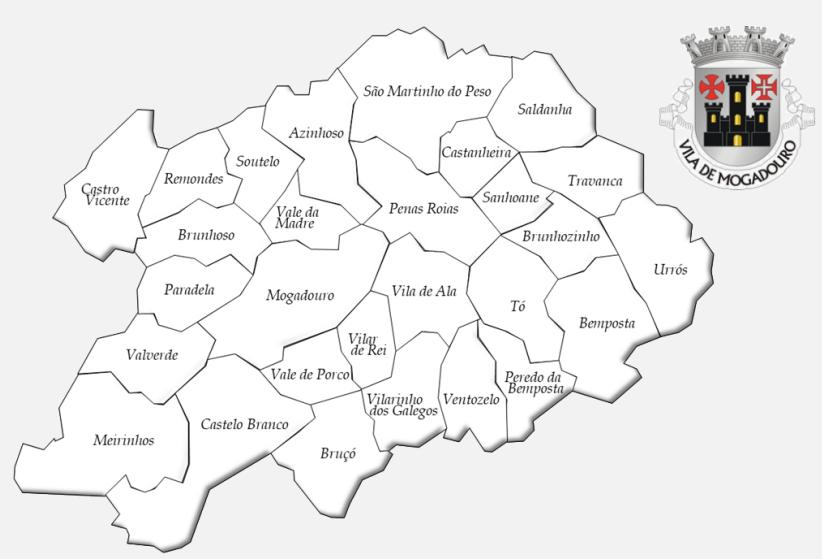
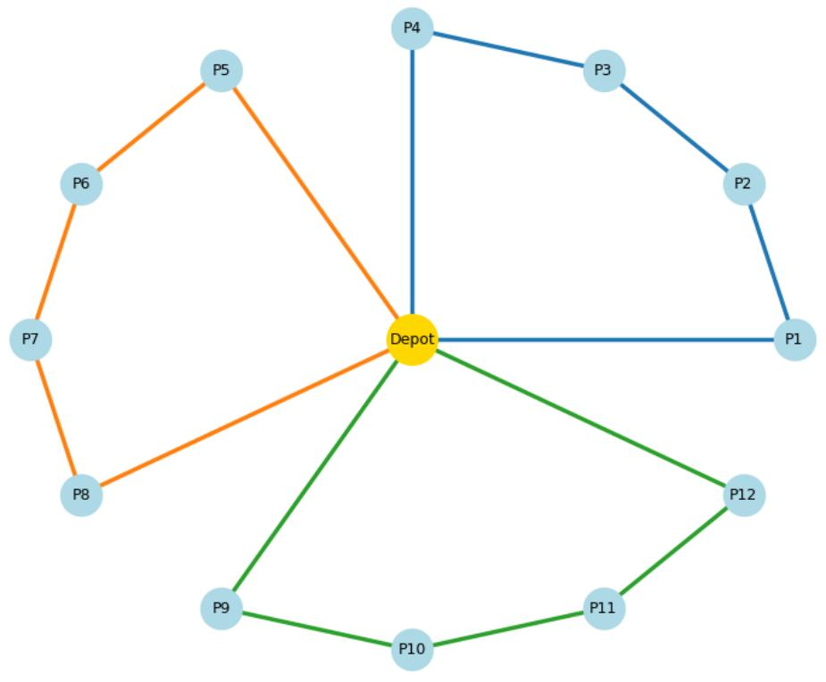
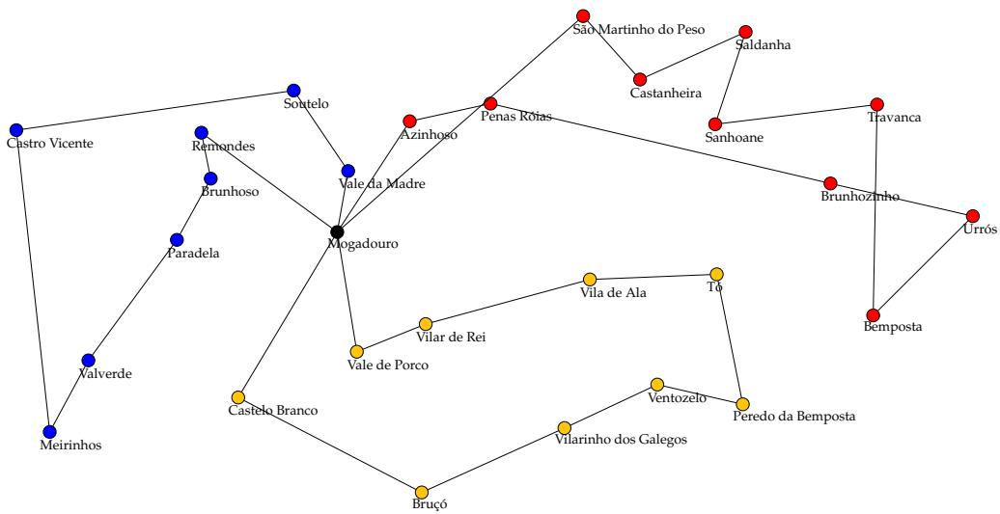
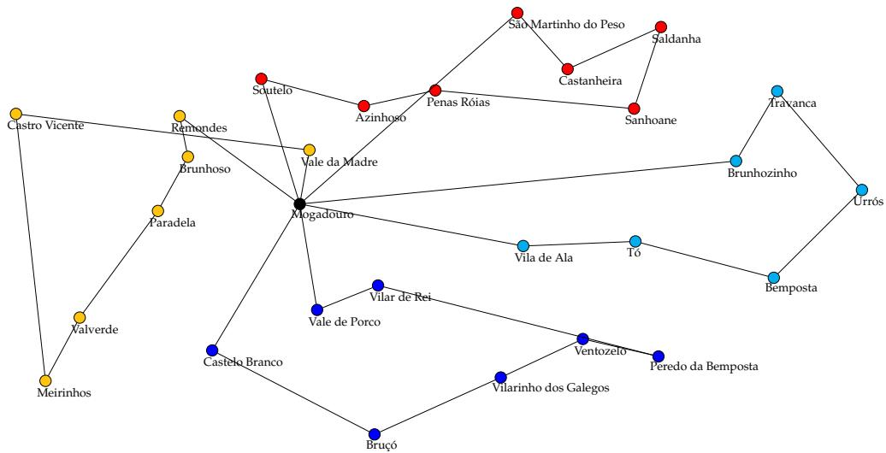
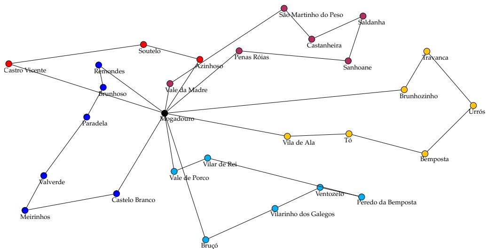
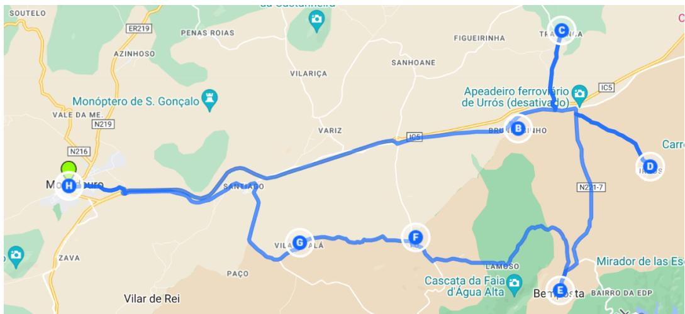

Article

# The ACO-BmTSP to Distribute Meals Among the Elderly

Sílvia de Castro Pereira 1,2 , Eduardo J. Solteiro Pires $^ { 2 , 3 , * \oplus }$ and Paulo B. de Moura Oliveira ${ } ^ { 2 , 3 \oplus }$

1 Instituto Politécnico de Bragança, Campus de Santa Apolónia, 5300-253 Bragança, Portugal; silvia.pereira@ipb.pt   
2 Departamento de Engenharias, Universidade de Trás-os-Montes e Alto Douro, 5000-811 Vila Real, Portugal; oliveira@utad.pt   
3 INESC TEC—INESC Technology and Science, Rua Dr. Roberto Frias, 4200-465 Porto, Portugal   
* Correspondence: epires@utad.pt

# Abstract

The aging of the Portuguese population is a multifaceted challenge that requires a coordinated and comprehensive response from society. In this context, social service institutions play a fundamental role in providing aid and support to the elderly, ensuring that they can enjoy a dignified and fulfilling life even in the face of the challenges of aging. This research proposes a Balanced Multiple Traveling Salesman Problem based on the Ant Colony Optimization algorithm (ACO-BmTSP) to solve a distribution of meals problem in the municipality of Mogadouro, Portugal. The Multiple Traveling Salesman Problem (mTSP) is an NP-complete problem where m salesmen perform a shortest tour between different cities, visiting each only once. The primary purpose is to minimize the sum of all distance traveled by all salesmen keeping the tours balanced. This paper shows the results of computing obtained for three, four, and five agents with this new approach and their comparison with other approaches like the standard Particle Swarm Optimization and Ant Colony Optimization algorithms. As can be seen, the ACO-BmTSP, in addition to obtaining much more equitable paths, also achieves better results in lower total costs. In conclusion, some benchmark problems were used to evaluate the efficiency of ACO-BmTSP, and the results clearly indicate that this algorithm represents a strong alternative to be considered when the problem size involves fewer than one hundred locations.

# check for updates

Academic Editor: Mohammad Majid al-Rifaie

Received: 31 August 2025

Revised: 10 October 2025

Accepted: 15 October 2025

Published: 21 October 2025

Citation: de Castro Pereira, S.; Solteiro Pires, E.J.; de Moura Oliveira, P.B. The ACO-BmTSP to Distribute Meals Among the Elderly. Algorithms 2025, 18, 667. https://doi.org/ 10.3390/a18100667

Copyright: © 2025 by the authors.

Licensee MDPI, Basel, Switzerland.

This article is an open access article distributed under the terms and conditions of the Creative Commons

Attribution (CC BY) license

(https://creativecommons.org/

licenses/by/4.0/).

Keywords: multiple traveling salesman problem; Ant Colony Optimization; local search

# 1. Introduction

Portugal is a country with an extensive Atlantic coastline, which has significantly influenced the distribution of its population. The majority of inhabitants are concentrated along the coast, particularly in metropolitan areas such as Lisbon and Porto, where employment opportunities, access to essential services, and overall living conditions are more favorable.

In contrast, the country’s interior is experiencing a continuous population decline. Many villages and small towns see their demographics shrink year after year, as younger generations either emigrate abroad or relocate to coastal regions in pursuit of better economic prospects. As a result, inland areas are becoming increasingly depopulated, with an aging population predominantly composed of individuals who remain in their homes, unwilling to abandon their roots. This ongoing exodus towards coastal cities and foreign destinations exacerbates the isolation of many rural communities, leading to the closure of schools, healthcare centers, and other essential public services. Furthermore, Portugal

is experiencing a significant demographic transition marked by the accelerated aging of its population.

Globally, population aging is accelerating: By 2050, one in six people worldwide will be over 65 years old [1]. In Portugal, the proportion of the elderly already exceeds ${ } ^ { 2 3 \% }$ , one of the highest rates in Europe. This crisis, resulting from a combination of several factors, such as an increase in life expectancy and decrease in birth rates, brings complex challenges and opportunities for solidarity and care services. Although many elderly people still feel capable of staying in their homes, they require varying levels of care to maintain their well-being. Providing these services within their own residences allows them to preserve their independence while receiving the necessary support. This approach not only improves their quality of life but also contributes to their emotional well-being, as they can continue living in the place where they have built their memories and spent most of their lives. Enabling elderly residents to age in familiar surroundings fosters a greater sense of security, comfort, and overall happiness, reinforcing the importance of localized care solutions tailored to their needs.

The concern for people’s well-being in remaining in their own homes and the demographic imbalance generate growing demands for specific care and services for the elderly, including medical assistance and social support that includes meal distribution. At the municipal level, meal distribution services are often coordinated by social service institutions, aligned with national strategies such as the Portuguese National Strategy for Active and Healthy Aging, which emphasizes in-home support to promote autonomy and dignity. In this scenario, a social service institution emerges as a fundamental institution in providing aid and support to the elderly. Another important aspect of those institutions is that his work is financially supported for elderly people in vulnerable situations. Through social assistance programs, the institution provides financial, food, and housing assistance to elderly people in precarious economic situations, ensuring that they have dignified living conditions.

Those institutions are responsible for providing daily meals to the elderly population who, while living in their own homes, no longer have enough agility and the conditions to prepare them. The overall objective is to deliver meals to elderly residents in all villages within the municipality (see Table 1). Since the meals are served simultaneously, multiple “salesmen” need to be employed, requiring the calculation of the optimal routes of each one.

Table 1. Parishes of Mogadouro.   
TOTAL: 28   

<table><tr><td colspan="3">Parishes of Mogadouro</td></tr><tr><td>Azinhoso</td><td>Sanhoane</td><td>Bemposta</td></tr><tr><td>Bemposta</td><td>São Martinho do Peso</td><td>Bruço</td></tr><tr><td>Brunhoso</td><td>Soutelo</td><td>Brunhozinho</td></tr><tr><td>Tó</td><td>Castanheira</td><td>Travanca</td></tr><tr><td>Castelo Branco</td><td>Urrós</td><td>Castro Vicente</td></tr><tr><td>Vale da Madre</td><td>Meirinhos</td><td>Vale de Porco</td></tr><tr><td>Paradela</td><td>Valverde</td><td>Pena Róias</td></tr><tr><td>Ventozelo</td><td>Peredo da Bemposta</td><td>Vila de Ala</td></tr><tr><td>Remondes</td><td>Vilar de Rei</td><td>Saldanha</td></tr><tr><td>Vilarinho dos Galegos</td><td></td><td></td></tr></table>

This study focuses on the municipality of Mogadouro, located in the Northeast of the Portugal territory, integrated into the district of Bragança and bordering Spain along the Douro River. It is an area in the northern interior of the country that constitutes a large municipality, with $7 5 6 \mathrm { k m } ^ { 2 }$ , with 28 parishes (Figure 1) and approximately 11,350 residents.

The town of Mogadouro has a municipal council responsible for managing this entire populated area, including its twenty-eight parishes. The existing road network also allows you to reach each of the parishes by private vehicle, leaving from the town. Normally, meals are served only once a day, at lunchtime, ensuring sufficient quantity and quality for the remaining meals of the day. The meal service therefore means that only one trip to the home of each person using this service is necessary, thus facilitating organization and reducing the associated costs. However, it also implies that all meals must be delivered between 11:45 a.m. and $1 { : } 3 0 \mathrm { p } . \mathrm { m }$ . at the latest.

  
Figure 1. Map of Mogadouro municipality.

The main contributions and novelties of this research are as follows:

Novel application: This study demonstrates the real-world applicability of the ACO-BmTSP algorithm, specifically addressing the daily distribution of meals for elderly residents in rural parishes of Mogadouro, Portugal.   
Innovative approach: ACO-BmTSP introduces a group of ants called a picket instead of individual ants to create balanced tours and simultaneously minimize their total cost.   
Experimental validation: In a comparative analysis against other benchmarks (PSO, ACO, TCX) using real-world data from 28 parishes in Mogadouro, the algorithm exhibited a consistent and marked improvement across the dual objectives of cost reduction and equity enhancement.   
Practical impact: The methodology facilitates the generation of equitable and efficient delivery routes that respect meal distribution time windows, thereby providing critical support for resource allocation and workforce planning decisions within social service institutions.

# 2. Literature Review

In the artificial intelligence (AI) landscape, the integration of bioinspired algorithms has emerged as a revolutionary approach, providing ingenious solutions to complex optimization problems. Ant Colony Optimization (ACO) stands out as a powerful technique inspired by the foraging behavior of ants. ACO was originally proposed by Marco Dorigo [2], a computer scientist and researcher in the field of AI. He introduced the initial concept of ACO in his seminal work “Optimization, Learning, and Natural Algorithms” in 1992, and since then, it has been extensively developed and applied to various optimization

problems. The Traveling Salesman Problem (TSP) is a classic optimization problem that consists of finding the optimal itinerary for a salesman to traverse a series of cities once before returning to the initial city (depot). TSP has applications in many fields, such as logistics [3], telecommunications [4], genetics [5], manufacturing [6], and so on. When the problem requires the use of many salesmen, it is called Multiple Traveling Salesman Problem (mTSP). Although the TSP and the Multiple Traveling Salesman Problem (mTSP) remain central in routing optimization, recent research emphasizes the importance of situating these within a broader context of operational research problems. For example, the Vehicle Routing Problem (VRP), a generalization of the TSP, addresses scenarios involving multiple vehicles and constraints such as capacities, time windows, and depot configurations. Liu et al. [7] provide a comprehensive review of heuristic and metaheuristic approaches for VRPs, covering recent advances and highlighting the effectiveness of methods like ACO, Genetic Algorithms, and hybrid models in practical routing contexts. In addition to routing, facility location is a core component in many distribution systems. These problems aim to determine the optimal placement of resources (e.g., depots or service centers) to minimize logistical costs or maximize service coverage. Farahani and Hekmatfar [8] present a key reference work with an extensive review of FLPs, discussing their classification, applications, and common solution methods, including metaheuristic approaches such as ACO and Particle Swarm Optimization (PSO). Moreover, modern operational research increasingly incorporates multi-objective metaheuristics, especially in logistics, healthcare, and smart city applications. Zhang et al. [9] review the role of metaheuristics in solving complex scheduling problems under Industry 4.0 and 5.0 paradigms, emphasizing the importance of balancing trade-offs such as efficiency, cost, and service quality—factors directly relevant to public service logistics, like meal distribution. These studies confirm that problems like the one addressed in this paper are well aligned with research in VRP, FLP, and multi-agent optimization, all of which have benefited from the application of ACO and other metaheuristics.

As the TSP has several variants, the ACO algorithm also presents multiple variations, each adapted to the problem to be solved. In this section, previous studies are studied. Junjie and Dingwei [10] presented an ACO algorithm applied to the mTSP with ability constraint and compared it with Genetic Algorithms testing problems from TSPLIB. Three years later, Feng et al. [11] present a combination of Particle Swarm Optimization (PSO) with ACO to solve mTSP. The proposed approach establishes a mapping between the sequence and the continuous position of the particles, demonstrating superior efficiency compared to traditional ACO and DPSO. Yun et al. [12] proposed a novel heuristic algorithm based on the methods of advanced Harmony Search and Ant Colony Optimization (AHS-ACO) to effectively solve the TSP, incorporating tuning adjustment strategies and mutation operators, resulting in high-quality solutions. To solve large-scale TSP instances, Chitty [13] applied ACO, eliminating high memory requirements and exploiting parallel hardware. To obtain the optimal routing path in stochastic networks, Al-Tayar and Alisa [14] proposed several scenarios using the ACO algorithm to determine the optimal routing path between the source node and the target node. The Team Ant Colony Optimization (TACO) algorithm developed by Vallivaara [15] adapts the Ant Colony System (ACS) to handle Multiple Traveling Salesman Problems. Instead of individual ACS ants solving TSP instances, TACO uses $N$ teams, each with m members. Each team functions as a single salesman, collaboratively constructing MTSP solutions while maintaining a unique taboo list to avoid revisiting nodes. This work with teams allows us to simultaneously explore distinct parts of the solution space, encouraging more diverse search strategies. This team-based structure allows TACO to better model and solve MTSP instances by optimizing paths for multiple salesmen rather than just one to deliver medicine across large hospitals, colonies [16],

and each pharmacy, including identification (ID), latitude, longitude, and its distance to the MDC, and considered the deposit where the deliverymen use a TACO algorithm and where the main goal is to reduce the total travel distance for each delivery person. In this case, TACO helps by generating multiple efficient routes of similar lengths, ensuring that the delivery location is visited only once. The authors applied TACO in an instance represented by a Medicine Distribution Center (MDC) at a public hospital in Brazil and 16 pharmacies. They worked out a matrix called the cost matrix, containing the data of the start and the finish their routes. They considered two scenarios: the lowest minimization results for the Total Cost of Routes (TCRs) and the Longest Route (LR) with standard deviations around zero. The authors concluded that FSS-TACO achieved the best results for both scenarios, and the global optimizer converged earlier than the other two approaches (TACO and PSO-TACO). Like ACO-BmTSP [17], TACO optimizes efficiency by applying two fitness objectives: minimizing the longest route and the overall travel distance, which improves the speed and balance of the whole delivery process. The primary distinction between these two algorithms lies in their approach to enhancing final solutions: while ACO utilizes a 2-opt algorithm for solution refinement, TACO leverages PSO (Particle Swarm Optimization) and FSS (Fish School Search) to optimize the parameterization of its base algorithm, thereby improving overall performance. On the other hand, while ACO-BmTSP is more deterministic in its choices to meet the objectives of the balancing problem, TACO relies more on dynamic interaction between teams and the flexibility to find solutions to multi-agent problems. Regarding the criteria used in ACO-BmTSP, the Transition State Rules (TSRs) are based on ant pheromone, heuristics, and balancing, while the TACO uses ant pheromone, heuristics, and interaction between teams.

Despite the progress of ACO and its variants in addressing mTSP, several research gaps remain. First, most studies focus predominantly on generic benchmark instances, with a scarcity of applications to real-world social logistics scenarios, such as meal distribution for the elderly. Second, many algorithms optimize only a single objective (typically minimizing the total cost or the most extended tour), without explicitly addressing the fairness of route allocation among multiple agents, which is essential in practice. Third, few works consider operational constraints, such as strict delivery time windows or dynamic events (e.g., traffic changes, new demands), which limit their applicability to real municipal logistics. Finally, the literature lacks comparative analyses of algorithms in the context of medium-sized instances (20 to 100 nodes), which are typical of local municipalities. These gaps motivate the present study, which proposes the ACO-BmTSP as a method that simultaneously minimizes total travel cost and ensures balanced workloads, validated in a real case study in Mogadouro, Portugal. Table 2 shows a summary of all relevant aspects previously stated in the referenced papers.

In recent years, relevant developments have emerged through the hybridization of ACO with Machine Learning (ML) or Reinforcement Learning (RL) techniques to adapt online parameters and guide the construction of solutions based on learned predictions. Chen et al. [18] propose a multi-objective mathematical model for the automated guided vehicle (AGV) routing problem in JIT-RMOVRPTW assembly environments, considering uncertainty in transportation times. Xu et al. [19] introduced a hybrid approach called MLACO, which combines machine learning (ML) with Ant Colony Optimization (ACO) to boost Column Generation (CG). They evaluated the method on the bin packing problem with conflicts. They showed that the MLACO method significantly improved the performance of CG compared to several state-of-the-art methods.

In this work, an algorithm originally based on ACO proposed by the authors of this paper [17] is applied to solve a meal distribution problem. Then, to improve the final results, a 2-opt algorithm is applied. This approach is tested in a set of 28 parishes in the

Mogadouro municipality, Portugal (see Table 1). The remainder of this paper is organized as follows. Section 3 defines the mTSP problem and its formulation. In Section 4, the Ant Colony Optimization algorithm and the 2-opt are explained in more detail. Next, Section 4.3 presents the algorithm used. The computational results are presented in Section 5, followed by the conclusions in Section 6.

Table 2. Comparison of existing studies on mTSP and related ACO variants.   

<table><tr><td>Author(s)</td><td>Algorithm</td><td>Objective(s)</td><td>Case Study/Data</td></tr><tr><td>Junjie &amp; Dingwei [10]</td><td>ACO for mTSP with capacity</td><td>Minimize total distance</td><td>TSPLIB benchmark</td></tr><tr><td>Feng et al. [11]</td><td>PSO-ACO hybrid</td><td>Minimize travel cost</td><td>Benchmark instances</td></tr><tr><td>Yun et al. [12]</td><td>AHS-ACO hybrid</td><td>High-quality tours (efficiency)</td><td>Benchmark TSP instances</td></tr><tr><td>Chitty [13]</td><td>Parallel ACO</td><td>Large-scale TSP</td><td>Benchmark TSP with up to thousands of cities</td></tr><tr><td>Al-Tayar &amp; Alisa [14]</td><td>ACO for stochastic routing</td><td>Robust path planning in networks</td><td>Logistics/stochastic networks</td></tr><tr><td>Vallivaara [15]</td><td>Team ACO (TACO)</td><td>Minimize longest route (MINMAX)</td><td>Simulated instances</td></tr><tr><td>Colony et al. [16]</td><td>TACO for medicine delivery</td><td>Minimize cost and balance routes</td><td>Public hospital, Brazil (16 pharmacies)</td></tr><tr><td>This work</td><td>ACO-BmTSP + 2-opt</td><td>Minimize cost + balance workloads</td><td>Real municipal data (Mogadouro, 28 parishes)</td></tr></table>

# 3. Multiple Traveling Salesman Problem

The mTSP extends the classical Traveling Salesman Problem (TSP) by introducing several salesmen who must collectively visit a set of cities. Each city is visited by a unique salesman only once. This problem has applications in various real-world scenarios, such as transportation and logistics, where it is employed for optimizing delivery routes and scheduling tasks among multiple vehicles [20]. On the other hand, emerging fields such as mobile robotics and drone delivery have been using MTSP to optimize path planning and coordination tasks [21].

The MTSP can be formulated in several ways depending on specific requirements and constraints, such as the following examples:

Symmetric/Asymmetric.   
Multi-Depot/Single-Depot.   
Capacitated/Not Capacitated.   
Dynamic/Static.   
Single-Objective/Multi-Objective.

According to the objective function, the Multiple Traveling Salesman Problem can be formulated with different optimization criteria, including MINSUM and MINMAX objectives.

MINSUM: In the MINSUM objective, the primary aim is to minimize the total distance traveled by all salesmen. This objective is to minimize the sum of distances traveled by each salesman.   
MINMAX: The MINMAX objective focuses on minimizing the maximum distance traveled by each salesman. In this case, the objective is to ensure that no single salesman has an excessively long route compared to others.

Both objective functions have distinct implications for the solution approach and the characteristics of the optimal solution. While the MINSUM objective prioritizes overall

efficiency and cost minimization, the MINMAX objective focuses on fairness and workload balancing. The choice between these objectives depends on the specific optimization goals and constraints of the problem, as well as the preferences and priorities of the decisionmakers involved.

# 3.1. Problem Definition

The problem addressed in this paper can be modeled using the single-depot mTSP, because there is a single meal preparation location (depot) and multiple delivery personnel were responsible for distributing meals to the registered elderly. Additionally, due to human resource management considerations, the delivery paths must be balanced, as the meal delivery time window must also be respected. $c _ { i j }$ represents the cost of the path from city i to city $j$ . Since this problem is symmetrical, $c _ { i j } = c _ { j i } ,$ it can be represented by the following equations:

$$
\min  \sum_ {j = 1} ^ {n} \sum_ {i = 1} ^ {n} c _ {i j} x _ {i j} \tag {1}
$$

$$
\sum_ {j = 1} ^ {n} x _ {1 j} = \sum_ {j = 1} ^ {n} x _ {j 1} = m \tag {2}
$$

$$
\sum_ {j = 2} ^ {n} x _ {i j} = 1, \quad i = 1, 2, \dots , n \tag {3}
$$

$$
\sum_ {i = 2} ^ {n} x _ {i j} = 1, \quad j = 1, 2, \dots , n \tag {4}
$$

$$
u _ {i} - u _ {j} + n x _ {i j} \leq n - 1, \quad 2 \leq i \neq j \leq n \tag {5}
$$

$$
x _ {i j} \in \{0, 1 \}, \quad i, j = 1, 2, \dots , n \tag {6}
$$

The Equation (1) shows the objective function where the main goal is to minimize the total traveling cost. Equation (2) describes that exactly m traveling salesmen start and return to the initial depot. Constraints (3) and (4) check that exactly one edge enters and exits each graph city. The sub-tour elimination restriction (5) defines an integer variable $u _ { i }$ for the position of node $i$ in a path and $n$ representing the maximum number of nodes visited by any salesman. At last, Equation (6) defines that the variable $x _ { i j }$ is binary.

The following assumptions are considered in this study:

The problem is defined as a single-depot mTSP, since all delivery personnel start and finish at the same location (the meal preparation center in Mogadouro).   
Each node (which represents a parish) must be visited exactly once by an exactly one salesman.   
The travel costs are symmetric: the distance from parish i to $j$ is equal to the distance from $j$ to i.   
Travel costs are deterministic and correspond to the real distances of the road network.   
• All deliveries occur within the same time window $( 1 1 { : } 4 5 \mathrm { a . m . - 1 : } 3 0 \mathrm { p . m . } )$ .   
The number of salesmen is predefined by the institution (three, four, or five in the experiments).

# 3.2. Problem Statement

The problem addressed in this work can be formulated as a Balanced Multiple Traveling Salesman Problem (BmTSP). A single depot represents the meal preparation facility and a set of n nodes represent the parishes where meals must be delivered. A set of $m$ salesmen are assigned to visit these nodes such that the following occur:

Each node is visited exactly once.

Each salesman starts and ends at the depot.   
The total travel cost is minimized.   
• The workloads are balanced across the salesmen.

  
Figure 2 illustrates the problem setting. The depot is located in the municipal center, while each colored route represents a salesman who delivers meals through the assigned parishes.

  
Depot

  
Parishes

  
Salesman 1

  
Salesman 2

  
Salesman 3   
Figure 2. Schematic representation of BmTSP.

# 4. Methodology and Proposed Approach

The proposed approach uses an ACO algorithm to produce a first solution that is improved by a local search method: the 2-opt. Both methods are described in the sequel.

# 4.1. The ACO Algorithm

This section briefly presents the ACO metaheuristic. A metaheuristic is a method in which there is no guarantee to find the optimal solution, but it can provide a good approximation in a reasonable amount of time [22]. The ant algorithm is a bioinspired algorithm that incorporates the behavioral characteristics of ants in the real world and has been effective in solving a series of difficult combinatorial optimization problems through its inherent search mechanism [23].

ACO iteratively performs the steps of sampling, evaluation, pheromone update, and evaporation until it finds an item set that fulfills all criteria or reaches a certain number of iterations without further improvements [24]. When ants search for food, they use pheromones (a semiochemical and odorous substance) secreted by previous ants for path selection [25]. To search for food sources, the ants go out and realize a path, dropping a certain amount of pheromones on the ground. Pheromone initialization is the most critical step, and the initialized quantity of pheromones is equivalent for all graph nodes [26]. The

evaluation of the edge’s pheromone amount, $\tau _ { i j } ,$ between edges $i$ and $j$ is performed using the following:

$$
\tau_ {i j} = (1 - \rho) \tau_ {i j} + \sum_ {k = 1} ^ {n _ {\mathrm {a}}} \Delta \tau_ {i j} ^ {k} \tag {7}
$$

where $\rho$ is the pheromone evaporation rate, $n _ { \mathrm { a } }$ is the number of ants that crossed the edge $( i , j )$ , and $\Delta \tau _ { i j } ^ { k }$ is the amount of pheromone deposited by the ant $k$ on the edge $( i , j )$ . This amount of pheromone is calculated by the following:

$$
\Delta_ {i j} ^ {k} = \left\{ \begin{array}{l l} Q / L _ {k}, & \text {i f t h e a n t k h a s p a s s e d t h r o u g h t h i s e d g e} \\ 0, & \text {o t h e r w i s e} \end{array} \right. \tag {8}
$$

where $L _ { k }$ measures the path distance visited by the ant $k ,$ and $Q$ is a constant value.

Once the ants have traversed a specific edge of the graph, they must select the subsequent edge to progress towards the food source. The concentration of pheromones on the next edge is critical; higher concentrations increase the likelihood of the ant choosing that particular edge. The probability of ant $k$ moving from node $i$ to node $j ,$ which has not yet been visited, is determined by the following:

$$
p _ {i j} ^ {k} = \frac {\left[ \tau_ {i j} \right] ^ {\alpha} \left[ \eta_ {i j} \right] ^ {\beta}}{\sum_ {l \in N _ {i} ^ {k}} \left[ \tau_ {i j} \right] ^ {\alpha} \left[ \eta_ {i j} \right] ^ {\beta}} \tag {9}
$$

In this context, α represents the significance of pheromone concentration in guiding the ant’s next move, while $\beta$ signifies the importance of distance in the ant’s decision-making process. $N _ { i } ^ { k }$ denotes the set of nodes that the ant $k$ has yet to visit, and $\eta _ { i j }$ indicates the inverse distance between nodes i and $j$ .

Over time, ants naturally gravitate toward the shortest path, gradually converging towards the optimal solution for the given problem. The ACO algorithm can be delineated systematically, as outlined in the Algorithm 1.

# Algorithm 1 ACO Algorithm

1: Initialize parameters   
2: Position ants at starting node   
3: while stop condition not satisfied do   
4: Ants build a solution   
5: Update pheromone   
6: Local Search (optional)   
7: Update best solution   
8: end while   
9: Save best solution

# 4.2. The 2-Opt Algorithm

The 2-Opt algorithm is a local search algorithm commonly used in optimization problems, particularly in the context of the TSP. It is relatively simple yet effective, and it often leads to significant improvements in the quality of the initial solution for optimization problems. The name 2-Opt comes from the fact that it considers the optimization of pairs of edges at a time. This approach works to iteratively improve an initial solution until a satisfactory or optimal solution is reached. The 2-Opt algorithm can be delineated systematically, as outlined in the Algorithm 2.

Algorithm 2 2-Opt algorithm   
1: Get an initial solution  
2: while stop condition not satisfied do  
3: Swap two edges  
4: if new solution is better than last solution then  
5: Accept the swap  
6: end if  
7: end while  
8: Save best solution

This algorithm is applied to improve our first solution obtained by ACO.

# 4.3. The Proposed Approach

In this section, the approach ACO-BmTSP is briefly described. This algorithm is presented in [17] and represents an approach based on the ACO method to solve the mTSP using several salesmen and keeping both the total cost at the minimum and the tours balanced. The ACO-BmTSP is a modified version of the Ant Colony Optimization (ACO) algorithm that uses a group of ants called a picket instead of individual ants to create tours. These ants start from a deposit and visit unpicked nodes to form potential solutions. The algorithm initializes ACO parameters and constructs tours for each ant in the picket. The tour construction involves selecting cities based on pheromone paths, updating visited cities and costs, and eventually returning to the deposit. Pheromone is updated as in traditional ACO. The objective function (10) evaluates each solution by minimizing tour costs and promoting balanced tours. This function addresses insensitivity to tour variations by considering sets of arcs traveled by each salesman.

$$
f = \sqrt {\sum_ {k = 1} ^ {m} \left(\sum_ {j = 1} ^ {| S _ {j} |} c _ {j}\right) ^ {2}}, \quad j \in S _ {j} \tag {10}
$$

In this context, $S _ { j }$ represents the set of arcs traveled by the salesman $k ,$ where $| S _ { j } |$ denotes the cardinality of this set, indicating the number of arcs traveled. The variable $m$ is the number of salesmen used. The algorithm is illustrated in Algorithm 3.

Algorithm 3 Picket ant algorithm   
1: $c_{j} = 0, \forall j \in \{1,2,\ldots,m\}$ 2: $u_{j} = \{Deposit_{j}\}, \forall j \in \{1,2,\ldots,m\}$ 3: $P = \{1,2,\ldots,n\} \setminus \{Deposits\}$ 4: while $P \neq \emptyset$ do  
5: Find the ant $j$ with the lowest cost $c_{j}$ 6: Select $p_{i} \in P$ according to transition rules  
7: $u_{j} = u_{j} \cup p_{i}$ 8: $c_{j} = c_{j} + dp_{j}p_{i}$ 9: $P = P \setminus \{p_{i}\}$ 10: end while  
11: Return the tours solution

In summary, the proposed approach introduces several key enhancements over the ACO algorithm to better address the BmTSP. First, instead of one ant to construct an entire solution, ACO-BmTSP employs an ant picket—a cooperative group of ants, each representing an individual salesman. Second, the ACO focuses only on minimizing the total cost, while the new approach has a continuous objective function that minimizes both the total cost and the disparity among tour lengths. A new aspect, not present in standard

ACO, is considered in the new approach—during the solution construction phase, the next city is assigned to the ant with the lowest current cost, guiding the process toward more equitable workload distribution. These modifications enable ACO-BmTSP to generate more balanced and efficient solutions for real-world scenarios.

# 5. Computational Results

The ACO-BmTSP method was simulated using Google Colaboratory, or Colab for short (https://colab.google/ (accessed on 10 March 2025)). Colab is a hosted Jupyter Notebook service that requires no setup to use and provides free access to some computing resources, like GPUs and TPUs, and provides a powerful cloud-based platform to write and execute Python code in a web-based environment.

# 5.1. Parameter Settings

Before executing the ACO-BmTSP approach, it is important to set its parameters: the total number of ants running per iteration, Ants, the number of best ants who deposit pheromone Bests, the pheromone evaporation rate, $\rho _ { \iota }$ , the exponent on pheromone $\alpha$ , and $\beta$ the exponent on distance. The number of iterations used was 150. The number of Ants used was 500, and the number of the best ants was 35. The value used for $\rho$ was 0.05 and $\alpha = \beta = 1$ . The parameter values used were chosen based on preliminary experiments aimed at balancing solution quality and runtime performance. The number of ants can be increased beyond 500, which leads to slight improvements in solution quality but results in a significant increase in computation time. Although a sensitivity parameter analysis is not the focus of this paper, these initial findings highlight the impact of parameter tuning on both solution quality and route balance. Similarly, $\alpha = \beta = 1$ provides a better exploration and exploitation balance. The number of agents or salesmen to deliver meals used in the simulations are three, four, and five. After that, the initial depot was chosen. Obviously, the chosen starting point is the headquarters of the social service institution located in the city of Mogadouro. All salesmen depart and return to this point. Keep in mind that the number of parishes to visit is 28.

# 5.2. Test Results

Table 3 shows the results of simulations for ACO-BmTSP using three, four, and five travelers. The column Best contains the best solution found over 20 runs performed (i.e., the sum of the total distance traveled by all the ants); the next columns present the individual tour lengths performed by each salesman.

Table 3. Simulation results for ACO-BmTSP.   

<table><tr><td>Heuristic</td><td>m</td><td>Best</td><td>TSP1</td><td>TSP2</td><td>TSP3</td><td>TSP4</td><td>TSP5</td></tr><tr><td rowspan="3">ACO-BmTSP</td><td>3</td><td>260.29</td><td>95.10</td><td>89.60</td><td>75.60</td><td>-</td><td>-</td></tr><tr><td>4</td><td>286.40</td><td>88.30</td><td>70.00</td><td>64.40</td><td>63.70</td><td>-</td></tr><tr><td>5</td><td>307.00</td><td>68.20</td><td>64.40</td><td>62.80</td><td>57.20</td><td>54.39</td></tr></table>

Figures 3–5 show the tours for three, four, and five agents traveling the 28 parishes, starting from the city of Mogadouro. The routes of each agent are marked using a different color for parishes traveled. It should be noted that the figures show the paths in a straight line, but the paths and their used distance are the real ones. In some cases, the access road to a parish is unique, so the salesman has to go back and forth along the same road. For these reasons, some routes cross paths in the map representation, but in reality, they only pass along the same road.

  
Figure 3. Best tour for three agents.   
Figure 4. Best tour for four agents.

  
Figure 5. Best tour for five agents.

Figure 6 shows the real maps with real routes that one of salesmen used in the best tour with four agents. The salesman starts in Mogadouro $( \mathrm { A } = \mathrm { H } )$ ), travels to Brunhosinho (B), then Travanca (C), Urrós (D), Bemposta (E), Tó (F), and finally, Vila de Ala (G), then returns to Mogadouro.

  
Figure 6. Google maps path for one TSP.

# 5.3. Parameter Sensitivity Analysis

The performance of ACO algorithms is critically dependent on parameter settings, particularly the number of ants, the pheromone importance factor $( \alpha )$ , and the heuristic importance factor (β). To evaluate their impact, additional experiments were carried out by varying $\alpha \in \{ 0 . 5 , 1 . 0 , 2 . 0 \}$ , $\beta \in \{ 0 . 5 , 1 . 0 , 2 . 0 \} _ { \scriptscriptstyle { \cdot } }$ , and the number of ants $\in \{ 5 0 , 2 5 0 \}$ , while keeping other settings fixed and using three, four, and five salesmen. A total of 20 runs were performed. The results are shown in Tables 4–6. For three, four, and five salesmen, the best values are found when $\alpha$ and $\beta$ have a value of 1, and the higher number of ants leads to a value closer to the optimal value found.

Table 4. Sensitivity analysis of ACO-BmTSP parameters for 3TSP.   

<table><tr><td>Parameters</td><td>Best</td><td>Worst</td><td>Avg</td></tr><tr><td>α = 0.5, β = 0.5, Ants = 50</td><td>263.6</td><td>313.0</td><td>291.7</td></tr><tr><td>α = 1.0, β = 1.0, Ants = 50</td><td>266.5</td><td>281.7</td><td>273.5</td></tr><tr><td>α = 2.0, β = 2.0, Ants = 50</td><td>268.1</td><td>292.9</td><td>277.7</td></tr><tr><td>α = 0.5, β = 0.5, Ants = 250</td><td>263.2</td><td>285.4</td><td>274.0</td></tr><tr><td>α = 1.0, β = 1.0, Ants = 250</td><td>261.3</td><td>270.7</td><td>265.9</td></tr><tr><td>α = 2.0, β = 2.0, Ants = 250</td><td>262.6</td><td>277.5</td><td>271.0</td></tr></table>

Table 5. Sensitivity analysis of ACO-BmTSP parameters for 4TSP.   

<table><tr><td>Parameters</td><td>Best</td><td>Worst</td><td>Avg</td></tr><tr><td>α = 0.5, β = 0.5, Ants = 50</td><td>312.5</td><td>343.4</td><td>322.4</td></tr><tr><td>α = 1.0, β = 1.0, Ants = 50</td><td>286.9</td><td>295.4</td><td>290.3</td></tr><tr><td>α = 2.0, β = 2.0, Ants = 50</td><td>288.1</td><td>322.4</td><td>306.3</td></tr><tr><td>α = 0.5, β = 0.5, Ants = 250</td><td>301.2</td><td>322.6</td><td>312.1</td></tr><tr><td>α = 1.0, β = 1.0, Ants = 250</td><td>286.6</td><td>288.1</td><td>287.0</td></tr><tr><td>α = 2.0, β = 2.0, Ants = 250</td><td>286.6</td><td>302.2</td><td>290.5</td></tr></table>

Table 6. Sensitivity analysis of ACO-BmTSP parameters for 5TSP.   

<table><tr><td>Parameters</td><td>Best</td><td>Worst</td><td>Avg</td></tr><tr><td>α = 0.5, β = 0.5, Ants = 50</td><td>350.8</td><td>368.3</td><td>359.0</td></tr><tr><td>α = 1.0, β = 1.0, Ants = 50</td><td>319.0</td><td>333.3</td><td>328.1</td></tr><tr><td>α = 2.0, β = 2.0, Ants = 50</td><td>328.2</td><td>351.1</td><td>340.1</td></tr><tr><td>α = 0.5, β = 0.5, Ants = 250</td><td>328.2</td><td>340.3</td><td>334.8</td></tr><tr><td>α = 1.0, β = 1.0, Ants = 250</td><td>318.9</td><td>323.2</td><td>320.8</td></tr><tr><td>α = 2.0, β = 2.0, Ants = 250</td><td>323.7</td><td>342.2</td><td>331.5</td></tr></table>

# 5.4. Test Comparisons

In order to compare the results obtained with the ACO-BmTSP simulations, other algorithms were also executed, and the results were described and analyzed. The results are presented in Table 7 and shows the best, worst, average, and standard deviation found over 20 runs performed for the TCX, ACO, PSO, MOAT-ACO, and ACO-BmTSP algorithms when three, four, and five travelers are used for the distribution of meals in the municipality of Mogadouro. Table 7 also presents the individual tour lengths performed by each salesman.

Table 7. Comparison with other approaches.   

<table><tr><td>Approach</td><td>m</td><td>Best</td><td>Worst</td><td>Avg.</td><td>Std.</td><td>TSP1</td><td>TSP2</td><td>TSP3</td><td>TSP4</td><td>TSP5</td></tr><tr><td rowspan="3">TCX [27]</td><td>3</td><td>335.50</td><td>358.20</td><td>348.38</td><td>7.62</td><td>150.80</td><td>98.40</td><td>86.30</td><td>-</td><td>-</td></tr><tr><td>4</td><td>349.20</td><td>379.30</td><td>368.07</td><td>10.72</td><td>122.40</td><td>113.30</td><td>82.10</td><td>61.50</td><td>-</td></tr><tr><td>5</td><td>366.90</td><td>396.20</td><td>362.69</td><td>9.87</td><td>107.20</td><td>96.40</td><td>74.70</td><td>46.10</td><td>42.50</td></tr><tr><td rowspan="3">ACO [28]</td><td>3</td><td>317.50</td><td>350.10</td><td>336.32</td><td>7.33</td><td>124.70</td><td>105.80</td><td>87.00</td><td>-</td><td>-</td></tr><tr><td>4</td><td>354.10</td><td>378.80</td><td>366.60</td><td>6.52</td><td>116.30</td><td>95.50</td><td>71.70</td><td>70.60</td><td>-</td></tr><tr><td>5</td><td>367.50</td><td>397.40</td><td>384.12</td><td>9.53</td><td>102.40</td><td>82.40</td><td>80.50</td><td>62.40</td><td>39.80</td></tr><tr><td rowspan="3">PSO [29]</td><td>3</td><td>406.00</td><td>450.10</td><td>431.40</td><td>11.80</td><td>149.60</td><td>148.80</td><td>107.60</td><td>-</td><td>-</td></tr><tr><td>4</td><td>409.60</td><td>452.90</td><td>431.20</td><td>12.65</td><td>143.80</td><td>103.40</td><td>88.30</td><td>74.10</td><td>-</td></tr><tr><td>5</td><td>408.90</td><td>453.30</td><td>435.75</td><td>11.76</td><td>107.60</td><td>98.40</td><td>74.20</td><td>64.60</td><td>64.10</td></tr><tr><td rowspan="3">ACO_BmTSP</td><td>3</td><td>260.29</td><td>270.30</td><td>264.09</td><td>2.75</td><td>95.10</td><td>89.60</td><td>75.60</td><td>-</td><td>-</td></tr><tr><td>4</td><td>286.40</td><td>295.00</td><td>288.58</td><td>1.92</td><td>88.30</td><td>70.00</td><td>64.40</td><td>63.70</td><td>-</td></tr><tr><td>5</td><td>307.00</td><td>326.50</td><td>316.24</td><td>5.82</td><td>68.20</td><td>64.40</td><td>62.80</td><td>57.20</td><td>54.39</td></tr></table>

As we can see, in all simulations, the algorithm that obtains the best total cost is ACO-BmTSP. Furthermore, the paths obtained are identical in terms of distances traveled, which clearly, in the case of this specific problem, reveals a similarity with reality. In particular, the ACO-BmTSP algorithm demonstrates a significantly more balanced routes allocation, with a reduced disparity between the shortest and longest tours. This indicates that, in addition to maintaining competitive total costs, ACO-BmTSP is more effective in promoting workload equity among travelers, which is an essential feature in real-world multi-agent routing scenarios. To evaluate the efficiency of the ACO-BmTSP algorithm, data were collected from other studies to enable comparison with the results obtained using different algorithms. Thus, Table 8 presents the outcomes reported for all other algorithms, whose primary objective is only to minimize the longest route. It should be noted that the ACO-BmTSP aims to minimize the overall travel cost and to obtain an equitable workload distribution.

Table 8. Comparison of performance of proposed algorithm for other instances.   

<table><tr><td>Name</td><td>m</td><td>TCX [27]</td><td>ACO [28]</td><td>GVNSSeq- VND [30]</td><td>MOAT- ACO [31]</td><td>IWO [32]</td><td>ABC(FC) [32]</td><td>ACO- BmTSP</td></tr><tr><td rowspan="3">51</td><td>3</td><td>203</td><td>160</td><td>160</td><td>160</td><td>160</td><td>160</td><td>161</td></tr><tr><td>5</td><td>154</td><td>118</td><td>118</td><td>118</td><td>118</td><td>118</td><td>117</td></tr><tr><td>10</td><td>113</td><td>108</td><td>112</td><td>112</td><td>112</td><td>112</td><td>93</td></tr><tr><td rowspan="3">100</td><td>3</td><td>12,726</td><td>8817</td><td>8509</td><td>8511</td><td>8548</td><td>8655</td><td>8580</td></tr><tr><td>5</td><td>10,086</td><td>6964</td><td>6767</td><td>6845</td><td>6772</td><td>6815</td><td>5773</td></tr><tr><td>10</td><td>6402</td><td>6370</td><td>6358</td><td>6358</td><td>6358</td><td>6358</td><td>5265</td></tr><tr><td rowspan="2">128</td><td>10</td><td>5912</td><td>-</td><td>2980</td><td>-</td><td>5066</td><td>5131</td><td>6304</td></tr><tr><td>15</td><td>5295</td><td>-</td><td>2305</td><td>-</td><td>4338</td><td>4439</td><td>6190</td></tr><tr><td rowspan="3">150</td><td>3</td><td>18,019</td><td>13,885</td><td>13,376</td><td>13,169</td><td>2408</td><td>2531</td><td>13,211</td></tr><tr><td>5</td><td>12,619</td><td>9270</td><td>8647</td><td>8467</td><td>1742</td><td>1803</td><td>9083</td></tr><tr><td>10</td><td>8054</td><td>6132</td><td>5674</td><td>5565</td><td>1554</td><td>1557</td><td>6221</td></tr><tr><td>11a</td><td>3</td><td>77</td><td>-</td><td>77</td><td>-</td><td>77</td><td>77</td><td>78</td></tr><tr><td>11b</td><td>3</td><td>73</td><td>-</td><td>73</td><td>-</td><td>73</td><td>73</td><td>96</td></tr><tr><td>12a</td><td>3</td><td>77</td><td>-</td><td>77</td><td>-</td><td>77</td><td>77</td><td>78</td></tr><tr><td>12b</td><td>3</td><td>983</td><td>-</td><td>1101</td><td>-</td><td>983</td><td>983</td><td>1101</td></tr><tr><td>16</td><td>3</td><td>94</td><td>-</td><td>94</td><td>-</td><td>94</td><td>94</td><td>94</td></tr></table>

– Not Calculated.

# 5.5. Computational Complexity Analysis

The computational complexity of the ACO-BmTSP can be approximated by analyzing its main steps. Each iteration requires constructing m tours of length $n / m$ on average, with complexity $\mathcal { O } ( \boldsymbol { m } \cdot \boldsymbol { n } )$ . The pheromone update step requires $O ( n ^ { 2 } )$ in the worst case, although sparse updates are often sufficient in practice. The additional 2-opt local search has complexity $O ( n ^ { 2 } )$ per tour but is applied only after the tours are constructed. Therefore, the overall complexity per iteration is approximately $O ( n ^ { 2 } + m \cdot n )$ . For comparison, the classical ACO exhibits similar complexity $\mathcal { O } ( n ^ { 2 } )$ , while PSO and TCX heuristics are closer to ${ \mathcal { O } } ( n \log n )$ . Although the proposed algorithm introduces extra balancing and local refinement steps, its asymptotic complexity remains polynomial and manageable for instances up to $n = 1 0 0 .$ , which is sufficient for municipal-scale planning problems.

# 5.6. Statistical Validation of Results

To determine the statistical significance of the proposed algorithm, the Mann–Whitney U test was applied to compare the proposed ACO-BmTSP with the baseline algorithms over five runs for deviation and total cost metrics. All results are shown in Tables 9–11.

For the three-, four-, and five-salesmen configurations, the Mann–Whitney U test indicated that both total cost and workload deviation showed statistically significant improvements for ACO-BmTSP compared to the three-based algorithms (ACO, PSO, and TCX). The Mann–Whitney U test is a non-parametric statistical method used to assess whether two independent samples come from the same distribution. It is particularly suitable when the data do not follow a normal distribution, making it an appropriate choice for comparing algorithmic performance metrics. Specifically, the Mann–Whitney U test is applied to determine whether there is a statistically significant difference in the performance of two algorithms (Algorithm A and Algorithm B) on a given problem. In this context, the following hypotheses were formulated:

Null Hypothesis $\left( H _ { 0 } \right)$ : There is no significant difference in the performance of Algorithm A (ACO-BmTSP) and Algorithm B (other algorithm); the two algorithms perform equally well, or their samples come from populations with the same median.   
Alternative Hypothesis $\left( H _ { 1 } \right)$ : There is a significant difference in the performance of Algorithm A and Algorithm B; the two algorithms perform differently, or their samples come from populations with different medians.

To evaluate these hypotheses, each algorithm was executed five times on the same set of benchmark instances. Three metrics were used to measure the statistical significance of the results concerning one analysis perspective:

1. Total cost: Calculated as the average of individual route costs across the five runs (gives a measure of distance traveled).   
2. Workload balance: Calculated as the standard deviation of the route costs (gives a measure of routes balancing).   
3. Hybrid metric: Defined as the square root of the sum of squared route costs, combining both total cost and balance.

The decision rule followed the conventional Mann–Whitney U procedure. The calculated U-statistic was compared against a critical value obtained from the Mann–Whitney U distribution table for small sample sizes (used in the third metric due to the minimal number of executions). Alternatively, when applicable, the $p$ -value was compared with the chosen significance level (α).

If $p$ -value $\leq \alpha$ , the null hypothesis was rejected, indicating a statistically significant difference between the algorithms.

If $p$ -value $> \alpha$ , the null hypothesis was not rejected, suggesting that there is no statistically significant difference in median performance.

In Tables 9–11, the total cost, the workload balance, and hybrid metrics are labeled as M1, M2, and M3, respectively. The ACO-BmTSP approach is referred to as A, and the others are referred to as B.

Table 9. Mann–Whitney U test comparing ACO-BmTSP with ACO, PSO, and TCX for 3TSP.   

<table><tr><td>Comparison</td><td>UM1</td><td>UM2</td><td>UM3</td><td>Result</td></tr><tr><td>ACO-BmTSP vs. ACO</td><td>0.0</td><td>0.0</td><td>0.0</td><td>Significant</td></tr><tr><td>ACO-BmTSP vs. PSO</td><td>0.0</td><td>0.0</td><td>0.0</td><td>Significant</td></tr><tr><td>ACO-BmTSP vs. TCX</td><td>0.0</td><td>0.0</td><td>0.0</td><td>Significant</td></tr></table>

Table 10. Mann–Whitney U test comparing ACO-BmTSP with ACO, PSO, and TCX for 4TSP.   

<table><tr><td>Comparison</td><td>UM1</td><td>UM2</td><td>UM3</td><td>Result</td></tr><tr><td>ACO-BmTSP vs. ACO</td><td>0.0</td><td>0.0</td><td>0.0</td><td>Significant</td></tr><tr><td>ACO-BmTSP vs. PSO</td><td>0.0</td><td>0.0</td><td>0.0</td><td>Significant</td></tr><tr><td>ACO-BmTSP vs. TCX</td><td>0.0</td><td>0.0</td><td>0.0</td><td>Significant</td></tr></table>

Table 11. Mann–Whitney U test comparing ACO-BmTSP with ACO, PSO, and TCX for 5TSP.   

<table><tr><td>Comparison</td><td>UM1</td><td>UM2</td><td>UM3</td><td>Result</td></tr><tr><td>ACO-BmTSP vs. ACO</td><td>0.0</td><td>0.0</td><td>0.0</td><td>Significant</td></tr><tr><td>ACO-BmTSP vs. PSO</td><td>0.0</td><td>0.0</td><td>0.0</td><td>Significant</td></tr><tr><td>ACO-BmTSP vs. TCX</td><td>0.0</td><td>0.0</td><td>0.0</td><td>Significant</td></tr></table>

The analysis of the experimental data clearly shows that the Mann–Whitney U test statistic is zero $U = 0 ,$ ). This result provides strong evidence to conclude that the ACO-BmTSP algorithm performs significantly better than the alternative method at the 0.01 level of significance $( p < 0 . 0 1 )$ . Therefore, these results confirm that the proposed algorithm outperforms the other algorithms, achieving lower costs and more balanced route allocations.

# 6. Conclusions and Future Work

This study introduces the application of the ACO-BmTSP to solve a distribution meal problem. The ACO-BmTSP leads to solutions that institutional leaders want; it finds the best and simultaneously the most balanced route planning to distribute meals to the population as quickly and efficiently as possible. The results confirmed that the work is balanced for all the salesmen, both in terms of the number of cities and in terms of kilometers traveled. As Table 3 shows, using three salesmen the algorithm is more efficient, indicating fewer numbers of workers to complete the same total path, which will be considered an advantage for the institutions, while keeping in mind that each worker will travel longer distances, the feasibility of which must subsequently be adjusted to the meal time window, as this task is required to be performed within a specific period of the day. To understand the performance of the algorithm and compare it with other known algorithms, the TCX, PSO, and ACO algorithms were applied to the same problems, and the results were analyzed. Here, the efficiency of the algorithm ACO-BmTSP in relation to the others is also maintained. For all cases, the best values, the worst values, and the average of the values obtained are presented, as well as the best length tour of each agent.

Although the method assumes static conditions, in real-world applications, dynamic factors such as traffic changes, road closures, or unforeseen delays may impact route feasibility. These limitations have not yet been incorporated into the current model. Future work will consider the integration of real-time data and dynamic re-routing mechanisms,

which may include adaptive ACO variants or hybrid models capable of adjusting to realtime constraints. Also, in future work, instead of considering the distance traveled by each of the salesmen, we will work with this data using the travel time for meal distribution.

# 6.1. Future Work

The present study establishes a solid foundation for the proposed methodology; nonetheless, several directions remain open for further investigation. Future research could benefit from a more explicit integration of managerial and policy-related perspectives, providing a deeper understanding of the practical relevance and implications of the findings. A systematic discussion of these insights would enhance the study’s contribution to both academic research and real-world decision-making contexts.

Moreover, subsequent studies should consider a more comprehensive evaluation of computational efficiency. In particular, reporting the computation time and performance comparison between the proposed algorithm and relevant benchmark approaches—together with a detailed specification of the computational environment—would provide a clearer assessment of the algorithm’s scalability and applicability in practice. Such an analysis would also help identify potential directions for methodological refinement and optimization.

Finally, extending the experimental analysis through additional tests, including sensitivity analysis of critical model parameters, would offer further validation of the robustness and stability of the proposed approach.

# 6.2. Future Extensions: IoT and Multi-Depot Scenarios

A promising direction for future work is the integration of Internet of Things (IoT) data into the optimization process. In practice, real-time information from GPS devices, traffic sensors, or mobile applications can be used to dynamically update travel costs and re-optimize routes during operations. This would enable the ACO-BmTSP to adapt to unexpected delays, new service requests, or disruptions in real time. Another relevant extension concerns scaling the problem to multi-depot scenarios, where multiple preparation centers or distribution hubs must coordinate deliveries simultaneously. Such an extension would increase the realism of the model and its applicability to larger municipalities or inter-municipal networks, where resources are distributed across several facilities.

Supplementary Materials: The following supporting information can be downloaded at: https://www. mdpi.com/article/10.3390/a18100667/s1. The existing road network also allows you to reach each of the parishes by private vehicle, leaving from the town. The distances between the locations of the Mogadouro parishes and their coordinates can be accessed and downloaded from the Supplementary Material. Normally, meals are served only once a day, at lunchtime, ensuring sufficient quantity and quality for the remaining meals of the day.

Author Contributions: Conceptualization, S.d.C.P. and E.J.S.P.; software, S.d.C.P. and E.J.S.P.; validation, S.d.C.P., E.J.S.P. and P.B.d.M.O.; formal analysis, S.d.C.P.; investigation, S.d.C.P.; writing— original draft preparation, S.d.C.P.; writing—review and editing, S.d.C.P., E.J.S.P. and P.B.d.M.O.; supervision, E.J.S.P. and P.B.d.M.O. All authors have read and agreed to the published version of the manuscript.

Funding: This research received no external funding.

Data Availability Statement: The original contributions presented in this study are included in the article/Supplementary Material. Further inquiries can be directed to the corresponding author.

Conflicts of Interest: The authors declare no conflicts of interest.

# References

1. World Health Organization. Global Report on Ageism; World Health Organization: Geneva, Switzerland, 2021.   
2. Dorigo, M.; Di Caro, G. The Ant Colony Optimization Metaheuristic. 1999. Available online: https://ieeexplore.ieee.org/ document/782657 (accessed on 13 February 2025).   
3. Bock, S.; Bomsdorf, S.; Boysen, N.; Schneider, M. A survey on the traveling salesman problem and its variants in a warehousing context. Eur. J. Oper. Res. 2025, 322, 1–14. [CrossRef]   
4. Yang, R.; Fan, C. Optimization of Multi-Agent Flying Sidekick Traveling Salesman Problem over Road Networks. arXiv 2024, arXiv:2408.11187. [CrossRef]   
5. Deng, Y.; Xiong, J.; Wang, Q. A hybrid cellular genetic algorithm for the traveling salesman problem. Math. Probl. Eng. 2021, 2021, 6697598. [CrossRef]   
6. Gutiérrez-Aguirre, P.; Contreras-Bolton, C. A multioperator genetic algorithm for the traveling salesman problem with job-times. Expert Syst. Appl. 2024, 240, 122472. [CrossRef]   
7. Liu, F.; Lu, C.; Gui, L.; Zhang, Q.; Tong, X.; Yuan, M. Heuristics for vehicle routing problem: A survey and recent advances. arXiv 2023, arXiv:2303.04147. [CrossRef]   
8. Farahani, R.Z.; Hekmatfar, M.; Fahimnia, B.; Kazemzadeh, N. Hierarchical facility location problem: Models, classifications, techniques, and applications. Comput. Ind. Eng. 2014, 68, 104–117. [CrossRef]   
9. Zhang, W.; Bao, X.; Hao, X.; Gen, M. Metaheuristics for multi-objective scheduling problems in industry 4.0 and 5.0: A state-of-the-arts survey. Front. Ind. Eng. 2025, 3, 1540022. [CrossRef]   
10. Junjie, P.; Dingwei, W. An ant colony optimization algorithm for multiple travelling salesman problem. In Proceedings of the First International Conference on Innovative Computing, Information and Control (ICICIC’06), Beijing, China, 30 August–1 September 2006; IEEE: Piscataway, NJ, USA, 2006; Volume 1, pp. 210–213.   
11. Feng, H.K.; Bao, J.S.; Ye, J. Particle swarm optimization combined with ant colony optimization for the multiple traveling salesman problem. In Materials Science Forum; Trans Tech Publications Ltd.: Wollerau, Switzerland, 2009; Volume 626, pp. 717–722.   
12. Yun, H.Y.; Jeong, S.J.; Kim, K.S. Advanced harmony search with ant colony optimization for solving the traveling salesman problem. J. Appl. Math. 2013, 2013, 123738. [CrossRef]   
13. Chitty, D.M. Applying ACO to large scale TSP instances. In Proceedings of the Advances in Computational Intelligence Systems: Contributions Presented at the 17th UK Workshop on Computational Intelligence, Cardiff, UK, 6–8 September 2017; Springer: Berlin/Heidelberg, Germany, 2018; pp. 104–118.   
14. Al-Tayar, D.; Alisa, Z. Enhancing sustainability in logistics through stochastic network routing mechanism optimization using ant colony algorithm. Herit. Sustain. Dev. 2023, 5, 229–238. [CrossRef]   
15. Vallivaara, I. A team ant colony optimization algorithm for the multiple travelling salesmen problem with minmax objective. In Proceedings of the 27th IASTED International Conference on Modelling, Identification and Control, Innsbruck, Austria, 11–13 February 2008; pp. 387–392.   
16. Colony, D.U.T.A. Optimizing Routes for Medicine Distribution Using Team Ant Colony System. In Proceedings of the Hybrid Intelligent Systems: 18th International Conference on Hybrid Intelligent Systems (HIS 2018), Porto, Portugal, 13–15 December 2018; Springer: Berlin/Heidelberg, Germany, 2019; Volume 923, p. 40.   
17. de Castro Pereira, S.; Solteiro Pires, E.J.; de Moura Oliveira, P.B. Ant-Balanced Multiple Traveling Salesmen: ACO-BmTSP. Algorithms 2023, 16, 37. [CrossRef]   
18. Chen, Y.; Chen, M.; Yu, F.; Lin, H.; Yi, W. An improved ant colony algorithm with deep reinforcement learning for the robust multiobjective AGV routing problem in assembly workshops. Appl. Sci. 2024, 14, 7135. [CrossRef]   
19. Xu, H.; Shen, Y.; Sun, Y.; Li, X. Machine Learning-Enhanced Ant Colony Optimization for Column Generation. In Proceedings of the Genetic and Evolutionary Computation Conference, Melbourne, Australia, 14–18 July 2024, pp. 1073–1081.   
20. Sharma, N.; Monika, M. A literature survey on multi-depot vehicle routing problem. Int. J. Res. Dev 2015, 3, 1752–1757.   
21. Patle, B.; Pandey, A.; Parhi, D.; Jagadeesh, A. A review: On path planning strategies for navigation of mobile robot. Def. Technol. 2019, 15, 582–606. [CrossRef]   
22. Ebid, A.M.; Abdel-Kader, M.Y.; Mahdi, I.M.; Abdel-Rasheed, I. Ant Colony Optimization based algorithm to determine the optimum route for overhead power transmission lines. Ain Shams Eng. J. 2024, 15, 102344. [CrossRef]   
23. Ronghua, M.; Xinhao, C.; Zhengjia, W. Improved ant colony optimization for safe path planning of AUV. Heliyon 2024, 10, e27753. [CrossRef] [PubMed]   
24. Zimny, L.; Schroeders, U.; Wilhelm, O. Ant colony optimization for parallel test assembly. Behav. Res. Methods 2024, 56, 5834–5848. [CrossRef] [PubMed]   
25. Wu, S.; Li, Q.; Wei, W. Application of Ant Colony Optimization Algorithm Based on Triangle Inequality Principle and Partition Method Strategy in Robot Path Planning. Axioms 2023, 12, 525. [CrossRef]

26. Al-Ebbini, L.M.K. An Efficient Allocation for Lung Transplantation Using Ant Colony Optimization. Intell. Autom. Soft Comput. 2023, 35, 1971–1985. [CrossRef]   
27. Yuan, S.; Skinner, B.; Huang, S.; Liu, D. A new crossover approach for solving the multiple travelling salesmen problem using genetic algorithms. Eur. J. Oper. Res. 2013, 228, 72–82. [CrossRef]   
28. Zheng, J.; Hong, Y.; Xu, W.; Li, W.; Chen, Y. An effective iterated two-stage heuristic algorithm for the multiple Traveling Salesmen Problem. Comput. Oper. Res. 2022, 143, 105772. [CrossRef]   
29. Sedighizadeh, D.; Masehian, E. Particle swarm optimization methods, taxonomy and applications. Int. J. Comput. Theory Eng. 2009, 1, 486. [CrossRef]   
30. Soylu, B. A general variable neighborhood search heuristic for multiple traveling salesmen problem. Comput. Ind. Eng. 2015, 90, 390–401. [CrossRef]   
31. Lu, L.C.; Yue, T.W. Mission-oriented ant-team ACO for min–max MTSP. Appl. Soft Comput. 2019, 76, 436–444. [CrossRef]   
32. Venkatesh, P.; Singh, A. Two metaheuristic approaches for the multiple traveling salesperson problem. Appl. Soft Comput. 2015, 26, 74–89. [CrossRef]

Disclaimer/Publisher’s Note: The statements, opinions and data contained in all publications are solely those of the individual author(s) and contributor(s) and not of MDPI and/or the editor(s). MDPI and/or the editor(s) disclaim responsibility for any injury to people or property resulting from any ideas, methods, instructions or products referred to in the content.