# 本科毕业论文

# 基于 Vue.js 的社区老年餐预定配送系统的

# 设计与实现

学 院： 计算机 与人工智能学院

专 业： 计算机科学与技术

届 别： 202 6 届

学 号： 201411010 024

姓 名： 王雪祥

指导教师： 崔玉胜

2026 年 5 月

# 毕业论文声明

本人郑重声明：所呈交的毕业论文是本人在导师的指导下独立进行研究所取得的研究成果。除了文中特别加以标注引用的内容外，本论文不包含任何其他个人或集体已经发表或撰写的成果作品。

本人完全了解有关保障、使用毕业论文的规定，同意学校保留并向有关毕业论文管理机构送交论文的复印件和电子版。同意省级优秀毕业论文评选机构将本毕业论文通过影印、缩印、扫描等方式进行保存、摘编或汇编；同意本论文被编入有关数据库进行检索和查阅。

本毕业论文内容不涉及国家机密。

论文题目：基于 Vue.js 的社区老年餐预定配送系统的设计与实现

学院：计算机与人工智能学院

学号：

学生：

# 基于 Vue.js 的社区老年餐预定配送系统的设计与实现

摘 要：伴随我国老龄化进程加快，社区老年膳食供应问题也愈见明显，是影响老年人生活品质的重要因素，而传统社区供餐服务亦有信息不畅、送餐速度慢服务个性化不够等不足，因此本研究制作社区老年膳食预订、派送平台，以浏览器/服务器为架构体系，后端以 FastAPI框架为依托，数据库采用 PostgreSQL并集成 PostGIS 空间扩展，前端以 Vue.js 为技术开发，包含老年用户、家属、配送人员、管理员四个子系统模块，老年用户端有智能AI助手、个性化膳食推荐、语音操作、放大显示等适老功能，家属端实现老人账户绑定、代为预订、健康管理提醒等功能，配送端实现订单受理、路径规划导航、异常上报等功能，管理端实现数据统计分析、AI评价审核等功能，系统在实践应用中，大大增加社区老年餐饮服务效率及服务品质，解决老年人就餐难题，也提高家属远程照护能力，为社区养老服务模式提供可推广的智能化解决方案。

关键词：社区老人餐；餐品预定；餐品配送；Vue.js

# Design and Implementation of a Community Elderly Meal

# Reservation and Delivery System

Abstract:With the acceleration of China’s aging process, the issue of communitybased meal supply for the elderly has become increasingly prominent as an important factor affecting the quality of life of senior citizens, while traditional community meal services are plagued by problems such as poor information circulation, slow delivery and insufficient personalized services; therefore, this study develops a community meal reservation and delivery platform for the elderly, which adopts a Browser/Server architecture, is supported by the FastAPI framework on the backend, uses PostgreSQL with PostGIS spatial extension as the database, and is developed with Vue.js on the frontend, comprising four subsystem modules for elderly users, family members, delivery staff and administrators, where the elderly user module provides age-friendly functions including an intelligent AI assistant, personalized meal recommendations, voice operation and enlarged display, the family member module realizes functions such as elderly account binding, proxy reservation and health management reminders, the delivery module supports order acceptance, route planning and navigation as well as exception reporting, and the management module achieves data statistical analysis and AI-based evaluation and review; in practical application, the system has greatly improved the efficiency and quality of community catering services for the elderly, solved dining difficulties for the elderly, enhanced the remote care capability of family members, and provided a scalable intelligent solution for the community elderly care service model.

Key words: Community Elderly Meal; Meal Reservation;Meal Delivery;Vue.js

# 目 录

摘 要. I

Abstract.. II

1 引言.. 1

1.1 研究背景. 1  
1.2 研究意义. 1  
1.3 国内外研究现状.. 2

2 系统开发相关技术介绍. 4

2.1 FastAPI 后端框架.. 4  
2.2 PostgreSQL 数据库. 4   
2.3 Vue.js前端框架.. 5   
2.4 JWT 认证技术.. 6

3 系统分析.. 6

3.1 可行性分析.. 6

3.1.1 经济可行性.. 6  
3.1.2 技术可行性.. 7  
3.1.3 社会可行性... 8

3.2 需求分析... 9

3.2.1 功能需求分析... 9  
3.2.2 功能流程分析.. 13

4 系统设计.. 17

4.1 系统整体设计. 17

4.1.1 老人功能设计. 18  
4.1.2 家属功能设计. 19  
4.1.3 配送员功能设计.. 20  
4.1.4 管理员功能设计.. 20

4.2 数据库设计.. 21

4.2.1 实体属性设计. 21  
4.2.2 逻辑模型设计. 28  
4.2.3 数据库结构设计.. 28

5 系统实现.. 39

5.1 老人功能实现. 39

5.1.1 登录注册页功能实现. 39

5.1.2 首页功能实现.. 40  
5.1.3 订单页功能实现.. 41  
5.1.4 我的页功能实现. 42

# 5.2 家属功能实现. 44

5.2.1 登录注册页功能实现. 44  
5.2.2 首页功能实现.. 45  
5.2.3 订餐页功能实现. 46  
5.2.4 订单页功能实现. 46  
5.2.5 消费页功能实现. 47  
5.2.6 我的页功能实现.. 48

# 5.3 配送员功能实现. 50

5.3.1 登录注册页功能实现. 50  
5.3.2 订单页功能实现. 50  
5.3.3 导航页功能实现.. 51  
5.3.4 我的页功能实现. 52

# 5.4 管理员功能实现. 53

5.4.1 登录页功能实现.. 53  
5.4.2 工作台预览页面功能实现... 53  
5.4.3 老人管理页面功能实现. 54  
5.4.4 家属管理页面功能实现. 55  
5.4.5 跑腿管理页面功能实现.. 56  
5.4.6 订单管理页面功能实现.. 57  
5.4.7 餐品管理页面功能实现.. 58  
5.4.8 社区管理页面功能实现.. 59  
5.4.9 通知管理页面功能实现. 60  
5.4.10 评价管理页面功能实现. 61  
5.4.11 全局功能实现. 62

6 结束语.. 63

参考文献.. 64

# 1 引言

# 1.1 研究背景

据最新调研数据表明，我国正急速老龄化，预计至 2025年底，全国人口将达到140489万人，已连续四年呈负增长，从2026年起，人口数量将进入相对稳定的下降阶段，但老龄化趋势继续增强，60 岁及以上年龄人口将超过3.31亿，占人口总数的 $2 3 . 4 \%$ ， 65岁及以上老人将达 2.58亿，占人口总数的$1 8 . 3 \%$ ， 80 岁以上高龄老年人也将超过 4200 万，而且高龄老年人增长速度是老龄化速度的 1.3倍。此次老龄化加速主要缘于1962年至 1975年出生高峰一代正步入老年，对社区服务系统造成较大压力，尤其是老年人日常生活照料问题，日益突出，饮食问题就是其中之一，直接影响到老年人的生活质量。

对老年人来说，吃一顿热乎、安全、合口的饭菜，不仅是维持基本生活品质的需要，也是检验社区服务是否有人情味儿的重要指标。而且，目前社区为老年人送餐还存在一些问题，比如送餐路线不够智能(本项目目前尚未解决此问题，计划后期运用人工智能技术优化路线规划)，个性化送餐不足，不能满

足老年人即时用餐和定制化餐食的需求，尤其是对于患有糖尿病、高血压等慢

性病的老人，需要更专业的营养配餐，而多数助餐点以标准化套餐为主，难以

顾及每位老年人的健康状况和口味需求。另外，在信息技术飞速发展的同时，

数字化服务成为应对人口老龄化挑战的重要方式之一，运用互联网、大数据、

人工智能等新技术，确实能有效提高社区养老服务的质量和效率，所以，在这

样的时代背景下，研制集智能预定、高效配送于一体的社区老年人餐饮系统，

运用技术创新解决传统助餐模式的局限性，十分紧迫且具有现实意义。

# 1.2 研究意义

从用户使用感受上来看，系统较好地解决了老年人用餐难题，尤其是对于

行动不便、或独自生活的老年人，可在线订餐，选择不同种类的餐食，而且根

据用户健康状况，提供个性化膳食建议，同时，利用配送过程中的实时跟踪功

能(未来计划引入基于人工智能技术优化配送路线)，使老人及其家人随时可了

解餐品所在位置，更加安心;在系统设计时，还针对老年人数字鸿沟问题予以

重视，故加入大字体显示、语音交互、操作步骤简化、微信一键登录、AI 智

能助手等功能，降低老年人使用智能设备的学习难度，帮助老年人更好地融入

智能生活;而且，针对家属也设计了一些特色功能，如子女在外出工作时，可

为父母订餐，查看父母健康档案，发送健康提醒等，既增进家人之间感情，也

在一定程度上缓解老年人的孤独感，对老年人心理健康有所益处。故该系统较

好地把现代科技与老年人实际需求结合，解决老年人具体饮食问题，也考虑了

使用者习惯及家属关爱，是从老年人及其家属角度设计的一种综合解决方案。

从技术上，系统不仅实现社区老年人餐饮服务的智能化，也提高配送效率

及服务质量;在系统设计时，运用AI智能推荐算法、地理空间信息技术等科技，

以数字化方式缩短服务时间，解决独居老人用餐服务覆盖不足问题，形成预约、

派送、关怀、管理为一体的社区老年人餐饮服务系统，也为其他社区开展类似

服务提供经验，而且在配送时，系统有跟踪配送人员位置、计算距离、导航等

功能，还特别加入PostGIS空间扩展，以支持未来智能路径规划功能发展，同

时，配送异常报告、订单状态更新等功能也予以考虑，保证高服务质量及良好

用户体验。

# 1.3 国内外研究现状

目前，国内关于社区老年人餐饮服务方面的研究，从服务模式上，以无锡市全龄社区餐厅为研究对象，借助智慧技术实现老年助餐服务品质与运营效率的提升，为社区老年助餐服务数字化发展提供经验[1];从技术运用上，以智能食堂为研究对象，研究先进设备、信息系统、人工服务的结合运用，为打造智能助餐服务系统奠定理论基础[2]，同时，以南京市“互联网+”助餐服务为研究对象，对线上线下融合过程中遇到的问题提出解决办法[5];从实际推广上，以哈尔滨某地区为研究对象，发现智慧助餐服务在政策支持、群众参与、数据安全、人才培育等方面存在不足，并提出建设性意见[3]，另一研究从营养学视角，提出应根据老年人健康状况、营养需求个性化供餐，实现服务内容与老年人需求高度匹配[4]。

国内外学者对老年助餐服务研究内容的侧重点各有不同，国外学者更多地从技术运用、用户体验等方面进行研究，如 Shin等[6]研制 ElderEats餐饮配送系统，依据老年人的使用特性，对界面、操作流程等进行优化，使老年人更容易

接受数字订餐服务;Pires[7]研究主要针对运用智能算法优化老年人餐食配送路线，既可提升配送效率，又可缩短食物运输时间，对食品安全具有一定的保障作用。

食品配送应用程序研究方面，Hwang 等[9]对市场上的应用进行分析后认为，

向这些应用添加某些定制功能，可大大增加老年人用户对这类服务的接受度和

使用意愿，但居住在乡村的老人和身体不便的老人在尝试使用这些数字平台时

遇到更多困难;《Older Americans Act》下的营养支持计划直接送餐到户，为老

年人提供膳食援助，有研究[10]以 54 位参与者为对象，结果表明，居家送餐服

务不仅改善了老年人饥饿、营养不良状况，还增加老年人社交活动，对老年人

及其照顾者的健康状况和生活质量产生积极影响;食品安全方面，国外学者对

食品递送整个链条的食品安全质量控制机制比较重视，最新研究文献[8]调查助

餐服务工作者在生产、包装、储存、分发等环节对食品安全知识的理解和操作

情况，特别是强调遵守标准流程对保障老年消费者饮食安全的重要性。

从全局看，国内、外学者对社区老年人餐饮服务的发展都予以了高度重视，

但研究重点不同:国内学者多以具体地域为依托进行研究，且重智能技术实践，

如创新服务方式、技术整合、推广中的障碍等;国外学者重技术与制度的结合，

以优化配送路径算法、用户操作界面简化、食品安全管理等途径提高服务及效率，且不论国内、外学者都重视技术对老年膳食服务的改善作用，还强调了老年人个性化需求的满足、服务精准化的重要性，同时看到了数字鸿沟、食品安全、专业人力资源缺乏等可能成为服务普及的障碍，这些研究为我设计社区老年人餐食预订、配送系统提供了一定的借鉴，也使我对今后社区老年人餐食服务应向智能化、人性化、精确化方向发展有了更明确的认识。

# 2 系统开发相关技术介绍

# 2.1 FastAPI 后端框架

后端系统建设方面，后端系统建设，以 FastAPI为系统支撑框架，以Python为编程语言，开发现代 Web API，由于系统需要支持多个用户同时操作，FastAPI的异步处理特性正好对应高并发场景，如订单高峰时段，支持多个老人下单，配送员接单，家庭成员代下单等，确保系统运行的高效性及稳定性。数据校验，用 FastAPI 自带的 Pydantic 库定义的数据模型进行类型校验及必填项校验，如用户注册、订单、菜品信息等，也大大减少手动编写校验代码

的工作量;前后端团队协作，FastAPI 提供的 Swagger UI 界面，前端开发人员可直观地测试接口功能，了解到接口需要的参数及返回值，提高沟通效率。

代码结构，运用 FastAPI的依赖注入机制管理共享资源，如数据库连接池、用户身份认证等，如用 getdb 函数可方便获得数据库会话，用 getcurrentuser 进行用户身份确认，使项目结构更加清晰有序，也便于单元测试。

本项目后端全部用 FastAPI处理老人端、家属端、配送员端、管理员端各种请求，如用户登录、餐品展示、订单处理、物流追踪等，都具有高效可靠的操作性能。

# 2.2 PostgreSQL 数据库

PostgreSQL是开源关系型数据库管理系统，性能较好、稳定性高，本次系统采用 PostgreSQL 替换 MySQL，主要理由有以下几点:

从数据安全性上，PostgreSQL对数据完整性有更强的维护机制，支持事务，如订单的生成，要么全部成功，要么全不成功，避免数据出现不一致的情况，设计时还利用外键约束保证订单与用户信息的关联关系正确，设置触发器，每

次数据修改时自动记录时间，进一步提高系统数据的安全性。

从数据存储的灵活性上, PostgreSQL 的 JSONB 类型十分出色,适合存储结构比较灵活的数据,如老年人的健康档案、营养信息等,查询性能上比 MySQL的 JSON类型更好,而且可以创建索引,提高查询速度,把老人的健康信息存储在JSONB格式中,使人工智能算法在推荐饮食时快速获得所需资料,大大提高了响应速度。

从查询能力上, PostgreSQL 支持更复杂的 SQL 操作,如多表连接,高效的数据聚合分析,对人工智能推荐算法需要处理大量复杂数据的要求非常重要。

从性能上, PostgreSQL 采用多版本并发控制(MVCC)技术,即使在高并发访问时也能稳定运行,如订单高峰期,系统仍然能正常运行。

从扩展性上, PostgreSQL平台可安装各种扩展,如本项目用到的PostGIS空间扩展插件,为今后实现更高级功能,如配送路线规划等,打下技术基础。

# 2.3 Vue.js 前端框架

Vue.js 是渐进式 JavaScript 框架,以用于构成 UI，而 uni-app 是基于 Vue.js 的

跨平台开发框架,借助于两者结合开发多终端应用。

在实践过程中, Vue.js的双向数据绑定为开发者带来很大便利,数据变化视图也随之变化,不用开发者手动操作 DOM,前端开发者可以更多地关注数据状态的管理,开发过程更加便捷。而且Vue.js支持组件化开发,把页面拆分成一个个独立的、可重复利用的组件,如商品展示、订单列表等,每个组件都有自己的模板、逻辑、样式,既增加代码的可维护性,又实现资源的重复利用,大大提升开发效率。

选择 uni-app 的原因正是其强大的跨平台兼容性,遵循 Vue.js 语法,同一份代码编译到包括微信小程序、H5在内的多个平台时,会自动把Vue组件转换为对应平台上的原生代码,真正实现“一次编写，随处运行”，而且 uni-app 还提供条件编译，以解决各平台差异，如针对只有微信小程序才有的功能，用 ifdefMP-WEIXIN 这样的预处理指令包裹起来，使程序在各环境下都能正确运行，给开发者提供更大灵活性，另外，uni-app 还有着丰富的插件生态，提供大量预制组件，如地图、在线支付、消息推送等，这些现成组件大大加快第三方服

务的集成，提高项目开发效率。

# 2.4 JWT 认证技术

在用户身份验证方式的选取上,系统最终选取 JWT(JSON WebToken)作为老年人、家属、配送员、管理员四种用户的身份验证机制。

在身份验证方式上,系统采用无状态设计,用户登录成功后,后端发出包含用户唯一标识及用户角色信息的 Token 给客户端,再在每次 API 请求时,由前端携带 Token,后端以 Token 的合法性为依据完成用户身份验证,不需服务器端保存会话信息,降低数据存储压力,尤其是用户数量较多时,这一优势更加显著。

权限管理方面，借助 JWT在 Token中携带用户角色信息，后端接收到 Token后,解析 Token中的用户角色信息,快速获取用户角色，进行基于角色的访问控制，如配送员只可访问与配送相关的接口，管理员拥有全部管理权限，既保证了系统的安全性，又十分合理。

为提升用户使用体验,特别是针对老年用户使用习惯,系统还支持微信一键登录,借助微信小程序授权,后端调用相关接口获取用户 openid,生成 JWT Token

反馈给前端,无需用户手动输入账号密码,省去登录步骤,极大便利了老年用户操作。

从系统架构上,针对老年人、家属、配送员、管理人员四类角色的前端应用,都采用统一的 JWT认证方式与后端交互,统一的认证方式不仅简化了系统架构设计,还减少开发过程中的重复性劳动,提高项目实施效率。

# 3 系统分析

# 3.1 可行性分析

# 3.1.1 经济可行性

在系统开发环节，技术选型上，充分考虑经济性，其一，核心技术都选用开源技术，如 FastAPI、PostgreSQL、Vue.js、uni-app 等，开源技术无需付费，大大减少初期开发成本;其二，初期部署用配置要求较低的云服务器，月费用相对较低，不会对项目经济造成过大压力。其三，对第三方服务的成本控制也进行充分考虑，如接入的 DeepSeek AI 大模型服务，主要用来智能菜品推荐、健康建议，按 Token 计用费，系统还设计了规则算法降级策略，必要时可使用

规则算法代替 AI 推荐，控制成本;另外，阿里云智能语音交互 API(包括语音合

成 TTS 和语音识别 ASR)对新用户给予免费额度，而且系统还实现语音服务结

果缓存复用(通过 voicesynthesis 表与 ai_conversations 存储)，减少重复调用，

进一步降低初期运营成本，从而实现既保证系统功能完整性，又做到良好成本

控制，使项目在经济上具有可行性。

# 3.1.2 技术可行性

由于社区老人餐在用餐高峰时段可能接到较多订单，FastAPI以异步性处理能力为优势，可应对高并发情况。

在 数 据 存储方面，起初也想用 MySQL 作 为 数 据 库 ，但 最终选择PostgreSQL 作为主要数据存储，主要原因是 PostgreSQL 对地理空间信息支持较好，尤其是加上PostGIS扩展后，不仅可以实现基本的地理位置查询，还为今后可能开发的智能配送路线规划预留了技术接口，大大减少了后续扩展工作所需时间及成本。

在前端界面建设方面，为同时支持微信小程序、H5网页两种不同平台应

用，用 Vue.js 结合 uni.app 技术框架建设，用同一套源代码编译成适用于多个

目标平台的应用程序，大大减少了重复性编码工作，实际操作中发现，对某页

面进行修改时，无论是小程序还是 H5，都能同时修改，大大提高了开发效率。

智能推荐设计双轨制，平时用 DeepSeek大模型做个性化推荐，模型服务

不稳定时，自动切换到基于规则的推荐，如根据老人健康标签、历史订单推荐

相似餐品，这样即使网络不好，推荐功能也能正常运行。

在安全方面，除常规 JWT 认证、HTTPS 加密外，还使用 SQLAlchemy

ORM防止SQL注入，实际测试中，模拟了几种常见注入攻击，系统都能有效

拦截，用户数据得到良好保护。

综上，本项目所采用的各技术解决方案，都经过严格实践检验，且能很好

地服务于社区老年餐饮服务实际业务，技术上可行性很高。

# 3.1.3 社会可行性

伴随着我国进入老龄化阶段，老年人口数量的增多，社区老人餐饮服务需

求也相应增加，据国家统计局数据预测，到 2026 年，我国 60 岁及以上人口将

达 3.31 亿以上，占总人口的 $2 3 . 4 \%$ ， 65 岁及以上人口将达 2.58 亿，占总人口的 $1 8 . 3 \%$ ，老年人口问题的重视，尤其是老年人饮食问题，与老年人日常生活照料息息相关，从自身所见，许多独居老人因行动不便，只能勉强解决温饱，或靠邻居帮忙获取食物，膳食质量难以得到保障，本系统上线后，利用线上订餐、配送服务，解决老年人“就餐难”问题，满足社会需求，同时，系统还提供家属远程下单、查看健康档案、发送健康提醒等功能，即使子女不在身边，也可关注父母的饮食、健康情况，增进家庭成员感情交流与支持。

国家也对老年助餐服务设施的建设相当重视, 2023年 10月,民政部等十部委联合印发《积极发展老年助餐服务行动方案》,文件中指出,到 2025年底,全国城乡社区老年助餐服务覆盖率要大幅提高,到2026年底,建成更加健全的服务网络和多元化的供给体系,构建覆盖广、布局优、共享共建的老年助餐服务系统，提供便捷、经济、安全、可持续的助餐服务，本系统的设计就是以这些政策为背景，采用加大字体显示、语音控制、AI智能助手等适老技术，降低老年人群使用先进科技设备的门槛，还允许家庭成员代为下单，即使有些老年人不善

于使用智能手机，也可以顺利地享用老年助餐服务。

所以，无论是从社会需求上，还是从国家相关政策上，本系统的设计和实现都是社会可行的。

# 3.2 需求分析

# 3.2.1 功能需求分析

老人：注册、公告查看、饮食偏好、餐品点餐、健康提醒、订单管理、

紧急联系人、健康档案管理、餐品收藏、评价管理；老人用例图如图 3-1

所示：

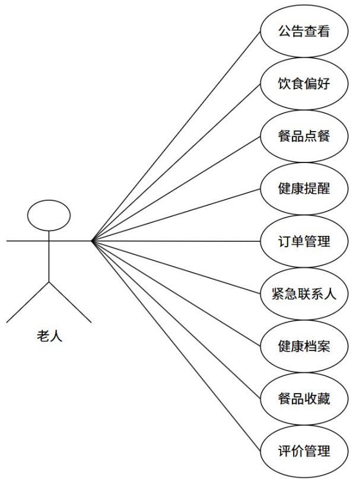  
图3-1 老人用例图

家属：老人绑定、老人健康数据、评价管理、老人健康提醒、餐品收藏、为老人订餐、消息中心、订单管理、老人消费统计；家属用例图如图 3-2 所示：

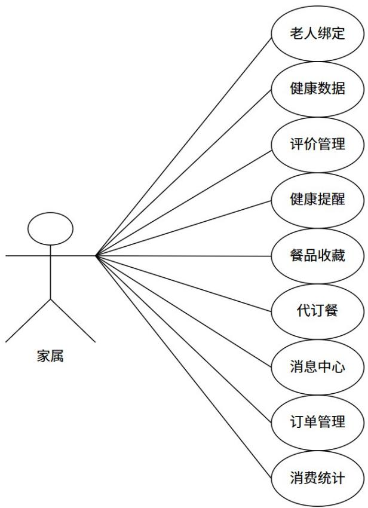  
图3-2 家属用例图

配送员端：排班管理、接单、异常处理、订单配送、导航规划、消息通知、收入统计、评价查看；配送员用例图如图 3-3 所示：

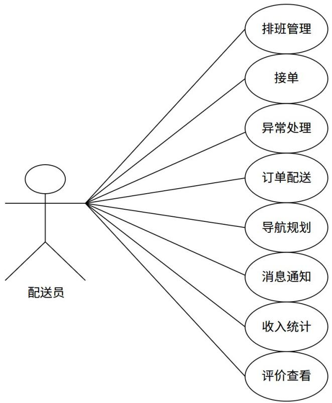  
图3-3 配送员用例图

管理员端：家属管理、老人管理、老人绑定、配送员管理、订单管理、餐品管理、社区管理、通知管理、配送员定位、配送员排班、评价管理；管理员用例图如图3-4所示：

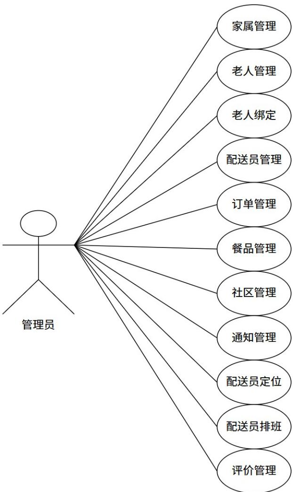  
图3-4 管理员用例图

# 3.2.2 功能流程分析

进入登录与绑定模块后，用户首先通过账号密码或微信一键登录系统；

接着系统校验是否存在已存登录凭证，若无凭证则跳转至账号注册环节，

完成注册后返回登录步骤重试，若有凭证则进一步判断账号身份；非老人

/ 家属身份的账号需切换账号重试，身份校验通过后分流为老人登录与家

属登录两条路径；其中老人登录成功后直接进入预定模块，家属登录成功

后需先校验是否已绑定老人，未绑定则执行家属绑定老人操作，绑定完成

后选择已绑定的老人，最终同样进入预定模块。该登录绑定流程如图3-5

所示。

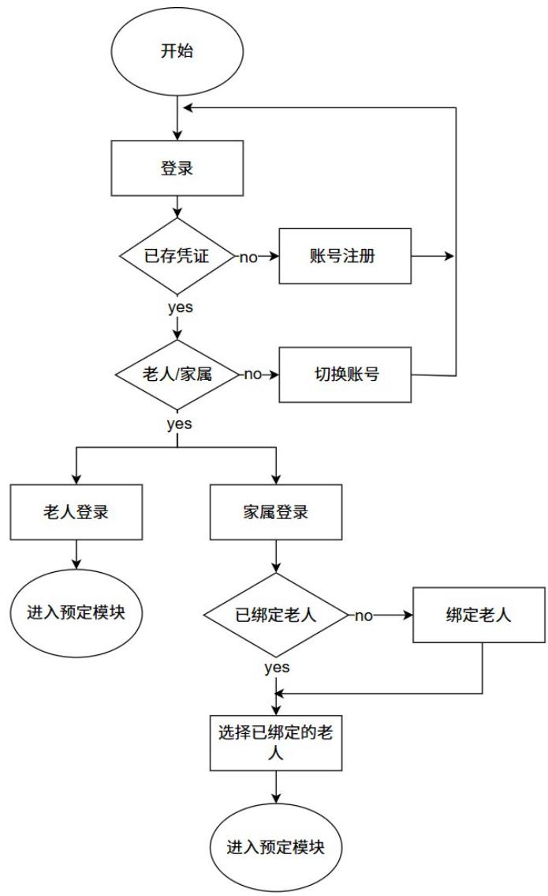  
图3-5 登录绑定流程图

在预定模块中,首先判别配送时间是否到达,若未到达,则直接进入下单模块;若配送时间已到达,再判别是否申请退款,若申请退款,则予以退款,取消订单,流程异常结束;若不退款,进入等待时间环节,然后再次循环判别时间是否到达,直至时间达标,把订单状态改为待接单,最后进入配送模块。预定流程如图 3-6 所示。

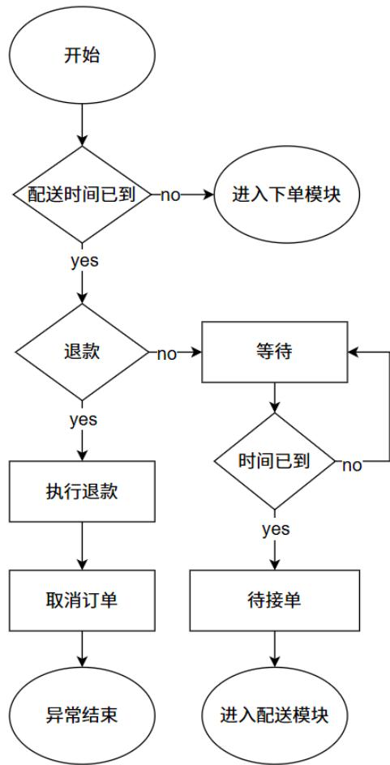  
图3-6 预定流程图

下单模块开始，用户选择餐品，选择立即下单或选择配送时间，把所

选的餐品加入到购物车中，查看购物车，确认订单信息，提交订单;提交订

单后进行支付，支付成功后订单状态变为待接单，进入配送模块，也可以

申请退款;支付失败则提示环境异常，用户处理成功则重新支付，处理失败

则取消订单，异常结束。下单流程见图 3-7。

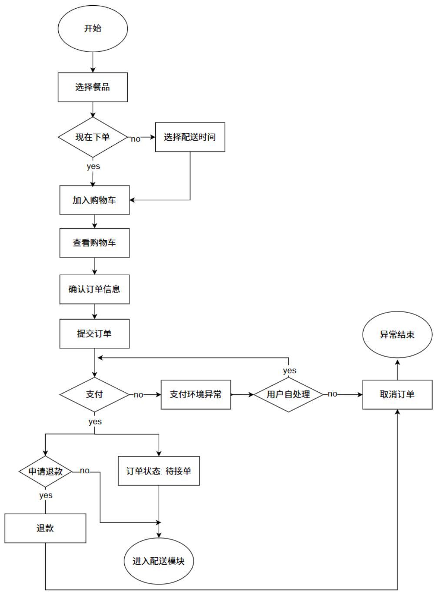  
图3-7 下单流程图

到达配送模块后，先由配送员接单，如不接单则由管理员指派接单，然后

订单状态变为配送中，配送员开始导航，位置实时更新，家属和管理员可实时

跟踪，途中如正常配送，则判断是否到达目的地，未到达则等待，到达后点击

已送达，如异常配送，上报并由管理员处理，处理结束则恢复正常流程，最后

通知用户和家属，订单状态更新为已完成，进入评价模块。配送流程如图3-8

所示。

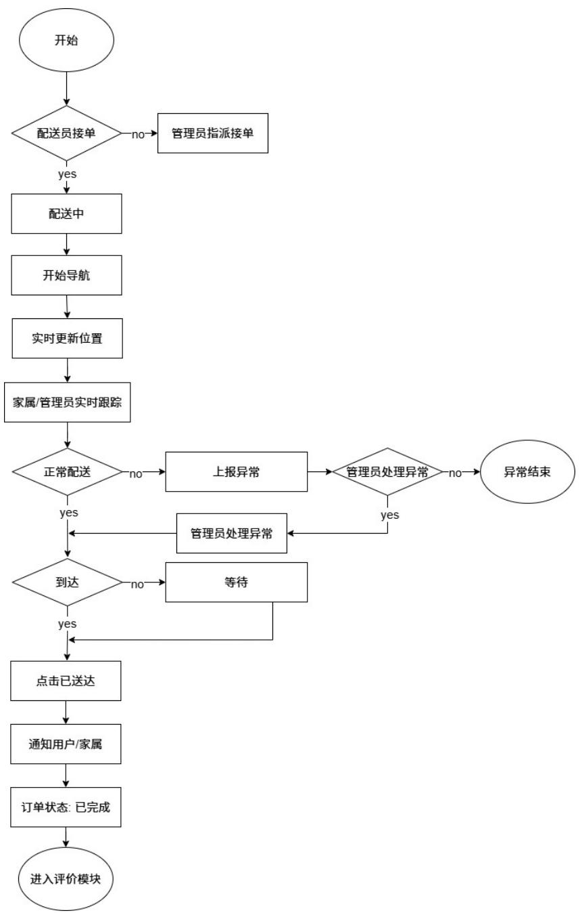  
图3-8 配送流程图

在评价环节中，系统首先判断用户是否选择评价，若不评价，直接正常结

束流程;若评价，同时对餐品进行评价和配送评价，评价完毕后，AI 马上对汇

总的评价信息进行分析，并提出相应的改进建议，最后商家(管理员端)根据建议进行改进，流程正常结束。评价流程见图 3-9。

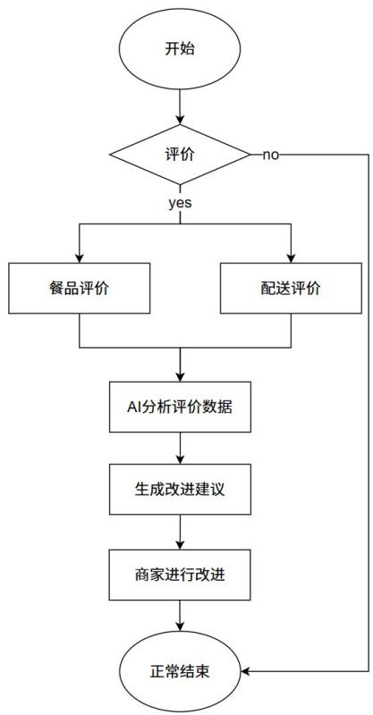  
图3-9 评价流程图

# 4 系统设计

# 4.1 系统整体设计

社区老年人餐饮服务预定、配送系统就是为社区内老年人提供便捷、高效的餐饮服务，以围绕四大角色为核心，形成从订餐到配送到后台管理的完整服

务机制，其一是老年人用户，注册登录平台后可浏览餐品，在线订餐，查看个人信息、订单信息，操作简单直观;其二是老年人家庭成员，可代老年人订餐，同时可查看配送进度，管理消费记录，通过个人中心处理相关事宜;其三是配送人员，接收分配任务，规划最佳路线，将餐品送至指定地点，也可通过专门入口查看个人工作绩效;最后是系统管理员，运用后端管理系统监控整体运营情况，包括订单、人员信息、菜单更新、社区数据等，同时发布通知，妥善处理用户反馈，使服务质量保持在最佳状态，既简化了老年人用餐流程，也增进家庭成员的安全感和信任感，还提高管理效率，系统功能结构图如图 4-1 所示。

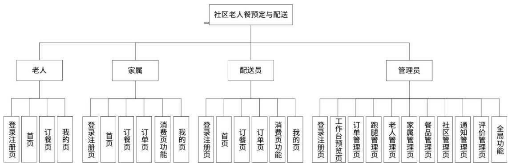  
图 4-1 系统功能结构图

# 4.1.1 老人功能设计

从老从老年人使用时的便捷性感受上，以“简单易懂、智能服务”为设计思

路:其一，“登录注册页面”是进入系统的通道，以设计简洁、明了为准则，降低老年用户第一次运用数字系统时的“学习成本”，使老年用户更容易进入系统;其二，“首页”有智能助手、个性化推荐、点餐、与配送员沟通等功能，智能助手可进行语音识别，用户用语音完成指定任务(目前该功能尚未实现);个性化推荐根据用户的健康档案信息(如高血压、糖尿病状况及其个人口味偏好记录)(目前只支持基于口味的推荐)进行合适食物的推荐，简易点餐，即时客服(暂未实现)等，保证在出现问题时用户能快速得到解决;其三，“订单详情页”有订单状态跟踪，评价，用户可随时查看自己订单的最新状态，对服务进行评价;其四，“我的页面”有个人信息，如自我健康管理，饮食习惯设置，收藏常用菜品，查看历史评价，系统通知，健康提示，紧急联络人设置等，既满足个性化需求，又为突发情况下的安全保障提供支持。老人功能结构图如图 4-2所示。

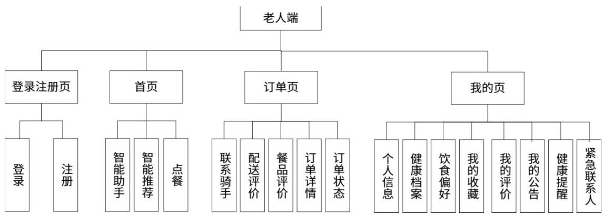  
图4-2 老人功能结构图

# 4.1.2 家属功能设计

依据家属真实需求及操作习惯，以“远程关爱、便捷管理”为设计主旨，

形成功能集中、流程清晰的系统架构:

用户先在“登录注册页”进行身份验证，然后在“首页”操作页面中选择

老人进行绑定，查看老人饮食记录，依据健康数据提出个性化建议，设置健康提醒(例如“记得按时吃药”)，实现对老人健康的远程管理;订餐时，进入“订餐页”进行点餐，下单后，可到“订单页”查看订单状态及详情，也可与配送人员沟通，对餐品及配送服务进行评价，消费页提供消费统计，老人绑定关系管理，便于家庭成员了解消费情况及管理账户间关系，我的页是综合性较强的功能模块，包括消息通知中心、个人收藏、历史反馈记录等，可满足用户不同需求，家属功能结构图见图 4-3。

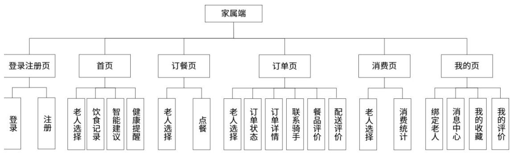  
图4-3 家属功能结构图

# 4.1.3 配送员功能设计

以配送员实际工作为切入点，以“高效配送、方便管理”为设计目标，形

成以功能模块为依托的系统结构:

配送员先在“登录注册页”进行身份验证进入系统，然后在“订单页”即配送员主要工作页面，查看订单信息，接收新订单，进行接单操作，也可与用户(老人或家属)联系，沟通配送事宜，再在配送过程中，于“导航页”查看实时地图，选择最优配送路线，如遇配送异常(如老人不在家、地址错误)可进行异常上报，最后在“我的页”查看收入明细、排班、消息、我的评价、个人信息管理，便于配送员查看收入、管理工作排班、接收系统消息、查看用户评价、管理个人信息。配送员功能结构图如图 4-4 所示。

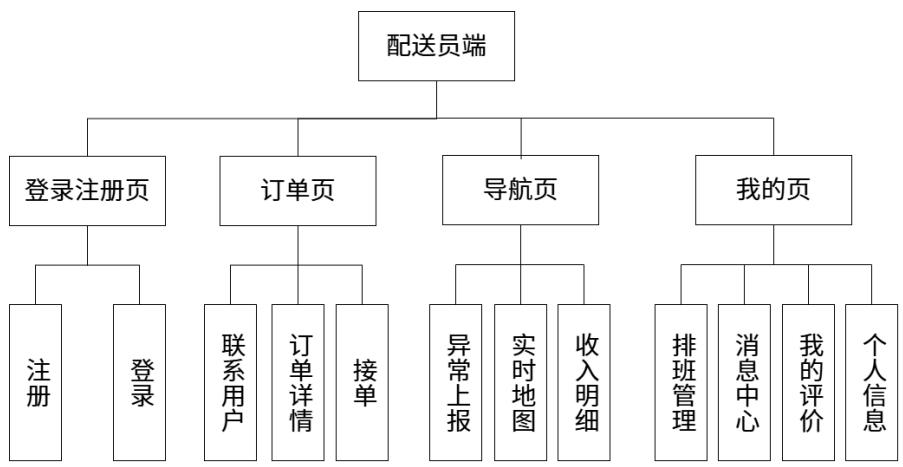  
图4-4 配送员功能结构图

# 4.1.4 管理员功能设计

以管理员真实使用为基准，以“统筹全局、高效管理”为设计目标，构建功能齐全的系统结构:其一，管理员在“登录注册页”进行登录验证，进入系统后在“工作台预览页”中，作为综合管理中心，提供快速下单、用户餐品一览、订单收益汇总等服务，让管理者及时掌握系统运行状况;其二，在“订单管理页”中，进行订单查看、配送指派、查看详情、导出数据等操作，让订单处理无缝衔接;其三，在“跑腿管理页”中，对配送员工作排班、地理位置追踪、基本信息进行增、删、改、查(CRUD)操作，以确保配送资源得到合理利用;其四，在“老人管理页”和“家属管理页”中，分别对老年人、家属的资料进行管理，包括信息展示、关联绑定等，以增加用户间的关联性;其五，在“餐品管理页”和“社区管理页”中，进行食品种类、社区服务范围基本信息的管理，以确保提供服务内容的稳定性和覆盖面;其六,在“通知管理页”中,进行系统公告的发布和管理,实现有效信息的传播;其七,在客户反馈方面,有“评价

管理页”,整合智能分析工具,进行评价回复、审核,提高服务质量;其八,在“全局功能”中,有智能助手等辅助工具,便于日常行政事务的高效完成。管理员功能结构图如图 4-5 所示。

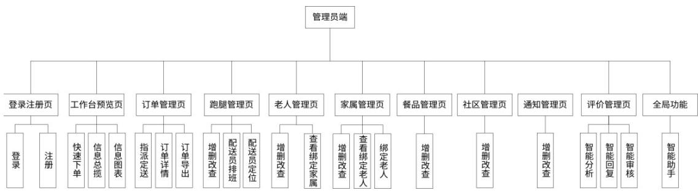  
图4-5 管理员功能结构图

# 4.2 数据库设计

# 4.2.1 实体属性设计

用户表的实体属性主要包括OpenID、用户名、密码哈希、用户类型、状态、

最后登录。用户表实体属性图如4-6图所示。

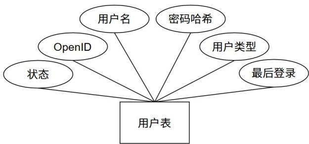  
图4-6 用户实体属性图

老人资料表的实体属性主要包括电话、姓名、用户 ID、头像、健康标签ID、社区 ID、性别、年龄、坐标位置、饮食偏好、区内地址。老人资料表实体属性图如 4-7 图所示。

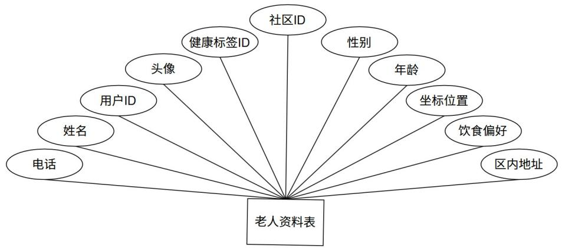  
图4-7 老人资料实体属性图

家属资料表的实体属性主要包括用户ID、姓名、头像、电话。家属资料表

实体属性图如 4-8 图所示。

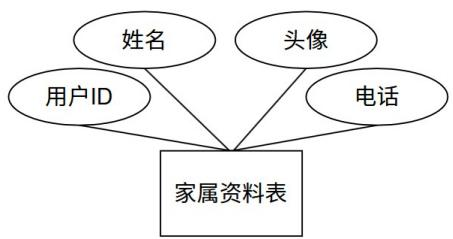  
图4-8 家属资料实体属性图

配送员资料表的实体属性主要包括车辆类型、电话、头像、用户ID、区域ID、姓名、状态、经度、纬度、更位置新时间。配送员资料表实体属性图如4-9图所示。

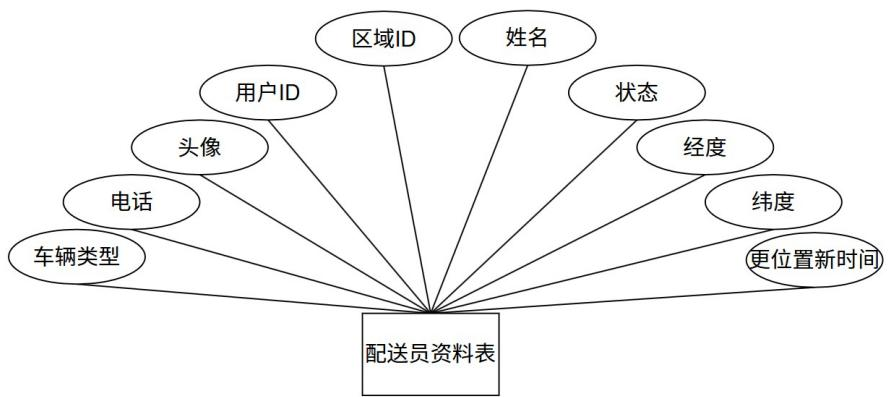  
图4-9 配送员资料实体属性图

管理员资料表的实体属性主要包括电话、姓名、用户ID。管理员资料表实

体属性图如 4-10 图所示。

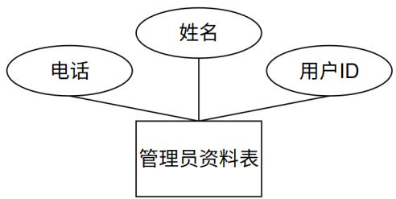  
图4-10 管理员资料实体属性图

社区表的实体属性主要包括管理者电话、状态、地址、管理者姓名、名称、

联系电话。社区表实体属性图如4-11图所示。

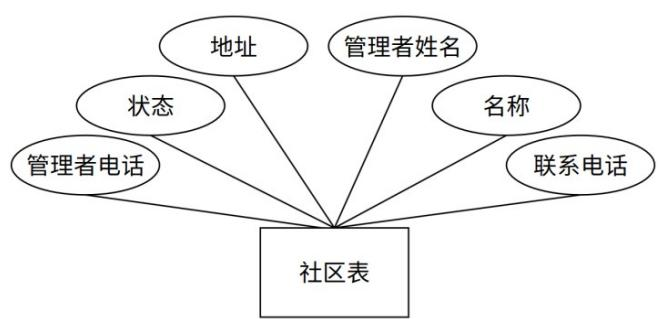  
图4-11 社区实体属性图

老人家属关系表的实体属性主要包括老人ID、成员ID、关系、是否

主要。老人家属关系表实体属性图如 4-12 图所示。

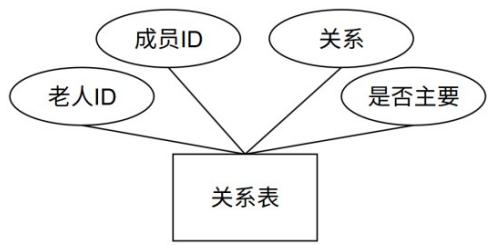  
图4-12 老人家属关系实体属性图

餐品表的实体属性主要包括名称、价格、描述、图片地址、状态、分类

ID、标签 ID。餐品表实体属性图如 4-13 图所示。

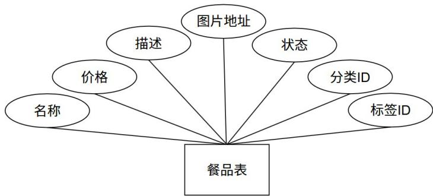  
图4-13 餐品实体属性图

订单餐品对应表的实体属性主要包括订单ID、餐品ID、数量、单价、小

计。订单餐品对应表实体属性图如 4-14 图所示。

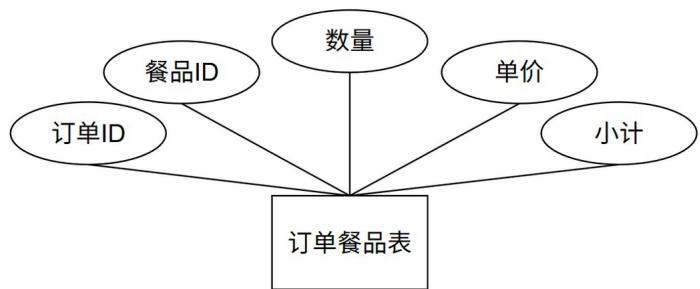  
图4-14 订单餐品对应实体属性图

订单表的实体属性主要包括订单类型、更新时间、配送地址、支付状态、

总金额、备注、支付方式、配送状态、创建时间、预定时间、老人 ID。订单

表实体属性图如 4-15 图所示。

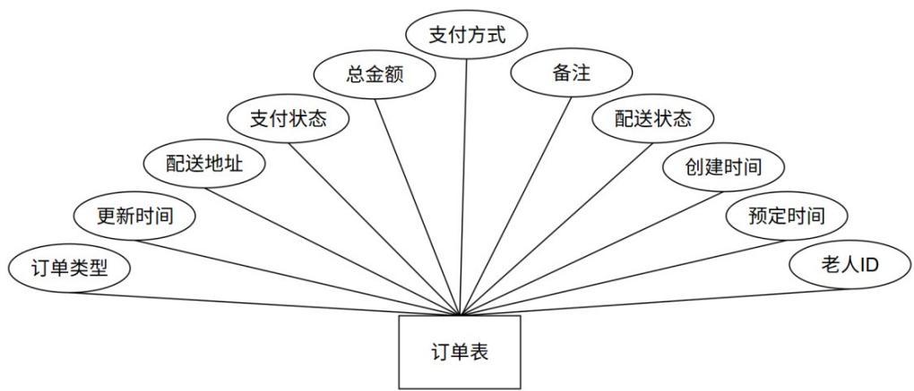  
图4-15 订单实体属性图

收藏表的实体属性主要包括老人ID、用户类型、餐品ID。收藏表实体属

性图如4-16图所示。

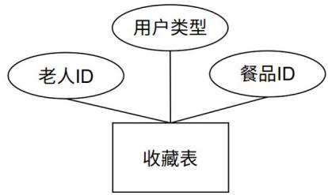  
图4-16 收藏实体属性图

配送表的实体属性主要包括订单ID、名称、配送员ID、描述、结束时间、

管理员分配、创建时间、预计时间、状态、创建时间、更新时间、实际时间。

配送表实体属性图如 4-17 图所示。

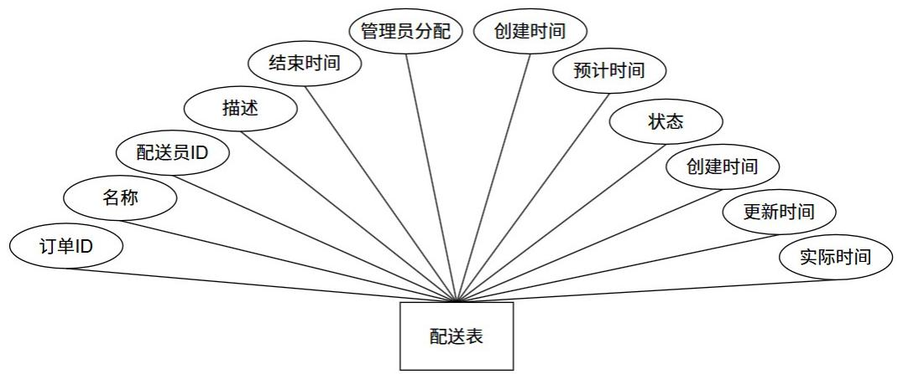  
图4-17 配送实体属性图

支付表的实体属性主要包括订单 ID、支付方式、金额、交易 ID、状态、

创建时间。支付表实体属性图如 4-18 图所示。

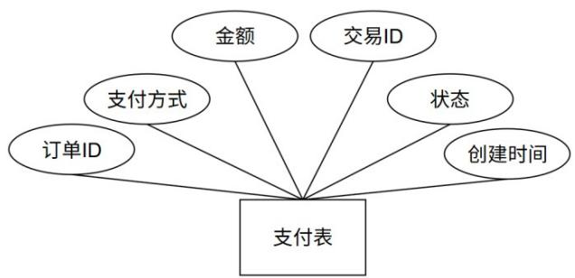  
图4-18 支付实体属性图

紧急呼叫表的实体属性主要包括老人ID、紧急类型、消息、创建时间、响

应状态、响应时间。紧急呼叫表实体属性图如 4-19 图所示。

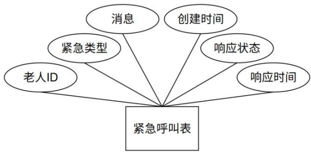  
图 4-19 紧急呼叫实体属性图

评价表的实体属性主要包括是否AI回复、图片/视频、评价者类型、评分、

订单 ID、配送员 ID、老人 ID、内容、状态、回复、是否 AI 审核。评价表实

体属性图如4-20图所示。

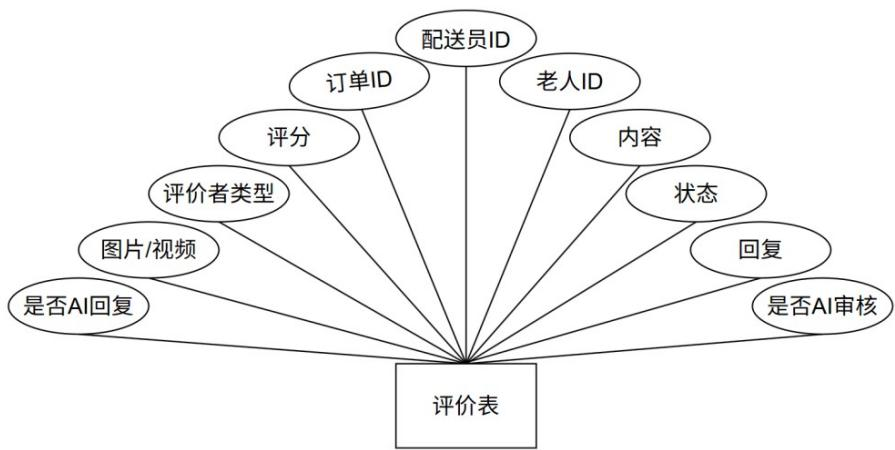  
图4-20 评价实体属性图

健康记录表的实体属性主要包括血压、体重、老人ID、身高、过敏史、创

建者、用药情况、医生建议、记录时间、血糖。健康记录表实体属性图如4-

21图所示。

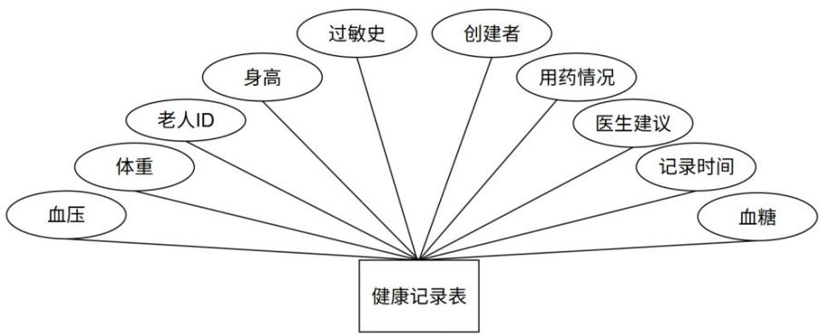  
图4-21 健康记录实体属性图

配送员排班表的实体属性主要包括员工ID、排班日期、备注、时间段、状

态。配送员排班表实体属性图如 4-22 图所示。

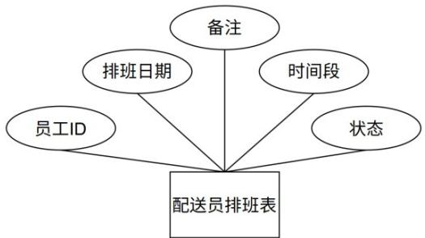  
图4-22 配送员排班实体属性图

异常记录表的实体属性主要包括配送ID、类型、描述、创建时间。异常记

录表实体属性图如 4-23 图所示。

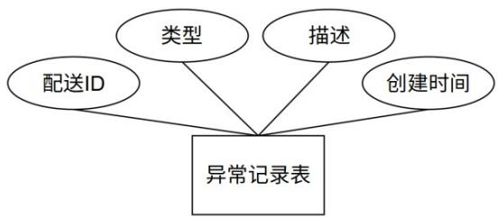  
图 4-23 异常记录实体属性图

公告表的实体属性主要包括内容、类型、标题、优先级、状态。公

告表实体属性图如 4-24 图所示。

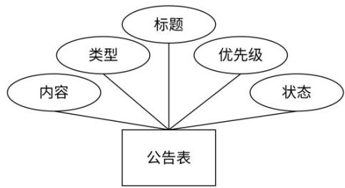  
图 4-24 公告实体属性图

健康提醒表的实体属性主要包括发送时间、家属ID、老人ID、读取

时间、提醒类型、内容、状态、预定时间。健康提醒表实体属性图如4-25图所示。

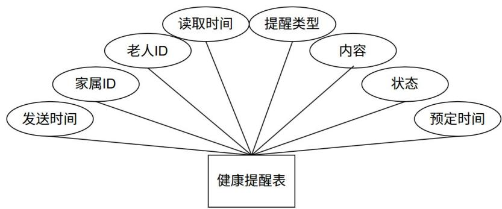  
图4-25 健康提醒实体属性图

# 4.2.2 逻辑模型设计

为了把业务上抽象的业务需求转换为实际可运用的数据库，逻辑模型设计是必不可少的步骤。逻辑模型是业务需求与实际物理实现的桥梁，对各实体间的关系、结构进行明确的定义，直接用于系统数据库设计。

为直观反映逻辑模型设计成果，图 4-26 所示为系统数据库实体关系(ER)图，

ER图包括20多个实体及实体间联系，其中用户表是基础表，与老人资料表、

家属资料表、配送员资料表、管理员资料表之间以“一对一”的关系实现对各

种用户类型的统一管理，其他实体围绕用户表布局，构成完整系统的数据结构。

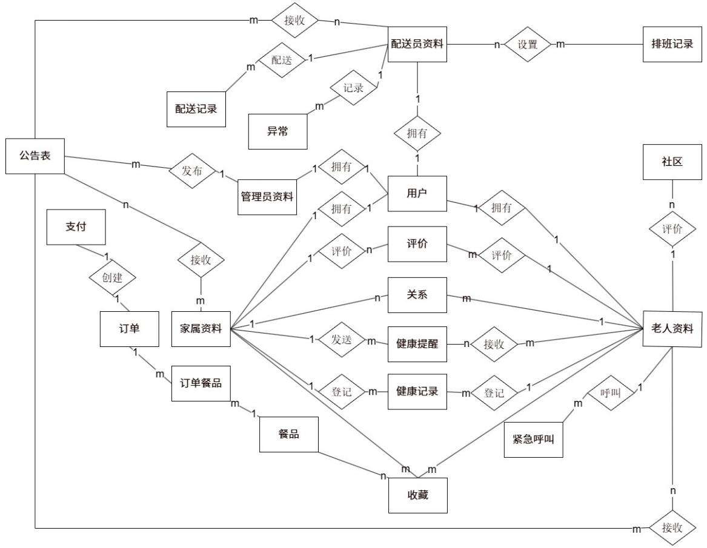  
图4-26实体关系图

# 4.2.3 数据库结构设计

在逻辑模型设计完成以后，下一步就是把实体关系图中表示的抽象实体及实体间关系转化为数据库表结构，进入数据库结构设计阶段。

逻辑模型用ER图对实体间关系进行高层次概括描述;数据库结构设计是这种概念模型的实现，即把各实体转化为相应的表格，把实体间关系转化为外键约束，把属性转化为字段，还须确定每个字段的数据类型、长度、各种约束条件等物理属性，这一阶段设计工作直接关系到数据库最终存储形式及操作性能，是从逻辑层次向实际系统构建不可缺省的一环。

用 户 表 实 体 属 性 为 ：主 键（ id）、 用 户 名（username）、 密码 哈希

（ password_hash ） 、 用 户 类 型 （ user_type ） 、 状 态 （ status ） 、 创 建 时 间

（created_at）、更新时间（updated_at）、邮箱（email）、最后登录时间

（last_login）、微信 openid（openid）、微信 unionid（unionid）。如表 4-27

所示。

表 4-27 用户表  

<table><tr><td>字段名称</td><td>类型</td><td>长度</td><td>字段说明</td><td>是否主键</td><td>是否默认值</td></tr><tr><td>id</td><td>integer</td><td>-</td><td>主键</td><td>是</td><td>否</td></tr><tr><td>username</td><td>character varying</td><td>50</td><td>用户名</td><td>否</td><td>否</td></tr><tr><td>password_hash</td><td>character varying</td><td>255</td><td>密码哈希</td><td>否</td><td>否</td></tr><tr><td>user_type</td><td>character varying</td><td>20</td><td>用户类型</td><td>否</td><td>否</td></tr><tr><td>status</td><td>character varying</td><td>20</td><td>状态</td><td>否</td><td>是</td></tr><tr><td>created_at</td><td>timestamp with time zone</td><td>-</td><td>创建时间</td><td>否</td><td>是</td></tr><tr><td>updated_at</td><td>timestamp with time zone</td><td>-</td><td>更新时间</td><td>否</td><td>是</td></tr><tr><td>email</td><td>character varying</td><td>100</td><td>邮箱</td><td>否</td><td>否</td></tr><tr><td>last_login</td><td>timestamp with time zone</td><td>-</td><td>最后登录时间</td><td>否</td><td>否</td></tr><tr><td>openid</td><td>character varying</td><td>100</td><td>微信 openid</td><td>否</td><td>否</td></tr><tr><td>unionid</td><td>character varying</td><td>100</td><td>微信 unionid</td><td>否</td><td>否</td></tr></table>

老 人 资 料 表 实 体 属 性 为 ： 用 户 ID （ user_id ） 、 姓 名 （ name ） 、 电 话

（ phone ） 、 地 址 （ address ） 、 饮 食 偏 好 （ dietary_preferences ） 、 位 置

（location）、年龄（age）、性别（gender）、创建时间（created_at）、更新

时 间 （ updated_at ） 、 社 区 ID （ community_id ） 、 健 康 标 签

ID（health_tag_id）、头像（avatar）。如表 4-28 所示。

表4-28 老人资料表  

<table><tr><td>字段名称</td><td>类型</td><td>长度</td><td>字段说明</td><td>是否主键</td><td>是否默认值</td></tr><tr><td>user_id</td><td>integer</td><td>-</td><td>用户ID</td><td>是</td><td>否</td></tr><tr><td>name</td><td>character varying</td><td>50</td><td>姓名</td><td>否</td><td>否</td></tr><tr><td>phone</td><td>character varying</td><td>20</td><td>电话</td><td>否</td><td>否</td></tr><tr><td>address</td><td>character varying</td><td>255</td><td>地址</td><td>否</td><td>否</td></tr><tr><td>dietary Preferences</td><td>text</td><td>-</td><td>饮食偏好</td><td>否</td><td>否</td></tr><tr><td>location</td><td>public.geography(Point,4326)</td><td>-</td><td>位置</td><td>否</td><td>否</td></tr><tr><td>age</td><td>integer</td><td>-</td><td>年龄</td><td>否</td><td>否</td></tr><tr><td>gender</td><td>character varying</td><td>10</td><td>性别</td><td>否</td><td>否</td></tr><tr><td>created_at</td><td>timestamp with time zone</td><td>-</td><td>创建时间</td><td>否</td><td>是</td></tr><tr><td>updated_at</td><td>timestamp with time zone</td><td>-</td><td>更新时间</td><td>否</td><td>是</td></tr><tr><td>community_id</td><td>integer</td><td>-</td><td>社区ID</td><td>否</td><td>否</td></tr><tr><td>health_tag_id</td><td>integer</td><td>-</td><td>健康标签ID</td><td>否</td><td>否</td></tr><tr><td>ayar</td><td>character varying</td><td>255</td><td>头像</td><td>否</td><td>否</td></tr></table>

家 属 资 料 表 实 体 属 性 为 ： 用 户 ID （ user_id ） 、 姓 名 （ name ） 、 电 话

（ phone ） 、 创 建 时 间 （ created_at ） 、 更 新 时 间 （ updated_at ） 、 头 像

（avatar）。如表 4-29 所示。

表4-29 家属资料表  

<table><tr><td>字段名称</td><td>类型</td><td>长度</td><td>字段说明</td><td>是否主键</td><td>是否默认值</td></tr><tr><td>user_id</td><td>integer</td><td>-</td><td>用户ID</td><td>是</td><td>否</td></tr><tr><td>name</td><td>character varying</td><td>50</td><td>姓名</td><td>否</td><td>否</td></tr><tr><td>phone</td><td>character varying</td><td>20</td><td>电话</td><td>否</td><td>否</td></tr><tr><td>created_at</td><td>timestamp with time zone</td><td>-</td><td>创建时间</td><td>否</td><td>是</td></tr><tr><td>updated_at</td><td>timestamp with time zone</td><td>-</td><td>更新时间</td><td>否</td><td>是</td></tr><tr><td>ayar</td><td>character varying</td><td>255</td><td>头像</td><td>否</td><td>否</td></tr></table>

配送员资料表实体属性为：用户 ID（user_id）、姓名（name）、电话

（ phone ） 、 交 通 工 具 类 型 （ vehicle_type ） 、 状 态 （ status ） 、 创 建 时 间

（ created_at ） 、 更 新 时 间 （ updated_at ） 、 区 域 ID （ area_id ） 、 头 像

（ avatar ） 、 纬 度 （ latitude ） 、 经 度 （ longitude ） 、 位 置 更 新 时 间

（location_updated_at）。如表 4-30 所示。

表4-30 配送员资料表  

<table><tr><td>字段名称</td><td>类型</td><td>长度</td><td>字段说明</td><td>是否主键</td><td>是否默认值</td></tr><tr><td>user_id</td><td>integer</td><td>-</td><td>用户ID</td><td>是</td><td>否</td></tr><tr><td>name</td><td>character varying</td><td>50</td><td>姓名</td><td>否</td><td>否</td></tr><tr><td>phone</td><td>character varying</td><td>20</td><td>电话</td><td>否</td><td>否</td></tr><tr><td>vehicle_type</td><td>character varying</td><td>50</td><td>交通工具类型</td><td>否</td><td>否</td></tr><tr><td>status</td><td>character varying</td><td>20</td><td>状态</td><td>否</td><td>是</td></tr><tr><td>created_at</td><td>timestamp with time zone</td><td>-</td><td>创建时间</td><td>否</td><td>是</td></tr><tr><td>updated_at</td><td>timestamp with time zone</td><td>-</td><td>更新时间</td><td>否</td><td>是</td></tr><tr><td>area_id</td><td>integer</td><td>-</td><td>区域ID</td><td>否</td><td>否</td></tr><tr><td>ayar</td><td>character varying</td><td>255</td><td>头像</td><td>否</td><td>否</td></tr><tr><td>latitude</td><td>character varying</td><td>20</td><td>纬度</td><td>否</td><td>否</td></tr><tr><td>longitude</td><td>character varying</td><td>20</td><td>经度</td><td>否</td><td>否</td></tr><tr><td>location UPDATED_AT</td><td>timestamp with time zone</td><td>-</td><td>位置更新时间</td><td>否</td><td>否</td></tr></table>

管理员档案表实体属性为：用户 ID（user_id）、姓名（name）、电话

（phone）、创建时间（created_at）、更新时间（updated_at）。如表 4-31 所示。

表4-31 管理员资料表  

<table><tr><td>字段名称</td><td>类型</td><td>长度</td><td>字段说明</td><td>是否主键</td><td>是否默认值</td></tr><tr><td>user_id</td><td>integer</td><td>-</td><td>用户ID</td><td>是</td><td>否</td></tr><tr><td>name</td><td>character varying</td><td>50</td><td>姓名</td><td>否</td><td>否</td></tr><tr><td>phone</td><td>character varying</td><td>20</td><td>电话</td><td>否</td><td>否</td></tr><tr><td>created_at</td><td>timestamp with time zone</td><td>-</td><td>创建时间</td><td>否</td><td>是</td></tr><tr><td>updated_at</td><td>timestamp with time zone</td><td>-</td><td>更新时间</td><td>否</td><td>是</td></tr></table>

社区表实体属性为：主键（id）、名称（name）、地址（address）、联系电

话 （ contact_phone ） 、 负 责 人 姓 名 （ manager_name ） 、 负 责 人 电 话

（manager_phone）、创建时间（created_at）、更新时间（updated_at）、状态

（status）。如表 4-32 所示。

表 4-32 社区表

表4-33 老人家属关系表  

<table><tr><td>字段名称</td><td>类型</td><td>长度</td><td>字段说明</td><td>是否主键</td><td>是否默认值</td></tr><tr><td>id</td><td>integer</td><td>-</td><td>主键</td><td>是</td><td>否</td></tr><tr><td>name</td><td>character varying</td><td>100</td><td>名称</td><td>否</td><td>否</td></tr><tr><td>address</td><td>character varying</td><td>255</td><td>地址</td><td>否</td><td>否</td></tr><tr><td>contact_phone</td><td>character varying</td><td>20</td><td>联系电话</td><td>否</td><td>否</td></tr><tr><td>manager_name</td><td>character varying</td><td>50</td><td>负责人姓名</td><td>否</td><td>否</td></tr><tr><td>manager_phone</td><td>character varying</td><td>20</td><td>负责人电话</td><td>否</td><td>否</td></tr><tr><td>created_at</td><td>timestamp with time zone</td><td>-</td><td>创建时间</td><td>否</td><td>是</td></tr><tr><td>updated_at</td><td>timestamp with time zone</td><td>-</td><td>更新时间</td><td>否</td><td>是</td></tr><tr><td>status</td><td>character varying</td><td>20</td><td>状态</td><td>否</td><td>否</td></tr></table>

老人家属关系表实体属性为：主键（id）、老年人ID（elder_id）、家庭成

员 ID（member_id）、关系（relationship）、是否主要联系人（is_primary）、

创建时间（created_at）、更新时间（updated_at）。如表 4-33 所示。

<table><tr><td>字段名称</td><td>类型</td><td>长度</td><td>字段说明</td><td>是否主键</td><td>是否默认值</td></tr><tr><td>id</td><td>integer</td><td>-</td><td>主键</td><td>是</td><td>否</td></tr><tr><td>elder_id</td><td>integer</td><td>-</td><td>老年人ID</td><td>否</td><td>否</td></tr><tr><td>member_id</td><td>integer</td><td>-</td><td>家庭成员ID</td><td>否</td><td>否</td></tr><tr><td>relationship</td><td>character varying</td><td>50</td><td>关系</td><td>否</td><td>否</td></tr><tr><td>is_primary</td><td>boolean</td><td>-</td><td>是否主要联系人</td><td>否</td><td>是</td></tr><tr><td>created_at</td><td>timestamp with time zone</td><td>-</td><td>创建时间</td><td>否</td><td>是</td></tr><tr><td>updated_at</td><td>timestamp with time zone</td><td>-</td><td>更新时间</td><td>否</td><td>是</td></tr></table>

餐品表实体属性为：主键（id）、名称（name）、价格（price）、描述

（description）、特殊标签（special_tag）、图片 URL（image_url）、状态

（ status ） 、 创 建 时 间 （ created_at ） 、 更 新 时 间 （ updated_at ） 、 分 类

ID（category_id）、标签 ID（tag_id）。如表 4-34 所示。

表 4-34 餐品表  

<table><tr><td>字段名称</td><td>类型</td><td>长度</td><td>字段说明</td><td>是否主键</td><td>是否默认值</td></tr><tr><td>id</td><td>integer</td><td>-</td><td>主键</td><td>是</td><td>否</td></tr><tr><td>name</td><td>character varying</td><td>100</td><td>名称</td><td>否</td><td>否</td></tr><tr><td>price</td><td>numeric(10,2)</td><td>-</td><td>价格</td><td>否</td><td>否</td></tr><tr><td>description</td><td>text</td><td>-</td><td>描述</td><td>否</td><td>否</td></tr><tr><td>special_tag</td><td>character varying</td><td>50</td><td>特殊标签</td><td>否</td><td>否</td></tr><tr><td>image_url</td><td>character varying</td><td>255</td><td>图片URL</td><td>否</td><td>否</td></tr><tr><td>status</td><td>character varying</td><td>20</td><td>状态</td><td>否</td><td>是</td></tr><tr><td>created_at</td><td>timestamp with time zone</td><td>-</td><td>创建时间</td><td>否</td><td>是</td></tr><tr><td>updated_at</td><td>timestamp with time zone</td><td>-</td><td>更新时间</td><td>否</td><td>是</td></tr><tr><td>category_id</td><td>integer</td><td>-</td><td>分类ID</td><td>否</td><td>否</td></tr><tr><td>tag_id</td><td>integer</td><td>-</td><td>标签ID</td><td>否</td><td>否</td></tr></table>

订单餐品对应表实体属性为：主键（id）、订单 ID（order_id）、餐品

ID（meal_id）、数量（quantity）、单价（unit_price）、小计（subtotal）、创

建时间（created_at）。如表 4-35 所示。

表4-35 订单餐品对应表

表 4-36 订单表  

<table><tr><td>字段名称</td><td>类型</td><td>长度</td><td>字段说明</td><td>是否主键</td><td>是否默认值</td></tr><tr><td>id</td><td>integer</td><td>-</td><td>主键</td><td>是</td><td>否</td></tr><tr><td>order_id</td><td>integer</td><td>-</td><td>订单ID</td><td>否</td><td>否</td></tr><tr><td>meal_id</td><td>integer</td><td>-</td><td>餐品ID</td><td>否</td><td>否</td></tr><tr><td>quantity</td><td>integer</td><td>-</td><td>数量</td><td>否</td><td>否</td></tr><tr><td>unit_price</td><td>numeric(10,2)</td><td>-</td><td>单价</td><td>否</td><td>否</td></tr><tr><td>subtotal</td><td>numeric(10,2)</td><td>-</td><td>小计</td><td>否</td><td>否</td></tr><tr><td>created_at</td><td>timestamp with time zone</td><td>-</td><td>创建时间</td><td>否</td><td>是</td></tr></table>

订单表实体属性为：主键（id）、老年人 ID（elderly_id）、总金额

（total_amount）、支付方式（payment_method）、支付状态

（payment_status）、状态（status）、配送地址（delivery_address）、备注

（notes）、创建时间（created_at）、更新时间（updated_at）、预定时间

（scheduled_time）、订单类型（order_type）。如表 4-36 所示。

<table><tr><td>字段名称</td><td>类型</td><td>长度</td><td>字段说明</td><td>是否主键</td><td>是否默认值</td></tr><tr><td>id</td><td>integer</td><td>-</td><td>主键</td><td>是</td><td>否</td></tr><tr><td>elderly_id</td><td>integer</td><td>-</td><td>老年人ID</td><td>否</td><td>否</td></tr><tr><td>total_amount</td><td>numeric(10,2)</td><td>-</td><td>总金额</td><td>否</td><td>否</td></tr><tr><td>payment_method</td><td>character varying</td><td>50</td><td>支付方式</td><td>否</td><td>否</td></tr><tr><td>payment_status</td><td>character varying</td><td>20</td><td>支付状态</td><td>否</td><td>是</td></tr><tr><td>status</td><td>character varying</td><td>20</td><td>状态</td><td>否</td><td>是</td></tr><tr><td>delivery_address</td><td>character varying</td><td>255</td><td>配送地址</td><td>否</td><td>否</td></tr><tr><td>notes</td><td>text</td><td>-</td><td>备注</td><td>否</td><td>否</td></tr><tr><td>created_at</td><td>timestamp with time zone</td><td>-</td><td>创建时间</td><td>否</td><td>是</td></tr><tr><td>updated_at</td><td>timestamp with time zone</td><td>-</td><td>更新时间</td><td>否</td><td>是</td></tr><tr><td>scheduled_time</td><td>timestamp with time zone</td><td>-</td><td>预定时间</td><td>否</td><td>否</td></tr><tr><td>order_type</td><td>character varying</td><td>20</td><td>订单类型</td><td>否</td><td>是</td></tr></table>

收藏表实体属性为：主键（id）、用户 ID（user_id）、用户类型

（user_type）、餐品 ID（meal_id）、创建时间（created_at）。如表 4-37 所示。

表 4-37 收藏表  

<table><tr><td>字段名称</td><td>类型</td><td>长度</td><td>字段说明</td><td>是否主键</td><td>是否默认值</td></tr><tr><td>id</td><td>integer</td><td>-</td><td>主键</td><td>是</td><td>否</td></tr><tr><td>user_id</td><td>integer</td><td>-</td><td>用户ID</td><td>否</td><td>否</td></tr><tr><td>user_type</td><td>character varying</td><td>20</td><td>用户类型</td><td>否</td><td>否</td></tr><tr><td>meal_id</td><td>integer</td><td>-</td><td>餐品ID</td><td>否</td><td>否</td></tr><tr><td>created_at</td><td>timestamp with time zone</td><td>-</td><td>创建时间</td><td>否</td><td>是</td></tr></table>

配送表实体属性为：主键（id）、订单 ID（order_id）、配送员

ID（deliverer_id）、结束时间（end_time）、预计时间（estimated_time）、状

态（status）、创建时间（created_at）、更新时间（updated_at）、实际时间

（actual_time）、是否由管理员分配（is_assigned_by_admin）等。如表 4-38 所示。

表 4-38 配送表

表 4-39 支付表  

<table><tr><td>字段名称</td><td>类型</td><td>长度</td><td>字段说明</td><td>是否主键</td><td>是否默认值</td></tr><tr><td>id</td><td>integer</td><td>-</td><td>主键</td><td>是</td><td>否</td></tr><tr><td>order_id</td><td>integer</td><td>-</td><td>订单ID</td><td>否</td><td>否</td></tr><tr><td>deliverer_id</td><td>integer</td><td>-</td><td>配送员ID</td><td>否</td><td>否</td></tr><tr><td>end_time</td><td>timestamp with time zone</td><td>-</td><td>结束时间</td><td>否</td><td>否</td></tr><tr><td>estimated_time</td><td>timestamp with time zone</td><td>-</td><td>预计时间</td><td>否</td><td>否</td></tr><tr><td>status</td><td>character varying</td><td>20</td><td>状态</td><td>否</td><td>否</td></tr><tr><td>created_at</td><td>timestamp with time zone</td><td>-</td><td>创建时间</td><td>否</td><td>是</td></tr><tr><td>updated_at</td><td>timestamp with time zone</td><td>-</td><td>更新时间</td><td>否</td><td>是</td></tr><tr><td>actual_time</td><td>timestamp with time zone</td><td>-</td><td>实际时间</td><td>否</td><td>否</td></tr><tr><td>is Assigned_by_admin</td><td>boolean</td><td>-</td><td>是否由管理员分配</td><td>否</td><td>是</td></tr></table>

支付表 实 体 属 性 为 ：主 键（id）、 订单 ID（order_id）、支付方 式

（payment_method）、金额（ amount）、 交易 ID（transaction_id）、状态

（status）、创建时间（created_at）。如表 4-39 所示。

<table><tr><td>字段名称</td><td>类型</td><td>长度</td><td>字段说明</td><td>是否主键</td><td>是否默认值</td></tr><tr><td>id</td><td>integer</td><td>-</td><td>主键</td><td>是</td><td>否</td></tr><tr><td>order_id</td><td>integer</td><td>-</td><td>订单ID</td><td>否</td><td>否</td></tr><tr><td>payment_method</td><td>character varying</td><td>50</td><td>支付方式</td><td>否</td><td>否</td></tr><tr><td>amount</td><td>double precision</td><td>-</td><td>金额</td><td>否</td><td>否</td></tr><tr><td>transaction_id</td><td>character varying</td><td>100</td><td>交易ID</td><td>否</td><td>否</td></tr><tr><td>status</td><td>character varying</td><td>20</td><td>状态</td><td>否</td><td>否</td></tr><tr><td>created_at</td><td>timestamp with time zone</td><td>-</td><td>创建时间</td><td>否</td><td>是</td></tr></table>

紧急呼叫表实体属性为：主键（id）、老年人ID（elderly_id）、紧急类型

（emergency_type）、消息（message）、响应状态（response_status）、响应

时间（response_time）、创建时间（created_at）。如表 4-40 所示。

表 4-40 紧急呼叫表  

<table><tr><td>字段名称</td><td>类型</td><td>长度</td><td>字段说明</td><td>是否主键</td><td>是否默认值</td></tr><tr><td>id</td><td>integer</td><td>-</td><td>主键</td><td>是</td><td>否</td></tr><tr><td>elderly_id</td><td>integer</td><td>-</td><td>老年人ID</td><td>否</td><td>否</td></tr><tr><td>emergency_type</td><td>character varying</td><td>50</td><td>紧急类型</td><td>否</td><td>否</td></tr><tr><td>message</td><td>text</td><td>-</td><td>消息</td><td>否</td><td>否</td></tr><tr><td>response_status</td><td>character varying</td><td>20</td><td>响应状态</td><td>否</td><td>是</td></tr><tr><td>response_time</td><td>timestamp with time zone</td><td>-</td><td>响应时间</td><td>否</td><td>否</td></tr><tr><td>created_at</td><td>timestamp with time zone</td><td>-</td><td>创建时间</td><td>否</td><td>是</td></tr></table>

评 价 表 实 体 属 性 为 ： 主 键 （ id ） 、 订 单 ID （ order_id ） 、 老 年 人

ID （ elderly_id ） 、 评 分 （ rating ） 、 内 容 （ content ） 、 创 建 时 间

（created_at）、状态（status）、图片（images）、更新时间（updated_at）、

回复（reply）、AI 审核（ai_reviewed）、AI 回复（ai_replied）、 配 送 员

ID（deliverer_id）、评价者类型（reviewer_type）等。如表 4-41 所示。

表 4-41 评价表  

<table><tr><td>字段名称</td><td>类型</td><td>长度</td><td>字段说明</td><td>是否主键</td><td>是否默认值</td></tr><tr><td>id</td><td>integer</td><td>-</td><td>主键</td><td>是</td><td>否</td></tr><tr><td>order_id</td><td>integer</td><td>-</td><td>订单ID</td><td>否</td><td>否</td></tr><tr><td>elderly_id</td><td>integer</td><td>-</td><td>老年人ID</td><td>否</td><td>否</td></tr><tr><td>rating</td><td>integer</td><td>-</td><td>评分</td><td>否</td><td>否</td></tr><tr><td>content</td><td>text</td><td>-</td><td>内容</td><td>否</td><td>否</td></tr><tr><td>created_at</td><td>timestamp with time zone</td><td>-</td><td>创建时间</td><td>否</td><td>是</td></tr><tr><td>status</td><td>character varying</td><td>20</td><td>状态</td><td>否</td><td>是</td></tr><tr><td>images</td><td>text[]</td><td>-</td><td>图片</td><td>否</td><td>否</td></tr><tr><td>updated_at</td><td>timestamp with time zone</td><td>-</td><td>更新时间</td><td>否</td><td>否</td></tr><tr><td>reply</td><td>text</td><td>-</td><td>回复</td><td>否</td><td>否</td></tr><tr><td>aireviewed</td><td>integer</td><td>-</td><td>AI审核</td><td>否</td><td>是</td></tr><tr><td>ai_replied</td><td>integer</td><td>-</td><td>AI回复</td><td>否</td><td>是</td></tr><tr><td>deliverer_id</td><td>integer</td><td>-</td><td>配送员ID</td><td>否</td><td>否</td></tr><tr><td>reviewer_type</td><td>character varying</td><td>20</td><td>评价者类型</td><td>否</td><td>否</td></tr></table>

健 康记录表 实 体 属 性 为 ：主键（ id）、 老 年 人 ID（elderly_id）、身高

（ height ） 、 体 重 （ weight ） 、 血 压 （ blood_pressure ） 、 血 糖

（blood_sugar）、过敏史（allergies）、 medications（medications）、医嘱

（doctor_advice）、记录时间（recorded_at）、创建者（created_by）。如表 4-

42 所示。

表4-42健康记录表  

<table><tr><td>字段名称</td><td>类型</td><td>长度</td><td>字段说明</td><td>是否主键</td><td>是否默认值</td></tr><tr><td>id</td><td>integer</td><td>-</td><td>主键</td><td>是</td><td>否</td></tr><tr><td>elderly_id</td><td>integer</td><td>-</td><td>老年人ID</td><td>否</td><td>否</td></tr><tr><td>height</td><td>numeric(5,2)</td><td>-</td><td>身高</td><td>否</td><td>否</td></tr><tr><td>weight</td><td>numeric(5,2)</td><td>-</td><td>体重</td><td>否</td><td>否</td></tr><tr><td>blood_pressure</td><td>character varying</td><td>20</td><td>血压</td><td>否</td><td>否</td></tr><tr><td>blood_sugar</td><td>numeric(5,2)</td><td>-</td><td>血糖</td><td>否</td><td>否</td></tr><tr><td>allergies</td><td>text</td><td>-</td><td>过敏史</td><td>否</td><td>否</td></tr><tr><td>medications</td><td>text</td><td>-</td><td>medications</td><td>否</td><td>否</td></tr><tr><td>doctor_advice</td><td>text</td><td>-</td><td>医嘱</td><td>否</td><td>否</td></tr><tr><td>recorded_at</td><td>timestamp with time zone</td><td>-</td><td>记录时间</td><td>否</td><td>是</td></tr><tr><td>created_by</td><td>integer</td><td>-</td><td>创建者</td><td>否</td><td>否</td></tr></table>

配 送 员排班表 实 体 属 性 为 ：主键（id）、 员 工 ID（staff_id）、日期

（schedule_date）、时间段（time_slot）、状态（status）、备注（note）、创

建时间（created_at）、更新时间（updated_at）。如表 4-43 所示。

表4-43配送员排班表  

<table><tr><td>字段名称</td><td>类型</td><td>长度</td><td>字段说明</td><td>是否主键</td><td>是否默认值</td></tr><tr><td>id</td><td>integer</td><td>-</td><td>主键</td><td>是</td><td>否</td></tr><tr><td>staff_id</td><td>integer</td><td>-</td><td>员工ID</td><td>否</td><td>否</td></tr><tr><td>schedule_date</td><td>date</td><td>-</td><td>日期</td><td>否</td><td>否</td></tr><tr><td>time_slot</td><td>character varying</td><td>20</td><td>时间段</td><td>否</td><td>否</td></tr><tr><td>status</td><td>character varying</td><td>20</td><td>状态</td><td>否</td><td>是</td></tr><tr><td>note</td><td>text</td><td>-</td><td>备注</td><td>否</td><td>否</td></tr><tr><td>created_at</td><td>timestamp with time zone</td><td>-</td><td>创建时间</td><td>否</td><td>是</td></tr><tr><td>updated_at</td><td>timestamp with time zone</td><td>-</td><td>更新时间</td><td>否</td><td>是</td></tr></table>

异常表实体属性为：主键（id）、配送 ID（delivery_id）、类型（type）、

描述（description）、创建时间（created_at）。如表 4-44 所示。

表 4-44 异常表  

<table><tr><td>字段名称</td><td>类型</td><td>长度</td><td>字段说明</td><td>是否主键</td><td>是否默认值</td></tr><tr><td>id</td><td>integer</td><td>-</td><td>主键</td><td>是</td><td>否</td></tr><tr><td>delivery_id</td><td>integer</td><td>-</td><td>配送ID</td><td>否</td><td>否</td></tr><tr><td>type</td><td>character varying</td><td>50</td><td>类型</td><td>否</td><td>否</td></tr><tr><td>description</td><td>text</td><td>-</td><td>描述</td><td>否</td><td>否</td></tr><tr><td>created_at</td><td>timestamp with time zone</td><td>-</td><td>创建时间</td><td>否</td><td>是</td></tr></table>

公告表实体属性为：主键（id）、标题（title）、内容（content）、类型

（type）、优先级（priority）、状态（status）、创建时间（created_at）、更

新时间（updated_at）。如表 4-45 所示。

表 4-45 公告表  

<table><tr><td>字段名称</td><td>类型</td><td>长度</td><td>字段说明</td><td>是否主键</td><td>是否默认值</td></tr><tr><td>id</td><td>integer</td><td>-</td><td>主键</td><td>是</td><td>否</td></tr><tr><td>title</td><td>character varying</td><td>100</td><td>标题</td><td>否</td><td>否</td></tr><tr><td>content</td><td>text</td><td>-</td><td>内容</td><td>否</td><td>否</td></tr><tr><td>type</td><td>character varying</td><td>50</td><td>类型</td><td>否</td><td>否</td></tr><tr><td>priority</td><td>character varying</td><td>20</td><td>优先级</td><td>否</td><td>是</td></tr><tr><td>status</td><td>character varying</td><td>20</td><td>状态</td><td>否</td><td>是</td></tr><tr><td>created_at</td><td>timestamp with time zone</td><td>-</td><td>创建时间</td><td>否</td><td>是</td></tr><tr><td>updated_at</td><td>timestamp with time zone</td><td>-</td><td>更新时间</td><td>否</td><td>是</td></tr></table>

健康提醒表实体属性为：主键（id）、发送者ID（sender_id）、接收者

ID （ receiver_id ） 、 提 醒 类 型 （ reminder_type ） 、 内 容 （ content ） 、 状 态

（status）、预定时间（scheduled_time）、发送时间（sent_time）、阅读时间

（read_time）、创建时间（created_at）、更新时间（updated_at）。如表 4-46

所示。

表4-46健康提醒表  

<table><tr><td>字段名称</td><td>类型</td><td>长度</td><td>字段说明</td><td>是否主键</td><td>是否默认值</td></tr><tr><td>id</td><td>integer</td><td>-</td><td>主键</td><td>是</td><td>否</td></tr><tr><td>sender_id</td><td>integer</td><td>-</td><td>发送者ID</td><td>否</td><td>否</td></tr><tr><td>receiver_id</td><td>integer</td><td>-</td><td>接收者ID</td><td>否</td><td>否</td></tr><tr><td>reminder_type</td><td>character varying</td><td>50</td><td>提醒类型</td><td>否</td><td>否</td></tr><tr><td>content</td><td>text</td><td>-</td><td>内容</td><td>否</td><td>否</td></tr><tr><td>status</td><td>character varying</td><td>20</td><td>状态</td><td>否</td><td>是</td></tr><tr><td>scheduled_time</td><td>timestamp without time zone</td><td>-</td><td>预定时间</td><td>否</td><td>否</td></tr><tr><td>sent_time</td><td>timestamp without time zone</td><td>-</td><td>发送时间</td><td>否</td><td>否</td></tr><tr><td>read_time</td><td>timestamp without time zone</td><td>-</td><td>阅读时间</td><td>否</td><td>否</td></tr><tr><td>created_at</td><td>timestamp with time zone</td><td>-</td><td>创建时间</td><td>否</td><td>是</td></tr><tr><td>updated_at</td><td>timestamp with time zone</td><td>-</td><td>更新时间</td><td>否</td><td>是</td></tr></table>

# 5 系统实现

# 5.1 老人功能实现

作为系统使用群体中的一部分，老年人的使用特点在系统设计时也应予以考虑。为老年人使用系统提供便利条件，系统界面、使用过程应简单、明了，大字体、语音提示等设计，使老年人无障碍地掌握和使用系统。

# 5.1.1 登录注册页功能实现

用户认证是老年人运用系统的第一阶段，故应设置简单易行的用户认证过程。用户认证界面包含两种登录方式:传统账号密码登录及快捷的微信一键登录，以保证老年用户无困难进入系统。界面如图5-1所示。

  
图5-1 老人登录注册界面

# 5.1.2 首页功能实现

首页是老年人进入系统后最先见到的页面，应简洁明了地体现系统功能，还应体现老年人个性化信息，运用人工智能技术，实现餐品推荐、点餐等功能，并设置悬浮式智能助手，支持语音识别，智能食品推荐，运用大字体、高对比度方案,使老年用户快速找到需要的服务，提高老年人使用体验，界面展示如图5-2所示。

  
图 5-2 首页界面

# 5.1.3 订单页功能实现

订单页面是老年人管理餐饮预定信息的重要窗口，担负着向老年人清晰展示订单状况及订单细节信息的功能;集订单列表检索、订单详情信息查看、取消订单等功能于一身，还可按订单状态进行过滤筛选，方便用户查看订餐进度，管理自己的订餐历史记录;在界面设计上，可展示七种不同的订单状态，还可区分即时下单与预约下单两种不同订单，提供联系配送员、提交评价等便捷操作选项，界面展示图如图5-3所示。

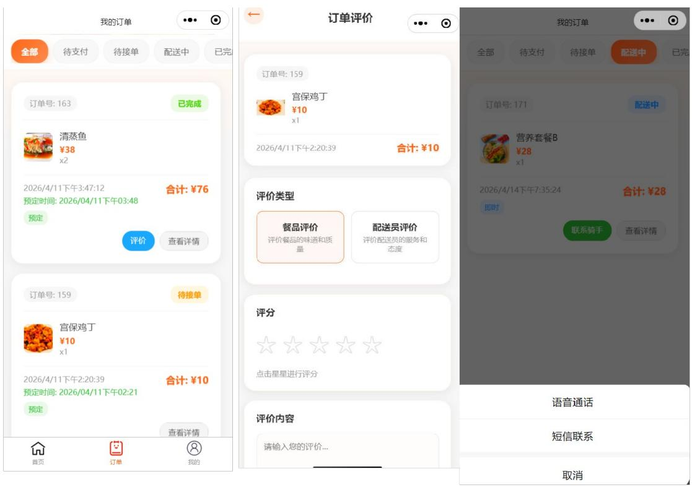  
图 5-3 订单界面

# 5.1.4 我的页功能实现

我的页面是老年人管理个人信息、设定偏好等的窗口,包括个人资料、健康信息、收藏夹等,同时提供用户编辑个人信息、维护健康信息、设定饮食偏好等服务,还提供紧急联系人管理、个性化公告、健康管理提醒等服务,满足老年

人各方面的需要;在界面设计上力求简明、清晰，主要功能一眼可见，操作简

单。界面如图 5-4、5-5、5-6 所示。

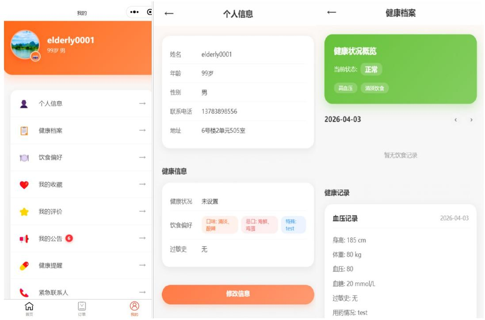  
图 5-4 我的界面(1)

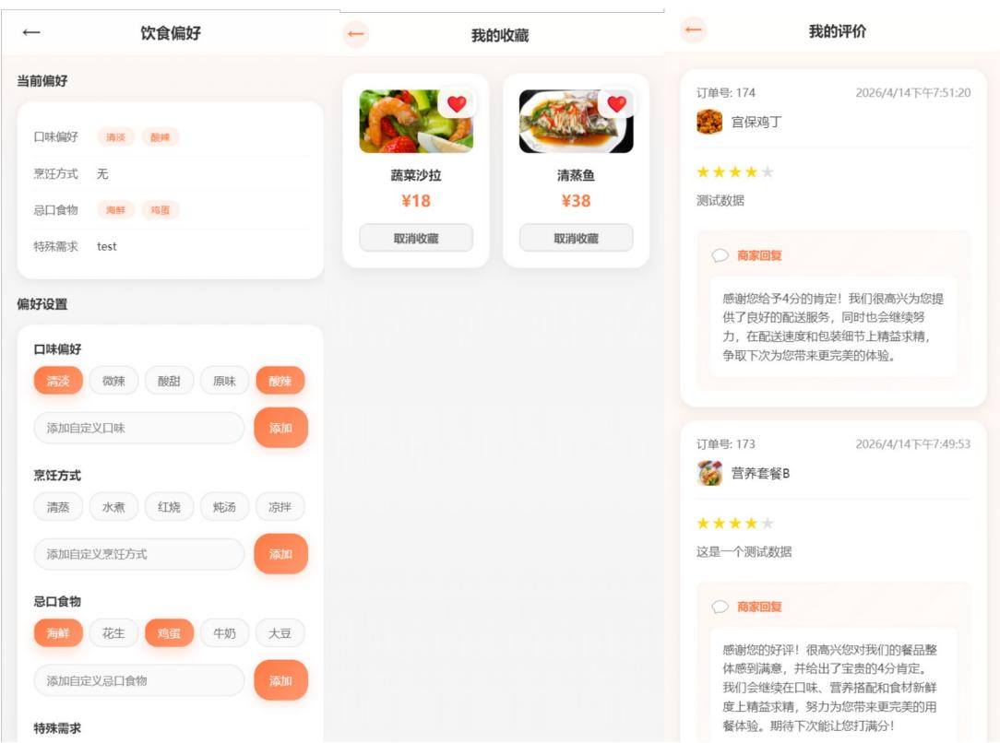

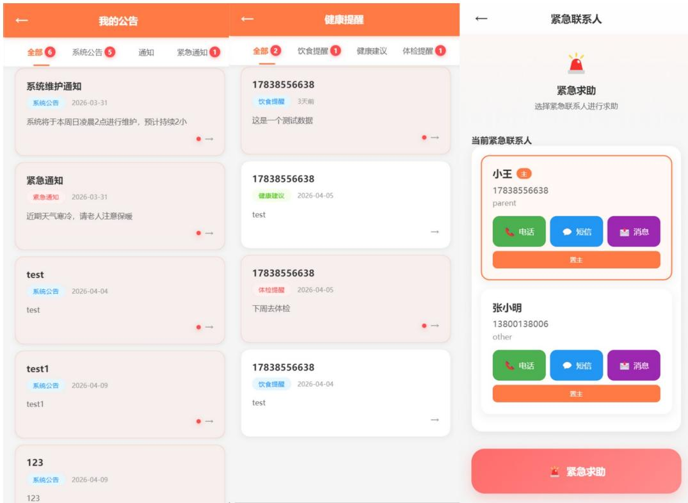  
图 5-5 我的界面(2)

# 5.2 家属功能实现

家属端是老人的辅助使用终端，可为老人代订餐、进行健康监控等，

使家属在远距离时也能关心、照顾老人，也可管理多个老人，还可进行健康数

据监控、消费管理等。

# 5.2.1 登录注册页功能实现

登录注册是也是家属使用系统的第一步，该页面实现了账号密码登录和微

信一键登录两种方式。界面展示图如图 5-7 所示。

  
图 5-6 我的界面(3)

# 5.2.2 首页功能实现

本页主要功能是老人健康状况总括、最新订单信息、健康提醒等，

运用数据可视化技术，展现老人的健康状况、用餐状况等，家属可及时了解老

人的健康状况，界面展示如图 5-8 所示。

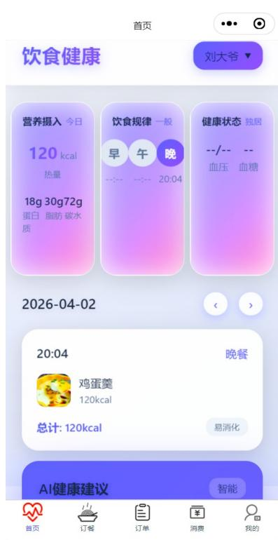  
图5-7 家属登录注册界面

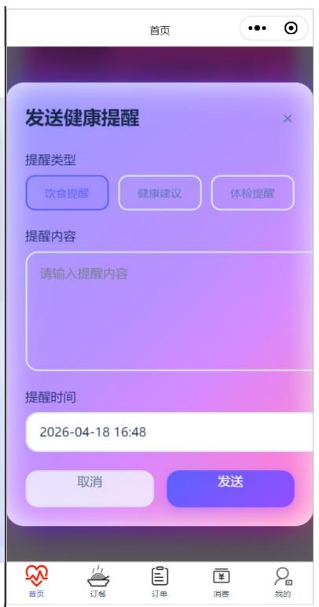  
图 5-8 首页界面

# 5.2.3 订餐页功能实现

本页面主要功能为:实现对餐品的浏览、分类筛选等作用，也可以为老人

选择合适的餐品并直接下单，让老人按时吃到满意的餐品，页面设计支持批量

订餐，为多位老人同时下单。界面展示图如图 5-9 所示。

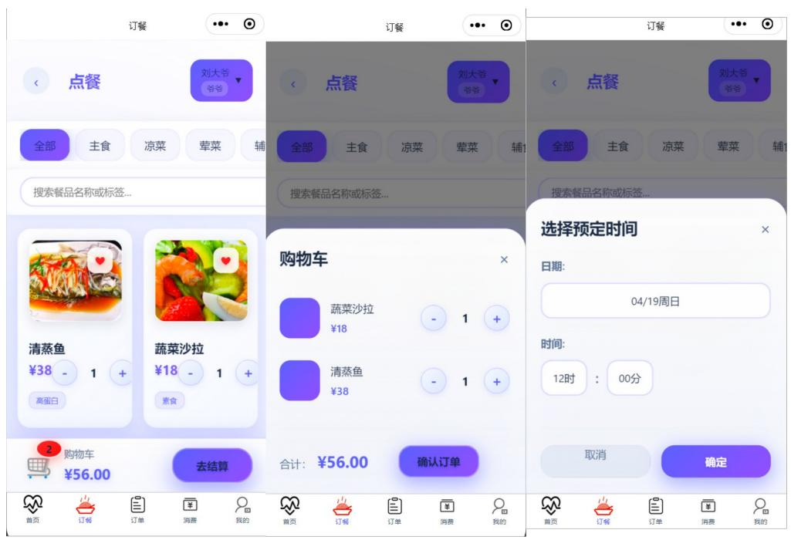  
图5-9 订餐界面

# 5.2.4 订单页功能实现

本页面可实现订单列表查询、订单详情查看、订单跟踪、评价等功

能，可查看老人全部订单列表，家属可方便地查看老人用餐情况及订单状态，

界面如图5-10所示。

  
图 5-10 订单界面

# 5.2.5 消费页功能实现

本页面主要为消费记录查询、消费统计等，让家属对老人餐饮消费情况有所了解，可合理制定餐饮预算，页面设计实现按时间范围统计消费金额、老人餐品偏好等功能。界面展示图如图5-11所示。

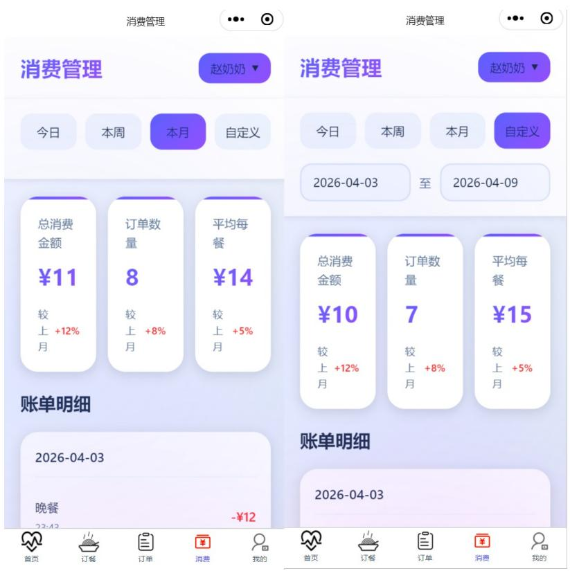  
图 5-11 消费界面

# 5.2.6 我的页功能实现

本页面完成个人信息修改、老人绑定等操作，还提供系统通知、意见反馈

等选项，以满足家属个性化需求，界面如图 5-12、5-13 所示。

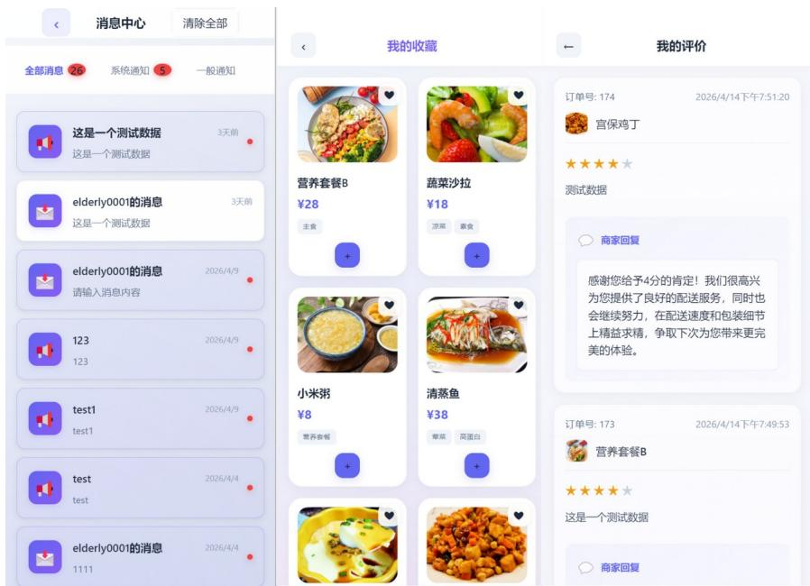  
图 5-12 我的界面(1)

图 5-13 我的界面(2)

# 5.3 配送员功能实现

配送员端是系统服务的执行终端，应具有订单管理、配送导航等功能，将

餐品及时、准确地送到老人手中。

# 5.3.1 登录注册页功能实现

登录注册也是配送员使用系统的第一步，登录页面提供账号密码登录和微

信一键登录两种登录方式，界面如图 5-14 所示。

  
图5-14 配送员登录注册界面

# 5.3.2 订单页功能实现

本页面可进行订单列表查询、订单详情查看、接取订单等操作，可按订单

状态进行筛选，便于配送员高效管理配送任务。页面设计还支持显示订单状态

标签、老人信息、配送地址等信息，界面展示如图 5-15 所示。

  
图5-15 订单界面

# 5.3.3 导航页功能实现

该页面可实现地图导航、位置更新等服务,可实时更新配送状态、上报配

送异常,确保配送过程顺利进行;页面设计还支持专注模式、多订单配送管理,提

高配送效率,界面展示如图 5-16 所示。

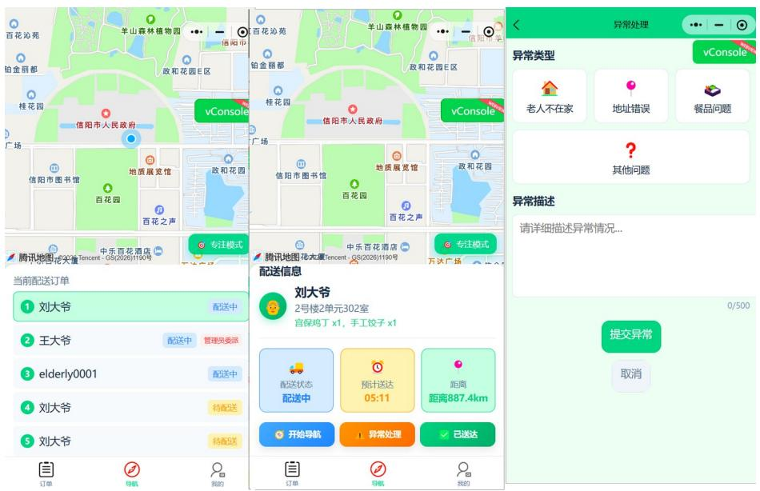  
图 5-16 导航界面

# 5.3.4 我的页功能实现

本页面完成个人信息编辑、收入明细查询、查看排班等操作，还提供系统

通知、意见反馈选项，以满足配送员个性化需求，界面展示如图5-17、5-18所示。

图
5-
17
我
的
界
面

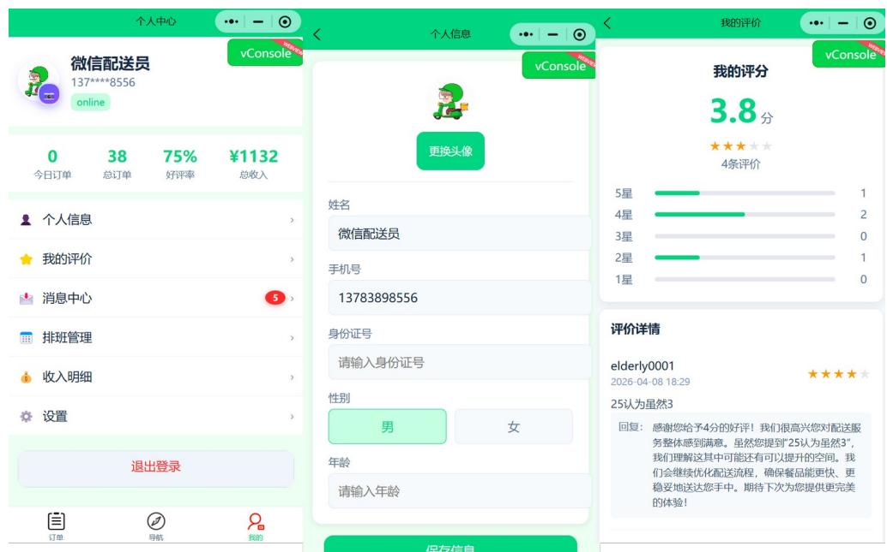

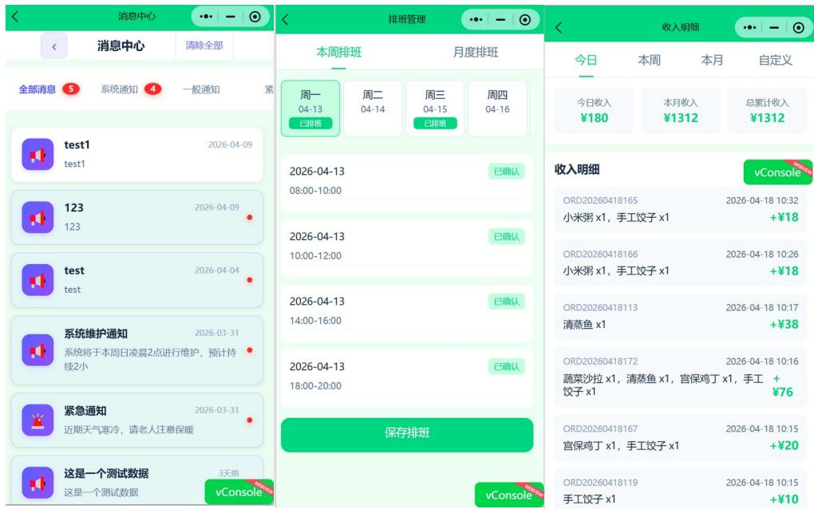  
(1)   
图 5-18 我的界面(2)

# 5.4 管理员功能实现

管理员界面是管理员界面是整个管理系统、控制中心的指挥中枢，对用户、订单、餐品等进行管理，以达到系统正常运行、业务流程顺利进行的目的，运用先进的用户界面设计，支持深色、浅色主题模式切换，提供全面有效的系统管理方案。

# 5.4.1 登录页功能实现

登录也是管理员使用系统的第一步，登录页面实现了账号密码登录，界面

展示图如图5-19所示。

  
图5-19 管理员登录界面

# 5.4.2 工作台预览页面功能实现

本页面包含订单统计、用户统计、配送效率统计等模块，运用数据看板的

形式把重要信息直观地呈现出来，为管理者提供有效、便捷地掌握系统运作状

况的手段。界面展示图如图 5-20 所示。

  
图5-20 工作台预览界面

# 5.4.3 老人管理页面功能实现

本页面完成老人信息列表、老人信息编辑、老人健康档案管理等操作，可按

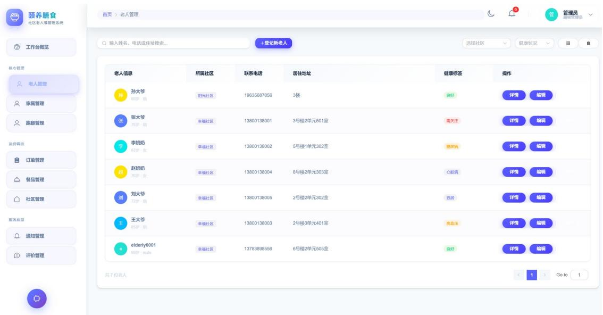

社区、健康状况等条件查询老人信息，便于管理员对老年用户的管理，界面展示如图 5-21 所示。

图5-21 老人管理界面

# 5.4.4 家属管理页面功能实现

本页面完成家属信息列表、家属信息编辑、老人绑定管理等操作，可查看家

属与老人的绑定情况，便于管理员对家属用户进行管理，界面如图5-22所示。

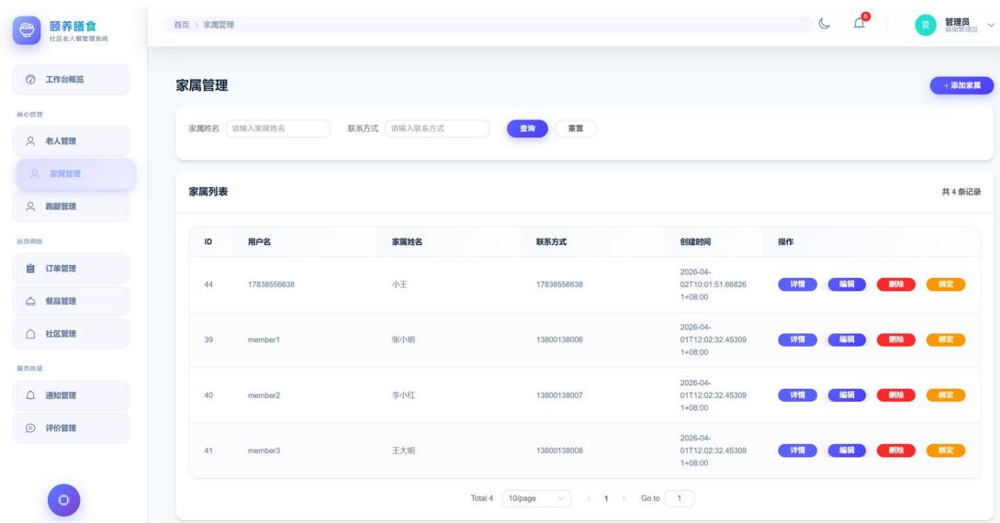  
图5-22 家属管理界面

# 5.4.5 跑腿管理页面功能实现

本页完成配送员信息列表、信息编辑、排班、定位等操作，界面如图 5-

# 23、5-24、5-25 所示。

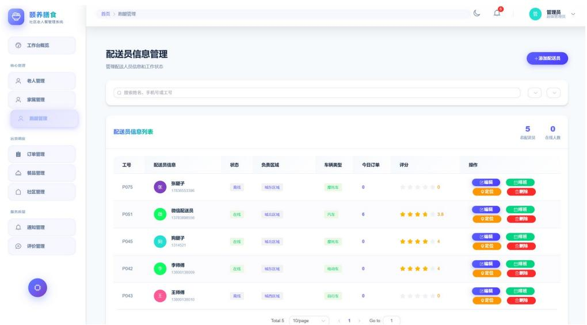  
图5-23 配送员信息管理界面

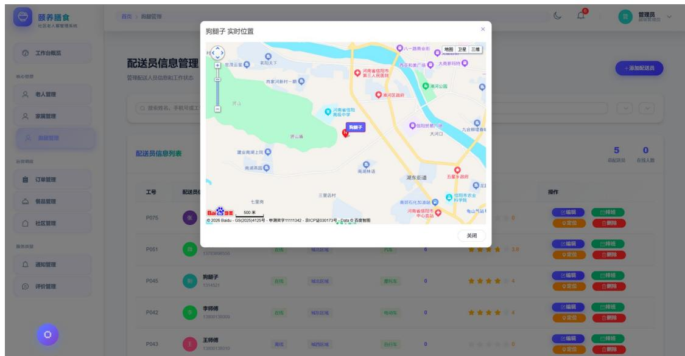  
图5-24 配送员定位界面

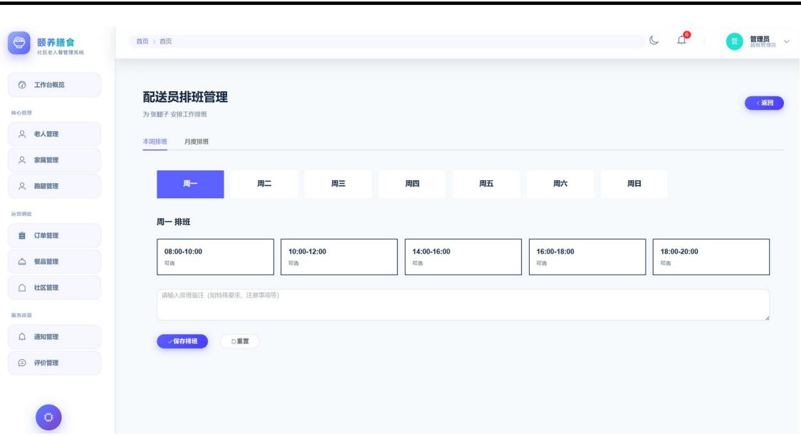  
5-25 配送员排班界面

# 5.4.6 订单管理页面功能实现

该页完成订单列表查询、订单详情查看、订单状态修改等操作，可依时间、

状态等条件查询订单，便于管理员处理异常订单、统计订单信息等，界面如图5-26 所示。

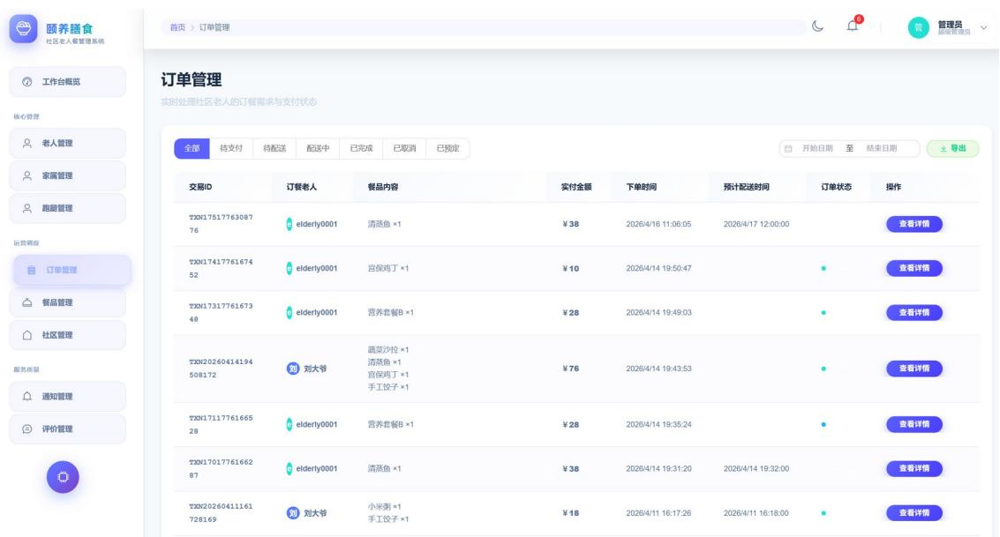  
图5-26 订单管理界面

# 5.4.7 餐品管理页面功能实现

本页面完成餐品列表、餐品编辑、分类管理等操作，还可对餐品进行上、下

架及价格修改等操作，便于管理员管理餐厅餐品，界面展示如图5-27所示。

  
图5-27 订单管理界面

# 5.4.8 社区管理页面功能实现

本页面完成社区列表、社区编辑、配送区域管理等操作，可对社区进行新增、

状态管理等操作，便于管理员管理系统的服务范围。界面展示如图 5-28 所示。

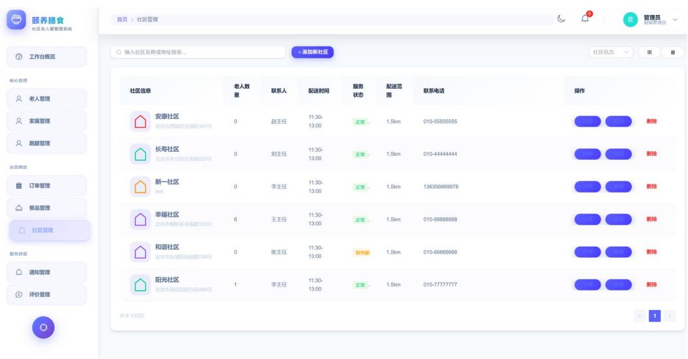  
图5-28 社区管理界面

# 5.4.9 通知管理页面功能实现

本页完成通知列表、通知编辑、通知发布等操作，可对通知按类型、状态进

行管理，便于管理员向用户发布系统公告、重要通知等信息，界面展示如图5-

29 所示。

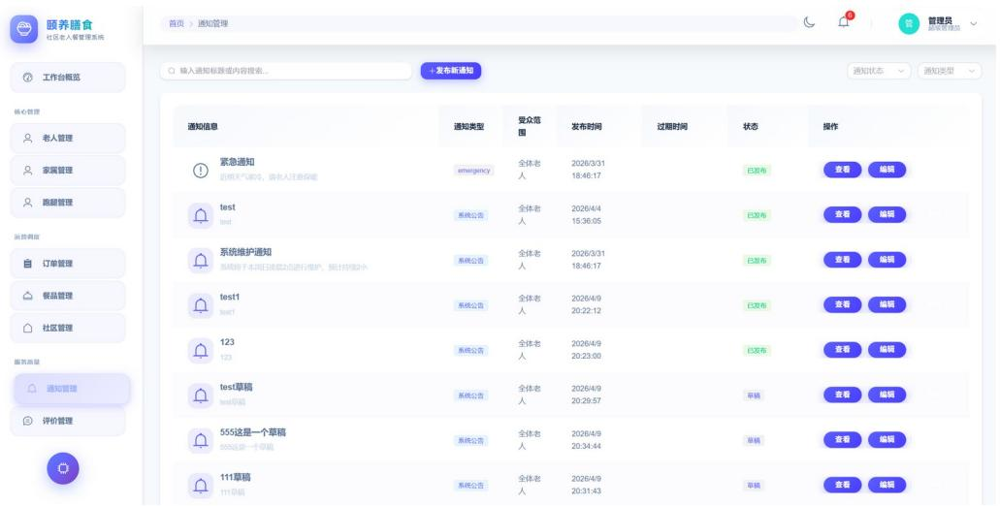  
图5-29 通知管理界面

# 5.4.10 评价管理页面功能实现

本页面集合了评价列表、人工智能审核、人工智能回复、智能数据分析、批

量审核等模块，可按评价种类、评分、审核状态等条件对用户评价进行筛选，

提高管理员处理问题的效率和准确性，运用这些模块还能够为用户带来更高效、

更个性化的服务体验，每一条用户反馈都能得到及时、准确的回复，界面展示

如图5-30所示。

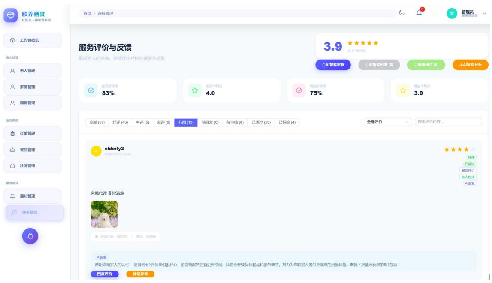  
图5-30 评价管理界面

# 5.4.11 全局功能实现

全局功能是系统全局范围内使用的功能，为各端用户使用同一智能服务及系统配置管理提供支持，包含 AI助手、系统设置两个部分，界面展示如图 5-31所示。

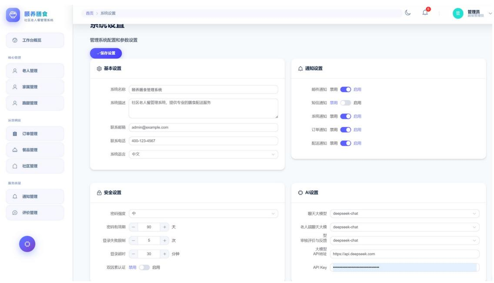  
图5-31 全局界面

# 6 结束语

# 参考文献

[1]彭青云,郭珈亦,丁诗雨.智慧赋能老年助餐新路径探索——以无锡市 D社区全龄餐厅为例[J].晋阳学刊,2025,(03):19-27.  
[2]石芳淼.数智时代老年助餐服务的人机协同研究——以 X 智慧食堂为例[J].中国战略新兴产业,2026,(04):101-103.  
[3]宋琳琳,杜思佳.智慧养老助餐服务供给困境及对策研究——以哈尔滨市道里区为例[J].辽宁行政学院学报,2025,(01):53-58.  
[4]毛绚霞,张佳屿,宋芳芳,等.智慧养老背景下社区中老年人群精准化营养助餐服务优化策略研究[C]//中国营养学会.第十七届全国营养科学大会摘要集.上海交通大学医学院;,2025:417.  
[5]姚淑婉.“互联网+”老年助餐服务的个案实践及优化路径研究[D].内蒙古科技大学,2025.  
[6]Shin Y, Lee J, Kim H, et al. ElderEats: Simplifying Food Delivery for Elderly Users[C]//Proceedings of the 2024 CHI Conference on Human Factors in Computing Systems,2024:1-15.   
[7]Pires EJ Solteiro. The ACO-BmTSP to Distribute Meals Among the Elderly[J]. Algorithms,2025,18:667.

[8]Kim S, Lee H, Park J. Employees' and volunteers' food safety knowledge and practices for production, packaging, holding, and delivery stages in home-delivered meal service for the elderly[J]. Food Control,2024,158:110-118   
[9]Hwang S, et al. Food Delivery Apps and Their Potential to Address Food Insecurity in Older Adults: A Review[J]. Int J Environ Res Public Health,2024.   
[10]Home-Delivered Nutrition Services for Older Adults Under the Older Americans Act[J]. JAMA Network Open,2025.