# 本科毕业论文

# 信阳学院大学生志愿者信息管理系统的设

# 计与实现

学 院： 大数据与人工智能学院

专 业： 计算机科学与技术

届 别： 2024 届

学 号： 2014110101 67

姓 名： 高玉娟

指导教师： 崔玉胜

2024 年 5 月

# 毕业论文声明

本人郑重声明：所呈交的毕业论文是本人在导师的指导下独立进行研究所取得的研究成果。除了文中特别加以标注引用的内容外，本论文不包含任何其他个人或集体已经发表或撰写的成果作品。

本人完全了解有关保障、使用毕业论文的规定，同意学校保留并向有关毕业论文管理机构送交论文的复印件和电子版。同意省级优秀毕业论文评选机构将本毕业论文通过影印、缩印、扫描等方式进行保存、摘编或汇编；同意本论文被编入有关数据库进行检索和查阅。

本毕业论文内容不涉及国家机密。

论文题目：信阳学院大学生志愿者信息管理系统的设计与实现

学院：大数据与人工智能学院

学号：

学生：

# 信阳学院大学生志愿者信息管理系统的设计与实现

摘 要：随着社会不断的发展，大学生志愿服务活动引起了广大群众的关注。

由于大学生志愿服务活动涉及大量参与者和多样化的项目，且这些活动分布广

泛，传统的手工管理方法已不再足以应对管理上的挑战，因此，本研究设计并开

发了一套针对大学生志愿者的信息管理系统。基于信息技术的发展与应用，通过

互联网和数据库技术，采用 SpringBoot 作为框架，B/S 模式进行架构，运用 Java

知识进行编程，MySQL数据库来支持系统所有数据，可以实现对大学生志愿服务

活动的全面管理。该系统可以帮助学校或组织实现志愿者的招募与注册、活动的

发布与报名、志愿者的时长管理等功能，提高志愿服务活动的组织效率和管理水

平。

关键词：志愿者；管理系统；Java；MySQL

# Design and Implementation of the Information Management

# System for College Student Volunteers in Xinyang University

Abstract:With the continuous development of society, the volunteer serviceactivities of college students have attracted the attention of the masses. Because thevolunteer service activities of college students involve a large number of participants anddiversified projects, and these activities are widely distributed, the traditional manualmanagement methods are no longer enough to meet the management challenges.Therefore, this study designed and developed an information management system forcollege student volunteers of Xinyang College. Based on the development and applicationof information technology, through the Internet and database technology, SpringBoot isused as the framework, B/S mode is used for architecture, Java knowledge is used forprogramming, and MySQL database is used to support all data of the system, which canachieve comprehensive volunteer service activities for college students. Management.The system can help schools or organizations realize the functions of volunteerrecruitment and registration, the release and registration of activities, and the durationmanagement of volunteers, and improve the organizational efficiency and managementlevel of volunteer activities.

Key words: Volunteer；Management System；Java；MySQL

# 目 录

摘要.. I

Abstract...

1 引言.. 1

1.1 研究背景. 1

1.2 研究意义. 1

1.3 国内外研究现状.. 2

2 系统开发相关技术介绍. 3

2.1 Java 技术.. 3

2.2 MySQL 数据库.. 3

2.3 SpringBoot 框架.. 3

2.4 B/S结构.. 4

3 系统分析.. 4

3.1 可行性分析... 4

3.1.1 经济可行性.. 4

3.1.2 技术可行性.. 4

3.1.3 社会可行性. 5

3.2 功能需求分析.. 5

3.2.1 志愿者功能分析.. 5

3.2.2 活动发起者功能分析.. 6

3.2.3 管理员功能分析.. 6

3.3 系统流程分析..

4 系统设计.. 8

4.1 系统整体设计.. 8

4.1.1 志愿者功能设计. 8

4.1.2 活动发起者功能设计.. 10

4.1.3 管理员功能设计. 11

4.2 数据库设计.. 11

4.2.1 数据库概念结构设计. 11

4.2.2 数据逻辑结构设计. 13

5 系统实现.. 15

5.1 志愿者功能实现. 15

5.1.1 志愿者登录注册功能实现.. 15

5.1.2 报名活动功能实现.. 17

5.1.3 个人中心功能实现. 18

5.1.4 活动报名管理功能实现. 18

# 5.2 活动发起者功能实现.. 19

5.2.1 活动发起者登录注册功能实现... 19

5.2.2 志愿活动管理功能实现. 19

5.2.3 活动报名管理功能实现. 20

5.2.4 活动时长管理功能实现. 21

# 5.3 管理员功能实现. 21

5.3.1 志愿者管理功能实现. 22

5.3.2 活动发起者管理功能实现. 22

5.3.3 活动类型管理功能实现. 23

5.3.4 志愿活动管理功能实现. 23

5.3.5 志愿时长管理功能实现. 24

# 6 系统测试.. 24

6.1 系统测试的目的和意义.. 24

6.2 系统功能测试和结果分析.. 24

6.2.1 志愿者管理测试.. 24

6.2.2 活动报名管理测试.. 25

6.2.3 志愿活动管理测试.. 25

6.2.4 管理员管理测试.. 26

7 结束语.. 27

参考文献.. 28

# 1 引言

# 1.1 研究背景

随着社会快速的发展，大学生对于志愿者活动越发感兴趣。这类活动不仅为社会解决问题，而且在促进大学生自我成长和灌输社会责任感方面发挥了重要作用。然而，在现有的大学生志愿者管理中，存在着一些问题，如信息更新不及时人手短缺、招募志愿者困难以及活动安排不合理等问题。因此，针对大学生开发一个有助于提高志愿者活动组织和运作效率的志愿者信息管理系统尤为重要。虽然，国内外对研究志愿者信息管理系统有了较为坚实的基础，但专注于大学生群体的系统研究仍相对匮乏。本课题的研究，旨在为大学生志愿者工作提供一种更科学、更有效的管理方式。通过对现有的大学生志愿者信息管理系统进行调研和分析，借鉴其优点，可以避免重复劳动，提高研究的效率和实用性。大学生志愿者信息管理系统的建设和完善，对于提高志愿者活动的管理质量，促进公益事业活动发展具有重要意义。

# 1.2 研究意义

大学生志愿者信息管理系统不仅具有深远的社会意义，还具有重要的教育价值。在社会层面，随着志愿服务活动日益深入人心，更多的大学生积极的参与到各类公益事业中，为社会贡献自己的力量。一个有效的信息管理系统能够为这些热心的年轻志愿者提供平台支持，优化他们的参与体验，确保志愿活动的高效组织与执行，进而提升社会服务的整体水平。

对于大学生个人来说，对志愿者信息的系统化管理，使他们能够根据自己的优势和兴趣，准确地选择合适的志愿活动，不仅可以在活动中实现自我价值，还可以在实践中增强个人的社会责任感。同时，志愿活动可以加强团队协作能力和社交能力，也为学生提供了宝贵的实践经验，对他们的整体发展和未来就业都具有积极影响。

在教育层面上，大学生志愿者信息管理系统的研究和应用，将有助于高校深化实践教育理念，加强学生的社会实践，将志愿服务作为拓展学生社会实践和人文关怀教育的重要途径。该系统的数据收集与分析功能还可以帮助高校评估志愿

服务活动对提升学生综合素质起到了积极作用，从而更好地指导学生发展。

从管理角度看，该系统能为高校及社会组织提供精准的数据支持，使志愿者管理工作更加规范、透明，减少资源浪费，提高资源配置效率。此外，系统的实施也是对现代信息技术在社会服务领域中应用的一种探索，有利于推动传统志愿服务向数字化、智能化方向发展。

# 1.3 国内外研究现状

有关大学生志愿者信息管理系统的研究在国外也取得了一些实质性的突破。例如，ZhimingL等研究了一种志愿者满意度机制，即需求-供应契合度，VMP通过该机制影响志愿者满意度，通过使用从中国四个非营利组织收集的整群样本（N=211），概述了一个中介模型并进行了实证检验。这一研究对提高系统用户的满意度和用户参与活动的主动性具有重要作用[1]。

Gareth P等在文献中表达了对志愿者管理理论和实践的实证探索，特别关注了在“COVID-19 后”世界中体育赛事的考虑因素，研究采用混合方法：对志愿者（ $\scriptstyle \mathrm { { \underline { { n } } } = 1 0 1 }$ ）进行调查，并结合对志愿者（n=8）和志愿者管理人员（ $\scriptstyle \mathbf { n = 6 } ,$ ）的一

系列访谈[2]。研究结果表明，灵活性、沟通、培训和安全措施是成功管理志愿者的关键要素。此外，该研究还强调了技术的重要性，特别是利用在线平台和数字化工具在招募、培训和协调志愿者方面的作用不容忽视。HuM.在文献中通过跨部门比较，研究了中国的志愿者服务管理[3]。研究发现，中国的志愿者服务管理存在跨部门协调不足、资源配置不均等问题。同时，研究还探讨了政府、非营利组织和企业在志愿者服务管理中的角色和作用，并提出了一些改进措施和建议，以促进中国志愿者服务管理的有效性和可持续发展。

另外，一些研究还关注大学生志愿者信息管理系统的用户体验和用户参与度。高校的研究人员针对当前志愿活动组织和管理的不足之处，设计和构建了一款基于SpringBoot框架的志愿服务活动,并使用MySQL数据库对数据进行缓存,以便于优化系统相应模块。

综上所述，国外大学生志愿者信息管理系统领域的研究已经取得了进展，重点是提高系统的适用性和用户需求，并对社会产生的积极影响，包括优化志愿者与志愿组织之间的匹配过程和促进社会资源的积累。

国内的研究主要关注系统的功能设计和体验，例如发布、管理和评估志愿活动的效率和便捷性，以及提高用户满意度的策略。许多学者和机构都开展了相关的研究工作，以提高大学生志愿活动的组织和管理效率。例如，马春晓的研究团队设计了一套基于云计算的志愿者志愿活动管理系统[4]，通过该系统可以方便地发布、管理和评估志愿活动，并提供了在线报名、签到等功能，极大地提高了志愿活动的组织效率。陈仪在文献中以国家博物馆为例，研究了博物馆志愿者服务的管理问题[5]。研究发现，博物馆志愿者服务管理的有效性对于提升博物馆服务质量和参观体验至关重要。

# 2 系统开发相关技术介绍

# 2.1 Java 技术

面向对象的编程语言Java是由 $\mathrm { C } { + + }$ 发展而来。相对于 $\mathrm { C } { + } { + }$ 语言，Java继承了$\mathrm { C } { + } { + }$ 大部分优点，但不支持多继承、指针等特征[6]。Java是一种面向对象的语言，其语法更为简洁明了、使用更灵活便捷、使得学习掌握更容易。Java为程序员提

供了更规范、更高效的编程方法，从而实现了面向对象的编程理论。

# 2.2 MySQL 数据库

MySQL的语言是非结构化的，当对客观事物的符号进行描述时，数据则是信息的载体，数据库负责记录跟踪这些数据[6]。MySQL 因为其数据库级小的体积，快速的操作速度以及较高的性价比，在中等网界的开发中成为了最佳选择，此外MySQL 服务也相对稳定。

# 2.3 SpringBoot 框架

SpringBoot 是一种开源应用框架，它内嵌了 Tomcat Serviet 容器，为 spring 组件提供一站式解决方案，并且还提供了具有控制反转属性的容器，简而言之，SpringBoot 简化了 spring 组件的搭建和开发过程。它通过 properties 文件代替了spring 复杂的 xml 配置文件，使得开发者只关注业务逻辑，减少对 xml 的繁琐配置。SpringBoot框架的核心功能之一是在三层调用的过程中进行对象注入，除此之外框架也包含了面向切面编程框架，并且更加注重模块化处理模块之间的交叉

点[8]。

# 2.4 B/S 结构

B/S结构，即浏览器/服务器结构，是以Web技术为基础的一种新型系统平台，也是 C/S 架构发展的必然产物[9]。B/S 结构作为当前广泛采用的网络化结构模式，其核心功能高度集成于系统的服务器上，这一操作不仅简化了操作流程，还使得系统维护和使用变得更加便捷。

# 3 系统分析

# 3.1 可行性分析

# 3.1.1 经济可行性

大学生志愿者信息管理系统采用的是 Java技术来实现其功能开发，整体而言，其是一个较为基础的系统设计和开发项目，因此采用的是有开源的开发环境来构建[10]。

通过使用大学生志愿者信息管理系统，显著降低了人员成本，极大提升了管理效率。由于当前人员管理的方式存在着诸多缺陷，主要表现在：首先人工成本

较大，导致企业运营成本增加，其次工作效率较低下，影响整体运营效率。在结合大学生志愿者信息管理系统的特点，还有一些记录和统计，智能大学生志愿者信息管理系统杜绝了以上的问题，提高了大学生志愿者信息管理系统的效率性和安全性。

若能将开发成本控制在企业经济能力可接受的范围之内，就有极大可能实现可行性。

# 3.1.2 技术可行性

在考虑技术可行性时，在确定技术方案的可行性之前，需要分析开发环境和系统的实际情况。特别是，关注其在当前现实条件下的可行性。只有这样，技术解决方案才能具有真正的实际应用价值。同时，在实际操作中有必要考虑时间不足、技术复杂度较高、缺乏技术积累、对技术的掌握不够等因素。

从技术角度分析开发大学生志愿者信息管理系统的开发内容，结合当前网络硬件和相关技术上来看，该系统的开发是可行的。

# 3.1.3 社会可行性

在可行性分析中，需要清晰地挖掘开发的系统带来的各种直接且有效的收益以及那些潜在的好处，这样，在后续的设计中更加的坚定和确信系统开发的意义[11]。通过解决一些社会方面存在的问题，设计并开发系统皆在为社会带来一定的价值对社会的发展具有一定影响力，有助于在一定程度下提升效率，为社会的进步和发展带来更多益处。

# 3.2 功能需求分析

软件产品可以通过功能分析准确地了解用户的期望和需求，从而确保它能够满足用户需求，提高用户满意度，并提高系统可用性。

# 3.2.1 志愿者功能分析

用户进入系统后系统会根据用户是否注账号进行分类，注册过账号的用户可直接进行登录，未注册过账号的用户需根据提示填写基本信息后方可进行登录。

根据志愿者需求进行分析，包括报名志愿活动、浏览公告信息、管理收藏、修改个人信息、评论活动等。志愿者用例图如图3-1所示。

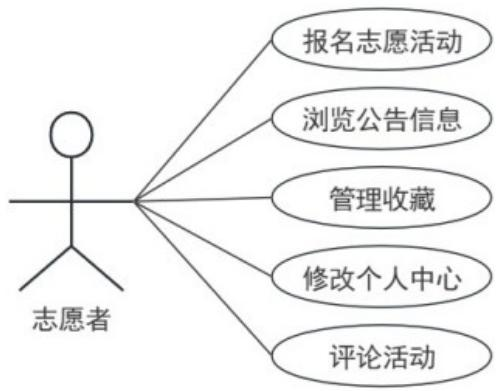

图3-1 志愿者用例图

# 3.2.2 活动发起者功能分析

根据活动发起者需求进行分析，包括修改个人中心、添加志愿活动、审批活动报名、填写志愿时长、回复评论等。活动发起者用例图如图3-2所示。

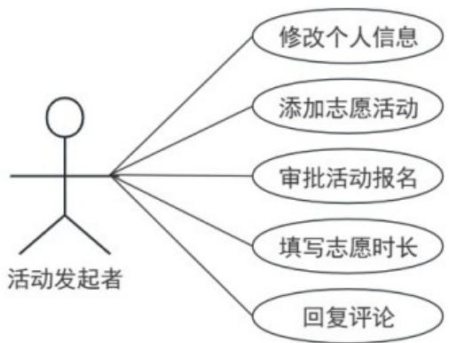

图3-2 活动发起者用例图

# 3.2.3 管理员功能分析

管理员用例图是按照管理员的权限和系统的管理需要来对其进行分析的。在该系统中，各种操作和任务都能被完成。管理员用例图包括修改个人信息、删除

志愿者、删除活动发起者、修改活动类型、审核志愿活动、查看活动报名、查看活动时长、管理轮播图，查看评论等。管理员用例图如图 3-3 所示。

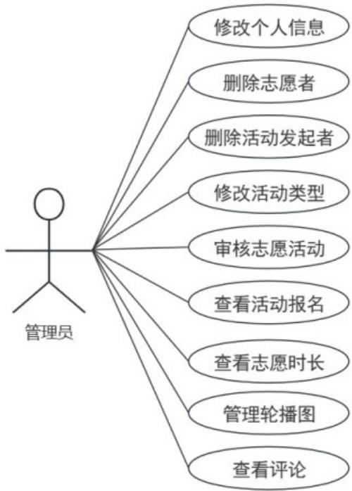

图3-3 管理员用例图

# 3.3 系统流程分析

系统流程图以可视化的形式辅助开发人员和分析师更深入地把握和构建系统的工作流程。

登录模块设定了许多的规则，旨在严格限定用户的操作权限。用户必须输入正确的用户名、密码和验证码，才能进入系统。当所有的信息都被确定并通过之

后，就代表着用户已经成功地登陆了，接下来就是使用自己的权限，在系统中进行各种操作了。

新用户添加流程非常严格，首先，系统会检查输入的新用户名是否已经存在于数据库中。如果用户已经存在，新用户可以直接用这个用户登录。登录流程图如图3-4所示。

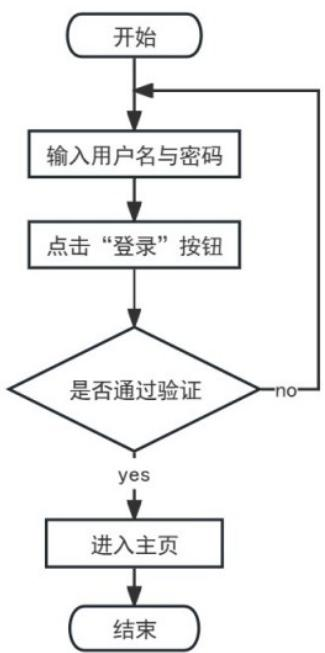

图3-4 登录流程图

如果用户不存在，就需要根据提示输入用户的基本信息。在添加用户时，系统会严格审核信息的完整性和准确性，只有信息完整且正确时，才能通过验证；否则，用户需重新填写或修改信息。在验证之后，系统会继续审查新输入的用户

信息是否有效。如果用户输入的信息无效，系统将发出提示，要求用户重新输入反之信息正确，系统将会把新用户的信息存储到数据库中并告知用户信息添加成功。添加用户的流程图如图 3-5 所示。

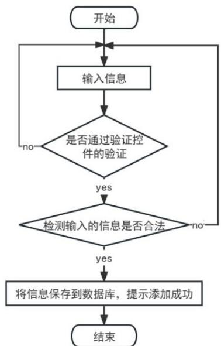

图3-5 添加用户流程图

# 4 系统设计

# 4.1 系统整体设计

在本次系统中，通过功能结构图简洁明了地展示了系统的功能。这个图表将复杂的功能以图形方式清晰呈现，为设计和测试等后续工作提供了明确的方向。

本系统的整体框架分为三部分志愿者、活动发起者以及管理员，系统功能结构图

如图 4-1 所示。

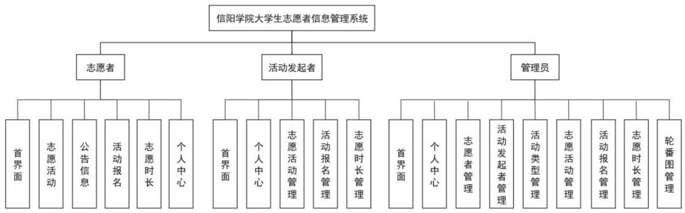

图4-1 系统功能结构图

# 4.1.1 志愿者功能设计

志愿者登录状态有两种：

(1) 从来没有参加过志愿者活动，没有注册账号，数据库中没有该用户的信息。

(2) 登录过此程序，注册过账号，数据库中已有该用户的信息。

当用户处于第一种情况，就表示未注册过，可以简单地点击界面最下方的“注册账号”按钮，随后填写基本的个人信息，就可以创建自己的账号并登录。

一旦账号创建成功，用户的信息将会自动保存在系统中。

当用户处于第二种情况，就表示用户已经注册过，当访问登录界面时，系统会识别并显示用户信息。用户登录流程便捷，只需提供正确的账号和密码，就可获得系统访问权限并执行相应操作

用户注册时需要填写账号、密码、姓名、性别、年龄、上传头像、手机号，

最后点击注册即可，当注册完成后登录账号输入账号和密码完成验证即可进入首

界浏览或参加志愿活动。志愿者登录注册功能设计图如图 4-2 所示。

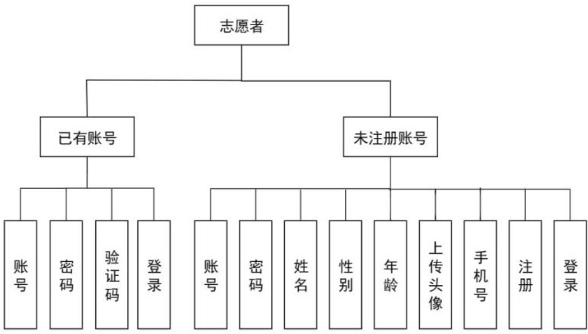

图4-2 志愿者登录注册功能设计图

在登录界面首先选择志愿者角色，输入账号和密码点击登录按钮进行登录，

进入首界面可以看到欢迎进入志愿者管理系统字样，在个人中心中可以修改个人

信息，在活动报名管理中查询活动，也可以删除已经参加过的活动，在志愿时长

管理中查询自己所参加活动的时长。后台管理功能设计图如图4-3所示。

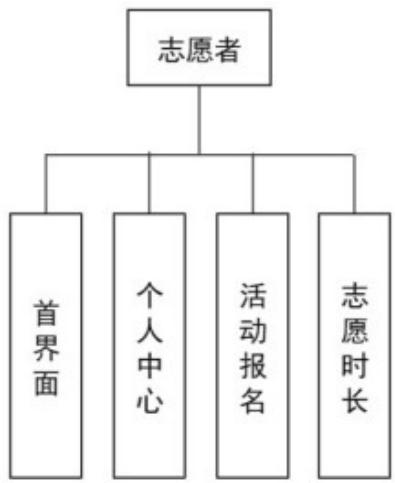

图4-3 后台管理功能设计图

# 4.1.2 活动发起者功能设计

在登录界面首先选择活动发起者角色，输入账号和密码点击登录按钮进行登录，在个人中心中个人信息，在志愿活动管理中可以查询活动，也可以新增或删除活动，对已通过审核的志愿活动进行删除或查看评论，在活动报名管理中可以查询志愿者所参加活动以及对其是否能通过参加此活动进行审核，在活动时长管理中填写或修改志愿者参加志愿活动的活动时长。活动发起者功能设计图如图 4-4 所示。

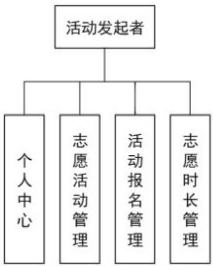

图 4-4 活动发起者功能设计图

# 4.1.3 管理员功能设计

首先选择管理员角色选项进行登录，进入首界可以看到有八个功能。在个人中心中可以修改密码以及用户名，在志愿者管理中可以查找志愿者查看详细信息在活动发起者管理中可以对活动发起者的信息进行查询，也可以新增志愿者和活动发起者。在活动类型管理中可以对其进行修改、新增、删除，在志愿活动管理中审核活动是否能通过，也可以看到活动类型占比情况和志愿者对此活动的评论在活动报名管理中可以查询志愿者所报名的志愿活动，在活动时长管理中可以查看志愿者的活动时长，时长统计可以看到所有志愿者参加所有活动的总共时长统计图，在关于我们中可以对关于我们、系统简介、轮播图管理、公告信息进行修

改。管理员功能设计图如图 4-5 所示。

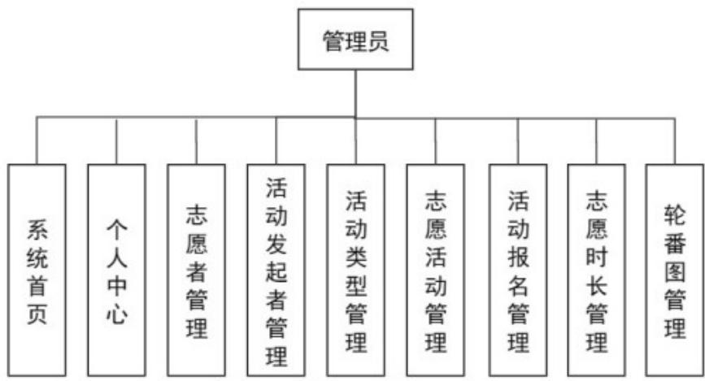

图 4-5 管理员功能设计图

# 4.2 数据库设计

# 4.2.1 数据库概念结构设计

(1) 志愿者实体属性包括账号、密码、姓名、性别、年龄、上传头像、手机号等。

(2) 活动发起者实体属性包括账号、姓名、手机号、头像、密码等。

(3) 活动报名实体属性包括活动标题、活动类型、活动时间、活动地点、发起者姓名、志愿者姓名、志愿者手机、志愿者手机、报名时间等。

(4) 志愿时长实体属性包括活动标题、活动类型、活动时间、发起者账号、发起者姓名、志愿者姓名、活动时长等。

(5) 志愿活动实体属性包括活动标题、活动时间、活动地点、发起者姓名、发者手机、服务对象、发布时间、截止时间、活动内容等。

(6) 管理员实体主要属性包括密码、用户名等。

通过对大学生志愿者信息管理系统的主要功能划分为几个功能实体模块，对

应关系用 E-R 图表示。系统 E-R 图如图 4-6 所示。

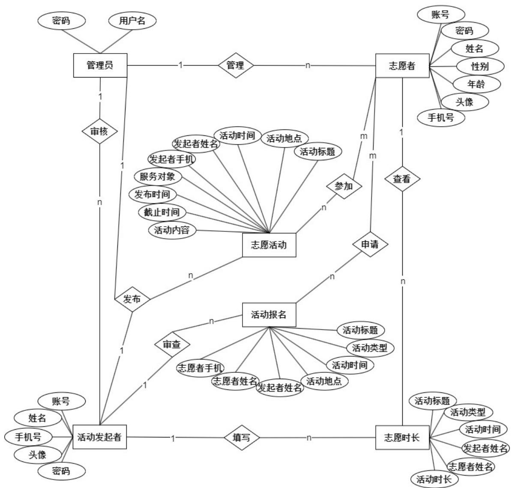

图 4-6 系统 E-R 图

# 4.2.2 数据逻辑结构设计

志愿者列表实体主要属性为：主键（id）、创建时间（creationime）、志愿者 账 号 （ volenteeraccount ） 、 密 码 （ password ） 、 志 愿 者 姓 名（volunteername）、性别（xingbie）、年龄（gender）、头像（profilepicture）、志愿者手机（volunteermob）、荣誉称号（honorarytitle）等。如表 4-1 所示。

表4-1 志愿者表

<table><tr><td>字段名称</td><td>类型</td><td>长度</td><td>字段说明</td><td>是否主键</td><td>是否默认值</td></tr><tr><td>id</td><td>bigint</td><td>20</td><td>主键</td><td>是</td><td>否</td></tr><tr><td>creationtime</td><td>timestamp</td><td>0</td><td>创建时间</td><td>否</td><td>是</td></tr><tr><td>volunteeraccount</td><td>varchar</td><td>200</td><td>志愿者账号</td><td>否</td><td>否</td></tr><tr><td>password</td><td>varchar</td><td>200</td><td>密码</td><td>否</td><td>是</td></tr><tr><td>volunteername</td><td>varchar</td><td>200</td><td>志愿者姓名</td><td>否</td><td>否</td></tr><tr><td>xingbie</td><td>varchar</td><td>200</td><td>性别</td><td>否</td><td>否</td></tr><tr><td>gender</td><td>int</td><td>11</td><td>年龄</td><td>否</td><td>否</td></tr><tr><td>profilepicture</td><td>longtext</td><td>0</td><td>头像</td><td>否</td><td>是</td></tr><tr><td>volunteermob</td><td>varchar</td><td>200</td><td>志愿者手机</td><td>否</td><td>否</td></tr><tr><td>honorarytitle</td><td>varchar</td><td>200</td><td>荣誉称号</td><td>否</td><td>是</td></tr></table>

活动发起者列表实体主要属性为：主键（id）、创建时间（creationtime）、

发 起 者 账 号 （ initiatoraccount ） 、 密 码 （ password ） 、 发 起 者 姓 名（initiatorname）、发起者手机（initiatormob）、头像（profilepicture）等。如表4-2 所示。

表4-2 活动发起者表

<table><tr><td>字段名称</td><td>类型</td><td>长度</td><td>字段说明</td><td>是否主键</td><td>是否默认值</td></tr><tr><td>id</td><td>bigint</td><td>20</td><td>主键</td><td>是</td><td>否</td></tr><tr><td>creationtime</td><td>timestamp</td><td>0</td><td>创建时间</td><td>否</td><td>是</td></tr><tr><td>initiatoraccount</td><td>varchar</td><td>200</td><td>发起者账号</td><td>否</td><td>否</td></tr><tr><td>password</td><td>varchar</td><td>200</td><td>密码</td><td>否</td><td>是</td></tr><tr><td>initiatarname</td><td>varchar</td><td>200</td><td>发起者姓名</td><td>否</td><td>否</td></tr><tr><td>initiatabmob</td><td>varchar</td><td>200</td><td>发起者手机</td><td>否</td><td>否</td></tr><tr><td>profilepicture</td><td>longtext</td><td>0</td><td>头像</td><td>否</td><td>是</td></tr></table>

管 理 员 列 表 实 体 属 性 为 ： 主 键 （ id ） 、 用 户 名 （ username ） 、 密 码

（password）、角色（role）等。如表 4-3 所示。

表 4-3 管理员表

<table><tr><td>字段名称</td><td>类型</td><td>长度</td><td>字段说明</td><td>是否主键</td><td>是否默认值</td></tr><tr><td>id</td><td>bigint</td><td>0</td><td>主键</td><td>是</td><td>否</td></tr><tr><td>username</td><td>varchar</td><td>100</td><td>用户名</td><td>否</td><td>否</td></tr><tr><td>password</td><td>varchar</td><td>100</td><td>密码</td><td>否</td><td>否</td></tr><tr><td>role</td><td>varchar</td><td>100</td><td>角色</td><td>否</td><td>否</td></tr></table>

志愿活动列表属性为：主键（id）、创建时间（creationtime）、活动标题

（ activitytitle ） 、 活 动 类 型 （ activitytype ） 、 图 片 （ picture ） 、 活 动 时 间（activitytime）、活动地点（activityplace）、活动内容（activitycontent）、发起者姓名（promoter）、服务对象（serviceobject）、发布时间（releasetime）、截止时间（deadline）、是否审核（review）、审核回复（reply）等。如表 4-4 所

示。

表4-4 志愿活动表

<table><tr><td>字段名称</td><td>类型</td><td>长度</td><td>字段说明</td><td>是否主键</td><td>是否默认值</td></tr><tr><td>id</td><td>bigint</td><td>20</td><td>主键</td><td>是</td><td>否</td></tr><tr><td>creationtime</td><td>timestamp</td><td>0</td><td>创建时间</td><td>否</td><td>是</td></tr><tr><td>activitytitle</td><td>varchar</td><td>200</td><td>活动标题</td><td>否</td><td>否</td></tr><tr><td>activitytype</td><td>varchar</td><td>200</td><td>活动类型</td><td>否</td><td>否</td></tr><tr><td>picture</td><td>longtext</td><td>0</td><td>图片</td><td>否</td><td>是</td></tr><tr><td>activitytime</td><td>datetime</td><td>0</td><td>活动时间</td><td>否</td><td>否</td></tr><tr><td>activityplace</td><td>varchar</td><td>200</td><td>活动地点</td><td>否</td><td>否</td></tr><tr><td>activitycontent</td><td>longtext</td><td>0</td><td>活动内容</td><td>否</td><td>否</td></tr><tr><td>promoter</td><td>varchar</td><td>200</td><td>发起者姓名</td><td>否</td><td>否</td></tr><tr><td>serviceobject</td><td>varchar</td><td>200</td><td>服务对象</td><td>否</td><td>否</td></tr><tr><td>releasetime</td><td>date</td><td>0</td><td>发布时间</td><td>否</td><td>否</td></tr><tr><td>deadline</td><td>date</td><td>0</td><td>截止时间</td><td>否</td><td>否</td></tr><tr><td>review</td><td>varchar</td><td>200</td><td>是否审核</td><td>否</td><td>否</td></tr><tr><td>reply</td><td>longtext</td><td>0</td><td>审核回复</td><td>否</td><td>否</td></tr></table>

活动报名列表实体属性为：主键（id）、创建时间（creationtime）、活动标

题（activitytitle）、活动类型（activitytype）、活动时间（activitytime）、活动地

点（activityplace）、发起者姓名（promoter）、志愿者姓名（volunteername）、

志 愿 者 手 机 （ volunteermob ） 、 跨 表 用 户 id （ crossuserid ） 、 跨 表 主 键

id（crossrefid）、是否审核（review）、审核回复（reply）等。如表 4-5 所示。

表4-5 活动报名表

信阳学院本科毕业论文

<table><tr><td>字段名称</td><td>类型</td><td>长度</td><td>字段名称</td><td>是否主键</td><td>是否默认值</td></tr><tr><td>id</td><td>bigint</td><td>20</td><td>主键</td><td>是</td><td>否</td></tr><tr><td>creationtime</td><td>timestamp</td><td>0</td><td>创建时间</td><td>否</td><td>是</td></tr><tr><td>activitytitle</td><td>varchar</td><td>200</td><td>活动标题</td><td>否</td><td>是</td></tr><tr><td>activitytype</td><td>varchar</td><td>200</td><td>活动类型</td><td>否</td><td>是</td></tr><tr><td>activitytime</td><td>varchar</td><td>200</td><td>活动时间</td><td>否</td><td>是</td></tr><tr><td>activityplace</td><td>varchar</td><td>200</td><td>活动地点</td><td>否</td><td>是</td></tr><tr><td>promoter</td><td>varchar</td><td>200</td><td>发起者姓名</td><td>否</td><td>否</td></tr><tr><td>volunteername</td><td>varchar</td><td>200</td><td>志愿者姓名</td><td>否</td><td>否</td></tr><tr><td>volunteermob</td><td>varchar</td><td>200</td><td>志愿者手机</td><td>否</td><td>否</td></tr><tr><td>crossuserid</td><td>bigint</td><td>20</td><td>跨表用户id</td><td>否</td><td>是</td></tr><tr><td>crossrefid</td><td>bigint</td><td>20</td><td>跨表主键id</td><td>否</td><td>是</td></tr><tr><td>review</td><td>varchar</td><td>200</td><td>是否审核</td><td>否</td><td>否</td></tr><tr><td>reply</td><td>longtext</td><td>0</td><td>审核回复</td><td>否</td><td>否</td></tr></table>

志愿时长列表实体属性为：主键（id）、创建时间（creationtime）、活动标

题（activitytitle）、活动类型（activitytype）、活动时间（activitytime）、发起者

姓名（promoter）、志愿者姓名（volunteername）、活动时长（activityduration）

等。如表 4-6 所示。

表4-6 志愿时长表

<table><tr><td>字段名称</td><td>类型</td><td>长度</td><td>字段说明</td><td>是否主键</td><td>是否默认值</td></tr><tr><td>id</td><td>bigint</td><td>20</td><td>主键</td><td>是</td><td>否</td></tr><tr><td>creationtime</td><td>timestamp</td><td>0</td><td>创建时间</td><td>否</td><td>是</td></tr><tr><td>activitytitle</td><td>varchar</td><td>200</td><td>活动标题</td><td>否</td><td>是</td></tr><tr><td>activitytype</td><td>varchar</td><td>200</td><td>活动类型</td><td>否</td><td>是</td></tr><tr><td>activitytime</td><td>varchar</td><td>200</td><td>活动时间</td><td>否</td><td>是</td></tr><tr><td>promoter</td><td>varchar</td><td>200</td><td>发起者姓名</td><td>否</td><td>是</td></tr><tr><td>volunteername</td><td>varchar</td><td>200</td><td>志愿者姓名</td><td>否</td><td>是</td></tr><tr><td>activityduration</td><td>float</td><td>0</td><td>活动时长</td><td>否</td><td>否</td></tr></table>

# 5 系统实现

# 5.1 志愿者功能实现

# 5.1.1 志愿者登录注册功能实现

用户进入网界，最先看到的是大学生志愿者信息管理系统的首界界面。此界面显示的是大学生志愿者信息管理系统的导航条和轮播图等重要信息。在首界面的右上角可以看到登录/注册选项。用户登录的前提是拥有有效的账号，无账号则需要先注册账号在登录。界面展示图如图5-1所示。

图5-1 志愿者登录注册界面

# 信阳学院大学生志愿者信息管

# 理系统登录

请输入账户

请输入验证码

# 登录

注册志愿者

图5-1 志愿者登录注册界面（续图）

使用 login 和 register 来进行用户的登录与注册，登录信息通过对数据库的对比，来判断用户密码是否正确，注册信息通过对数据库中数据的对比来判断用户是否存在，若存在则告知，若不存在，则添加用户，核心代码如代码5-1所示。

48 /\*\*   
49 \*登录   
50 \*/   
51 @IgnoreAuth   
52 @PostMapping(value  $=$  "/login")   
53 public R login(String username, String password, String captcha, HttpServletRequest request) {   
54 UsersEntity user  $=$  service.selectOne(new EntityWrapper<UsersEntity>().eq(column:"username", username));   
55 if(user==null || !user.getPassword().equals_password)) { return R_error(msg:"账号或密码不正确");   
56 }   
57 String token  $=$  tokenService.generateToken(user.getId(),userName,tableName:"users",user-role());   
58 return R.ok().put("token",token);   
60 }   
61   
62 /\*\*   
63 \*注册   
64 \*/   
65 @IgnoreAuth   
66 @PostMapping(value  $=$  "/register")   
67 @public R register(@RequestBody UsersEntity user){   
68 ValidatorUtilsiValidateEntity(user);   
69 if(userService.selectOne(new EntityWrapper<UsersEntity>().eq(column:"username",user.getUsername()！=null）{ return R_error(msg:"用户已存在");   
70 }   
71 }   
72 userService.insert(user);   
73 return R.ok();   
74 }

代码 5-1

# 5.1.2 报名活动功能实现

志愿者可以在志愿活动界面的输入栏中通过输入活动标题、活动地点、发起者姓名进行查询活动，也可以通过活动类型来查询志愿活动，进入志愿活动界面可以查看志愿活动的详细信息，也可以对此活动进行评论、报名或收藏。界面展示图如图5-2所示。

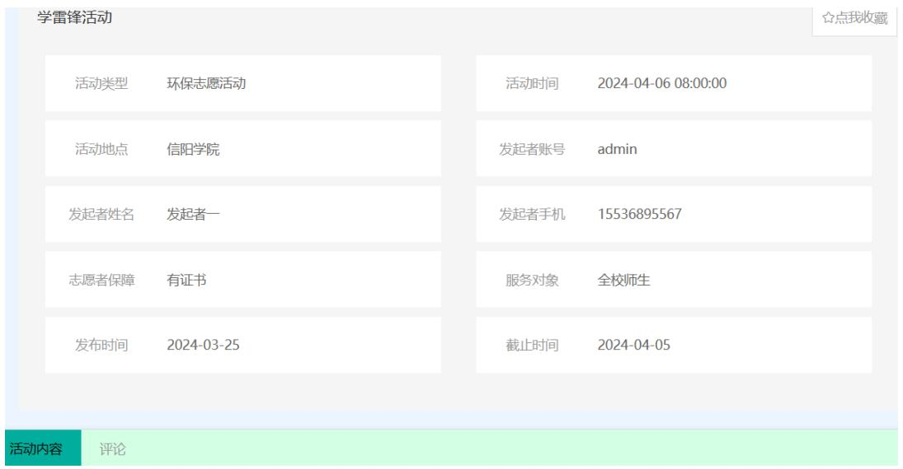

图 5-2 报名活动功能界面

# 5.1.3 个人中心功能实现

在个人中心界面志愿者可以更新个人详细信息并随时选择退出登录，在我的

收藏界面用户可以查看自己之前所收藏的志愿活动并对这些志愿活动进行详细操

作和管理。界面展示图如图 5-3 所示。

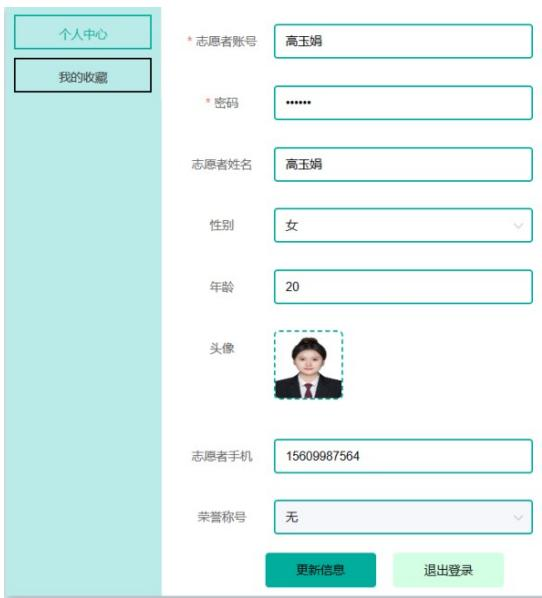

图5-3 个人中心功能界面

# 5.1.4 活动报名管理功能实现

志愿者可以在活动报名管理中通过搜索活动标题、发起者姓名、志愿者姓名、

是否通过等关键词进行查询所报名的活动以及查看所发布评论的回复。界面展示

图如图 5-4 所示。

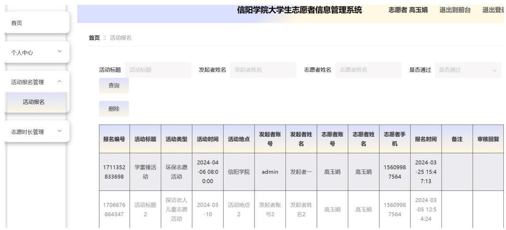

图5-4 活动报名管理功能界面

# 5.2 活动发起者功能实现

# 5.2.1 活动发起者登录注册功能实现

与志愿者一样，若果没有注册发起者账号，则可以点击右侧注册活动发起者，

填写账号、密码、确认密码、发起者姓名、发起者手机、上传头像、注册后点击

登录即可。

当登录后台界面时，用户选择活动发起者角色进行登录，输入正确的用户名、密码完成验证，就能够获得相应权限对系统进行相关操作。界面展示图如图5-5所示。

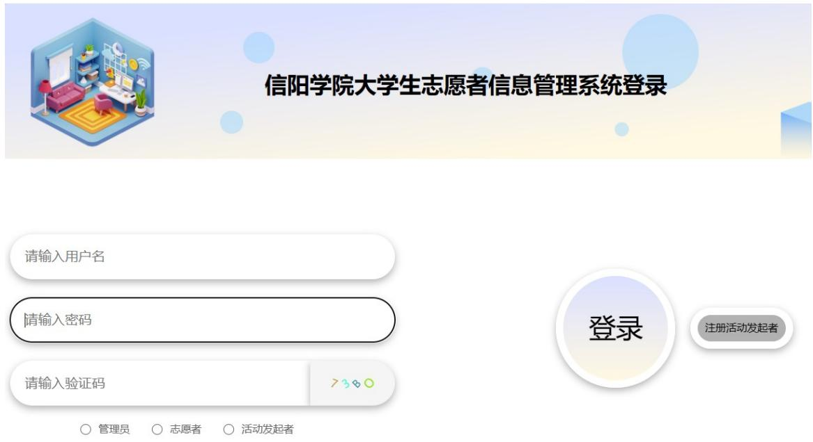

图5-5 活动发起者登录注册功能界面

# 5.2.2 志愿活动管理功能实现

活动发起者可以通过主界面来完成多项任务的操作和管理，其中活动发起者可以通过搜索活动标题、活动地点、发起者姓名、活动是否通过等关键词对其进行查询，也可以对活动进行新增、删除、修改等操作。界面展示图如图5-6所示。

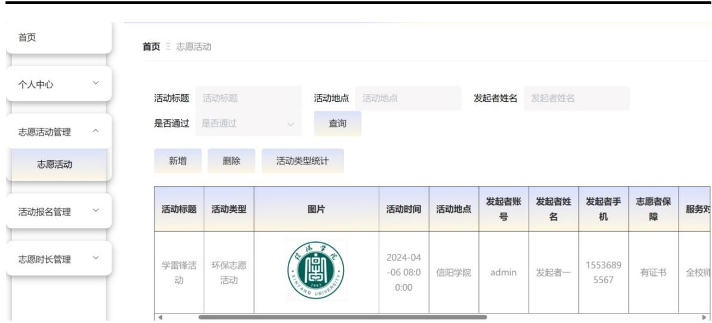

图5-6 志愿活动管理功能界面

# 5.2.3 活动报名管理功能实现

活动发起者可以通过搜索活动标题、发布者姓名、志愿者姓名等关键词查询

志愿者所参加活动以及对其是否能通过参加此活动进行审核，审核有不通过、通

过、待审核三种状态。界面展示图如图 5-7 所示。

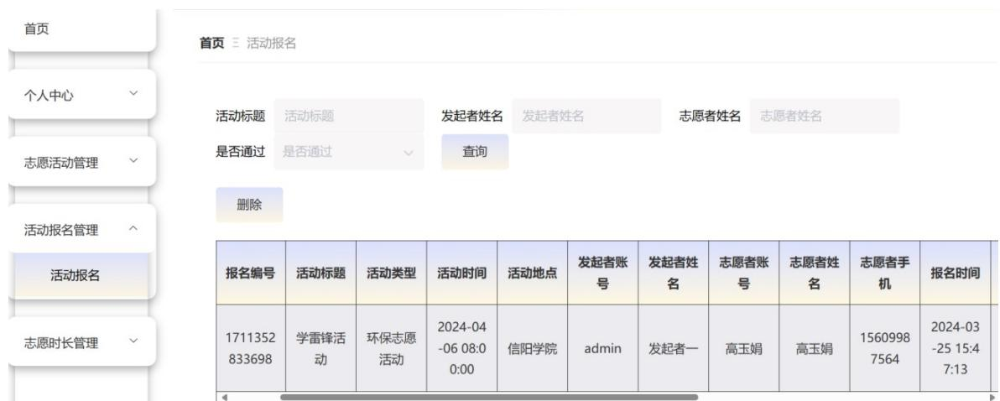

图5-7 活动报名管理功能界面

活动报名界面会通过 HuodongbaomingController 的 remindCount 来对其进行时

间和活动的提醒，活动报名管理功能核心代码如代码 5-2 所示。

@RequestMapping("/remind/{columnName}/\{type}\}")   
public R remindCount(@PathVariable("columnName") StringcolumnName,HttpServletResponse request, @PathVariable("type") String type,@RequestParam Map<String,Object> map){ map.put("column",columnName); map.put("type",type); if(type.equals("2")){ SimpleDateFormat sdf  $=$  new SimpleDateFormat( pattern:"yyyy-MM-dd"); Calendar c  $=$  Calendar.getInstance(); Date remindStartDate  $=$  null; Date remindEndDate  $=$  null; if(map.get("remindstart")！  $\equiv$  null）{ Integer remindStart  $=$  Integer.parseInt(map.get("remindstart").getTime()); c.setTime(new Date()); c.addCALENDAR.DAY_OF_MONTH,remindStart); remindStartDate  $=$  c.getTime(); map.put("remindstart",sdfs.format(remindStartDate)); } if(map.get("remindend")！  $\equiv$  null）{ Integer remindEnd  $=$  Integer.parseInt(map.get("remindend").getTime()); c.setTime(new Date()); c.addCALENDAR.DAY_OF_MONTH,remindEnd); remindEndDate  $=$  c.getTime(); map.put("remindend",sdfs.format(remindEndDate)); }

# 代码 5-2

# 5.2.4 活动时长管理功能实现

活动发起者可以通过活动标题、活动类型来查询志愿者所参加的活动从

而填写志愿时长。界面展示图如图5-8所示。

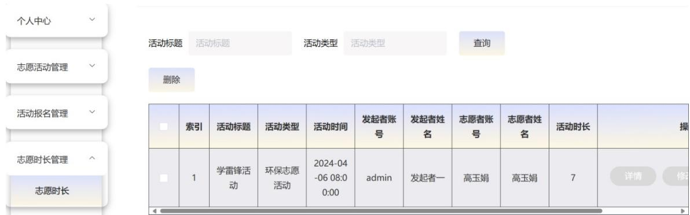

图5-8 活动时长管理功能界面

# 5.3 管理员功能实现

当登录后台界面时，需要先选择管理员角色进行登录，输入正确的用户名、密码完成验证，点击登录就能够访问系统并进行相应操作。

登录成功后，进入主界面，在此界面管理员可以利用相关权限对主界面进行多项任务的操作和管理，其中可以查看和修改个人信息、对志愿者和活动发起者进行管理、设置活动类型、对志愿活动进行审核、处理活动报名事宜、查看志愿者参加的活动和管理志愿时长，以及对系统管理进行管理等。

# 5.3.1 志愿者管理功能实现

管理员可以通过对志愿者进行查询，对个人信息不合法的志愿者进行删除操作，也可以新增志愿者，当志愿者忘记自己的密码或账号时，可以联系管理员进行修改操作，可以通过志愿者参加活动的次数或者时长来对志愿者授予荣誉称号界面展示图如图5-9所示。

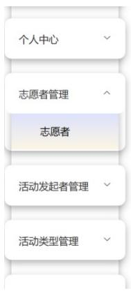

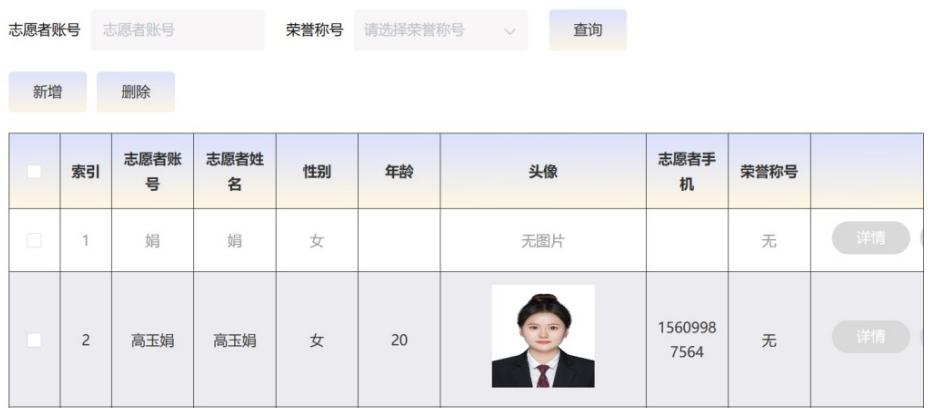

图5-9 志愿者管理功能界面

# 5.3.2 活动发起者管理功能实现

管理员可以对活动发起者进行查询，对录入信息不合法的活动发起者进行删除操作，也可以新增活动发起者，当活动发起者应自身问题忘记账号或者密码时可以联系管理员对其进行密码初始化操作。界面展示图如图 5-10 所示。

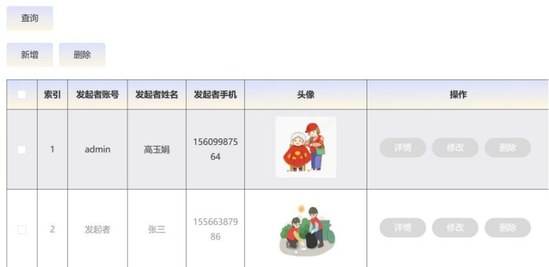

图5-10 活动发起者管理功能界面

# 5.3.3 活动类型管理功能实现

管理员可以通过对活动类型进行查询、对活动进行修改类型和删除类型，也

可以新增活动类型等。界面展示图如图 5-11 所示。

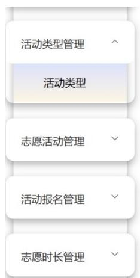

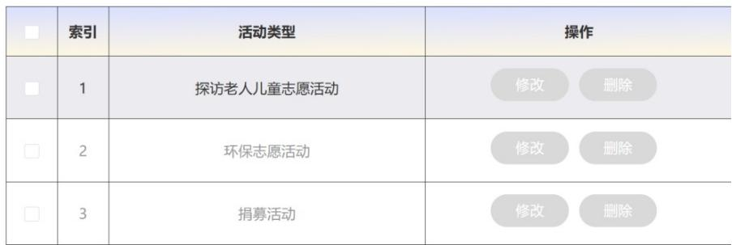

图 5-11 活动类型管理功能界面

# 5.3.4 志愿活动管理功能实现

管理员可以通过志愿活动界面输入志愿活动、活动地点、活动发起者姓名、

是否通过等关键词进行查询活动，可以对志愿活动进行审核判断其是否能通过，

进行查看详情，修改或删除志愿活动信息以及查看志愿者对此活动的评论和活动

发起者对评论的回复。界面展示图如图 5-12 所示。

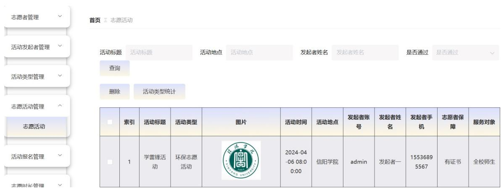

图 5-12 志愿活动管理功能界面

# 5.3.5 志愿时长管理功能实现

管理员可以通过搜索活动标题、活动类型等关键词查询志愿者的活动时长，

时长统计可以看到志愿者参加所有活动的总共时长统计图。界面展示图如图 5-13

所示。

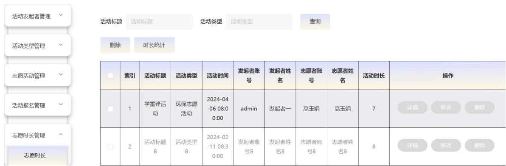

图5-13 志愿时长管理功能界面

# 6 系统测试

# 6.1 系统测试的目的和意义

系统的测试是不可或缺的一环，且这一环不是独立存在，而是贯穿在整个开发过程中。通过这种方式可以及时发现潜在的问题和矛盾，从而能过对系统进行尝试修改和完善。对于任何被测试的系统，都有可能暴露出一些问题，并且能够准确地定位问题所对应的位置。通过全程参与与整体检测，帮助我们发现问题。

# 6.2 系统功能测试和结果分析

# 6.2.1 志愿者管理测试

管理员拥有对账户完整管理功能。在创建新志愿者时，志愿者需要提供个人的基本信息，点击添加按钮将志愿者账号信息保存到数据库中。志愿者管理测表如表6-1所示。

表6-1 志愿者管理测试表

<table><tr><td>用例名称:</td><td>志愿者管理</td></tr><tr><td>测试项目:</td><td>添加志愿者</td></tr><tr><td>前置条件:</td><td>管理员可以正常登录系统后台</td></tr><tr><td>预期结果:</td><td>添加志愿者成功</td></tr><tr><td>操作步骤:</td><td>1.管理员登录系统，进入管理界面
2.选择志愿者管理，进入志愿者管理界面
3.点击添加按钮，填写志愿者相关信息并提交</td></tr><tr><td>测试结果:</td><td>添加志愿者成功</td></tr></table>

# 6.2.2 活动报名管理测试

活动发起者负责活动报名信息的编辑、添加和删除等操作。活动发起者可以点击删除按钮删除活动。活动发起者在整个活动的筹备和执行过程中扮演着至关重要的角色。他们负责对活动报名信息进行详细的编辑工作，确保每一项信息准确无误；同时，他们也可以灵活地添加或修改这些报名数据，以适应不同的需求一旦确定了活动内容，活动发起者还能够轻松地通过点击预设的删除按钮来正式取消该活动。这一操作为活动管理提供了极大的便利，使得组织者能够更加高效地调整和优化活动安排。活动报名管理测试表如表6-2所示。

表6-2 活动报名管理测试表

<table><tr><td>用例名称:</td><td>活动报名管理</td></tr><tr><td>测试项目:</td><td>删除活动报名</td></tr><tr><td>前置条件:</td><td>活动发起者可以正常登录系统后台</td></tr><tr><td>预期结果:</td><td>删除活动报名成功</td></tr><tr><td>操作步骤:</td><td>1. 活动发起者登录系统，进入活动报名管理界面</td></tr><tr><td rowspan="2">测试结果:</td><td>2. 选择活动报名，点击删除按钮</td></tr><tr><td>删除活动报名成功</td></tr></table>

# 6.2.3 志愿活动管理测试

当用户登录后，查看志愿活动信息，就可以查看用户是否可以参加志愿活动。

志愿活动管理测试表如表 6-3 所示。

表6-3 志愿活动管理测试表

<table><tr><td>用例名称:</td><td>志愿活动管理</td></tr><tr><td>测试项目:</td><td>对志愿活动信息的操作操作</td></tr><tr><td>前置条件:</td><td>活动发起者已经发布志愿活动信息，用户查看志愿活动</td></tr><tr><td>预期结果:</td><td>对志愿活动管理成功</td></tr><tr><td>操作步骤:</td><td>1. 用户成功登录本系统，选中某个志愿活动进入
2. 对该志愿活动详情进行查看
3. 用户参加志愿活动成功
4. 该用户登录自己的账号，并点击志愿活动信息管理</td></tr><tr><td>测试结果:</td><td>志愿活动信息管理</td></tr><tr><td>备注:</td><td>用户在查看志愿活动后，用户可以在志愿活动报名中查看处理状态</td></tr></table>

# 6.2.4 管理员管理测试

管理员有各种各样的管理权限，包括对普通用户和活动发起者进行初始化密

码，添加新用户，删除用户等操作。管理员在维护用户信息的同时也具备自我修

复账号的能力。管理员管理测试表如表 6-4 所示。

表6-4 管理员管理测试表

<table><tr><td>用例名称:</td><td>管理员管理</td></tr><tr><td>测试项目:</td><td>对志愿者和活动发起者的密码初始化</td></tr><tr><td>前置条件:</td><td>管理员可以正常登录系统后台</td></tr><tr><td>预期结果:</td><td>密码初始化成功</td></tr><tr><td>操作步骤:</td><td>1.管理员登录系统，进入管理员管理界面
2.点击初始化密码按钮</td></tr><tr><td>测试结果:</td><td>初始化密码成功</td></tr></table>

# 7 结束语

该系统采用了Java和MySQL技术，设计并实现了一套大学生志愿者信息管理系统。通过这一技术组合，我们构建了一个功能完备的平台，涵盖了志愿者管理、活动发起者管理、志愿活动管理，活动报名管理、活动时长管理以及管理员管理等核心功能。系统的开发严格遵循了软件工程的标准流程，其中包括文献调研、系统分析、系统设计、系统实现和系统测试等核心步骤，从而确保了系统的全面性和稳定性。

优点：

(1) 高效：通过系统可以实现活动管理、用户管理、活动报名管理、管理员管理等，提高了管理效率和质量。

(2) 便捷：简化操作过程，用户更容易掌握，给用户带来直观的交互，满足用户的使用需求，提高了用户的工作效率。

(3) 科学：系统设计合理，能够满足不同用户的需求和场景。

局限：

特定功能和需求可能无法完全满足：对于一些特殊情况或需求，可能需要人工干预或额外的支持。

本研究设计并实现了一套高效的大学生志愿者信息管理系统，旨在提升大学生志愿活动的管理效率，推动社会公益事业发展的同时也促进学生个人成长和培养学生的社会责任感。

# 参考文献

[1]Zhiming L,Haiwei J.Testing the Mediating Effect of Need–Supply Fit on theRelationship Between Volunteer Management Practices and Volunteer Satisfaction inChina[J].Journalof Social Service Research,2022,48(1):28-44.

[2]Gareth P,Olesya N.An Empirical Exploration of Volunteer Management Theory andPractice: Considerations for Sport Events in a “Post-COVID-19” World[J].Frontiers inSports and Active Living,2022,4689209-689209.

[3]Hu M.Managing volunteer service in China: A cross-sectoral comparison[J].No-nprofit Management and Leadership,2023,34(1):155-177.

[4]马春晓,叶青,吕明.志愿活动管理系统的设计与实现[J].工业控制计算

机,2022,35(01):135-136+139.

[5]陈仪.博物馆志愿者服务管理研究——以国家博物馆为例[J].文化学刊,2022,(04):144-149.

[6]刘小丹. $C ^ { + + }$ 与 Java 程序设计语言的特征研究[J].电脑编程技巧与维护,2023,(10):52-54.

[7]赵停停.基于MySQL数据库技术的Web动态网界设计研究[J].信息与电脑(理论版),2023,35(17):174-176.

[8]李明,冯树栋,白宗文,等.基于SpringBoot的成果需求匹配系统设计与实现[J].延安大学学报(自然科学版),2024,43(01):90-95.

[9]肖桂霞.基于 B/S 架构的 Web 单点登录协议综述[J].软件,2023,44(01):1-5+23.

[10]刘征,李井竹.基于 OBE 和思政的 Java 程序设计教学改革研究[J].互联网周

刊,2023,(18):73-75.

[11]李晓光,朱海岳.大学生志愿者服务社会化运行组织管理研究[J].就业与保

障,2022,(04):69-71.

